# A Predictive Data Analysis ~ 19-nCoV

(Data-Science cum Data-Mining project in R) <br />

[Ravi Prakash](https://raviprakashravi.cf/)

<hr />


    
A **Predictive Data Analysis** is a type of data-analysis where after the complete statistical study of the data, the model predicts some estimate when it receives a new datum.
It can be for various types of predictions categorization.

* Some other types of data-analysis can be _Descriptive, Diagnostic or Prescriptive Analysis._

This **Data Mining Project** involves a sequence of (_six_) steps i.e. <br />
   
> a) Business Understanding <br />
> b) Data Understanding <br />
> c) Data Preparation <br />
> d) Modeling <br />
> e) Evaluation <br />
> f) Deployment

<br /><br />
## Main Data-Mining Concepts Used

In this project, I will be using the _**time series dataset(s)**_ that will consist of the data values of different locations, worldwide.

### [DATA PREPROCESSIG &amp; POSTPROCESSING](#data-understanding)

> #### [Data Understanding](#Data-Understanding) &amp; [Data Preparation](#data-preparation)
> * Anomaly/Outliers - identification, varification & removal
> * Data Reduction
> * Exploratory Data Analysis (EDA) - using **boxplots** & **scatter-plots**

### [MODLING](#choosing-the-right-algo)
> * Regression
> * Model **overfitting**
> * SVMK, KNN, Linear &amp; Polynomial Regression

### [RESULT EVALUATION](#evaluation)

> #### [Selection of best fitting algorithm based on:](#choosing-the-right-algo)
> * RMSE
> * R<sup>2</sup>

<hr /><br />


# Table of Contents


> #### 1. [Introduction](#Introduction)
> #### 2. [Business Understanding](#Business-Understanding)
> #### 3. [Data Understanding](#Data-Understanding)
> #### 4. [Data Preparation](#Data-Preparation)
> #### 5. [Modeling](#Modeling)
> #### 6. [Evaluation](#Evaluation)
> #### 7. [Deployment](#Deployment)
> #### 8. [Conclusion](#Conclusion)
> #### 9. [Bibliography](#Bibliography)

<hr /><br />

### _Stepping into the project..._

<br /><br />


# "Rate of growth of COVID-19 in China : within next one week"


<br /><br />

<br /> 

## Introduction

> * [History of Pandemics](#history-of-pandemics)
> * [novel Coronavirus Diseases: 2020](#novel-coronavirus-disease-2020)
> * [The Outbreak - COVID-19](#covid-19-outbreak-in-world--)

### History of Pandemics: 

<br />

> * #### Great Plague of Marseille: 1720
> <br />
> As per the records Great Plague of Marseille started when a ship called Grand-Saint-Antoine docked in Marseille, France, carrying a cargo of goods from the eastern Mediterranean. <br />
> It continued for the next three years, killing up to **30%** of the population of Marseille.<br /> 
> 
> * #### First Cholera Pandemic: 1820
> <br />
> In 1820 the _First Cholera Pandemic_ occurred, in Asia, affecting countries, mainly Indonesia, Thailand and the Philippines. This pandemic has also killed about **100,000** as declared officially. It was a bacterial infection caused due to the contaminated water.<br />
>
> * #### Spanish Influenza/Flu: 1920
> <br />
> Spanish Flu was the mose recent and the most unrelenting pandemics. It has infected about half a billion people and **killed 100 million**. The Spanish flu holds the official record for the deadliest pandemic officially recorded in history.


<br /><hr /><br />


## novel Coronavirus Disease: 2020 
<br /> 

In the 21<sup>st</sup> century, novel **Co**rona**vi**rus **D**isease (COVID-19) has appeared as the most severe pandemic, originated from **Hubei** province of China.<br /><br /> 
    Caused by: **novel Coronavirus - 2**
    


<br />


### Story of its origin  - 
> During November, 2019 - a severe viral infection was noticed in **Wuhan**, a city in Hubei provinces of China. On November 17<sup>th</sup> 2019, the first case this infection was reported. Doctor's initially took it lightly as if it was a normal fever/cold. But, when a wide range of patients reported similar symptoms, a doctor - **Dr. Li Wenliang** of Chinese Academy of Sciences (**CAS**) Lab, claimed that it was a type of _severe acute respiratory syndrome_, spreading through a new coronavirus transmission in the whole Hubei province, very rapidly. Reportedly, chainese government warned him not to leak this anywhere. But anyhow, this news got exposed during the late December, 2019. <br /><br />
As per the sources, in 2003, the same lab found first deadly SARS Coronavirus, led to 813 casualties, all over the world, within two months! <br /><br />
Initially, it was named as "Wuhan Virus". But, as it started spreading rapidly from Hubei to the whole mainland of China, its name got replaced by term "China Virus".<br />

<br />


Finally, on **Feb. 11<sup>th</sup> 2020**, the World Health Organization (WHO) gave the disease an official name: **COVID-19**.<br />
WHO has also declared the COVID-19 as a **pandemic**. 
<br /><br /> 

Since the outbreak of COVID-19, over 350000 people have been infected throughout the world and **over 15000 people** have been **killed**.<br /><br />


#### This map shows the daily spread of the 2019-vCoV
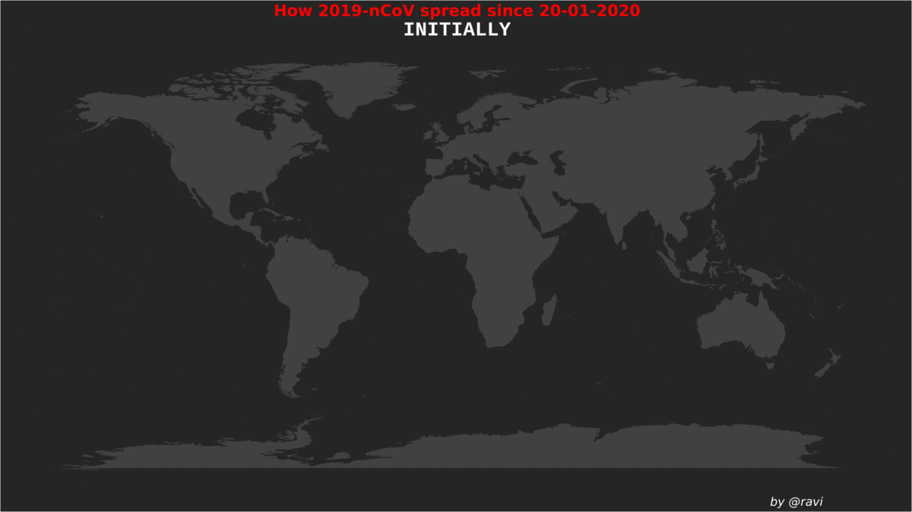

### COVID-19: Outbreak in world -
> A grand Cruise Ship called **Diamond Princess** was all set for it's two weeks' journey from **Yokohama** (Japan) to China, Vietnam, Taiwan and back to Japan. Guests boarded it on January 20<sup>th</sup>, but as the journey was about to end, on **February 1<sup>st</sup>** tested positive for coronavirus, who disembarked in Hong Kong on January 25<sup>th</sup>.<br /><br />
The cruise was cancelled from sailing as Japanese health instructors asked to check all the passengers, along with the crew.<br /><br />
And since then, the number of confirmed cases for COVID-19 kept increasing. Currently, the ship was carrying over 3500 people.


<br />


 
##### As per the data available, following graphs show the 2019-nCoV cases have increased since Jan. 22<sup>nd</sup>: <br /><br />

* Confirmed Cases:
  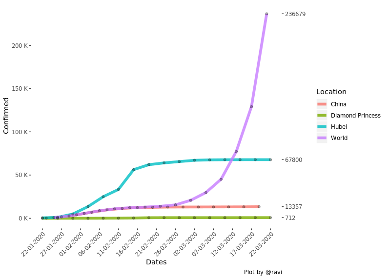
* Death Cases:
  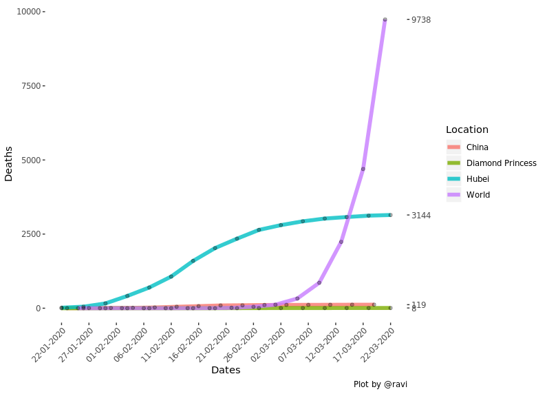
  
<br /><br />

### About the Disease

The COVID-19 is spread as rapidly as it has the **Reproduction Number** (R-naught) **2.5**.

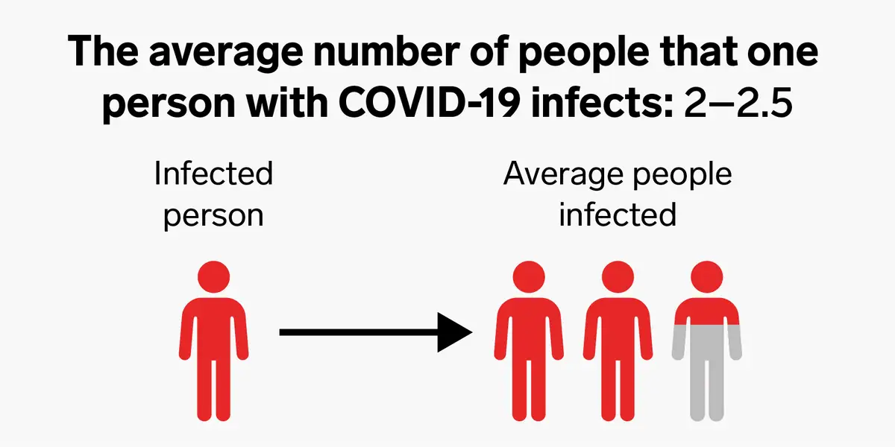

<br /><br />

**Reproduction Number:** is meant for the average number of people, whom an infected person is further infecting. In more generalized language, on an average, from every COVID-19 patient, virus are getting transmitted to at least 2.5 fit persons.<br />
For Ebola, this number is appx. 1.7<br /><br />
In order to have controle on any epidemic, the reproducibility score has to be decreased as much as possible.<br /><br />
That's why, most of the highly countries are locked down. In many of them, there are the shortage of hospitals/beds/doctors, too.<br />
Due to the lockdown, the market is also going down.<br /><br />


<br /> 
### Symptoms: 
<br /> 

The _severe acute respiratory syndrome COVID-19_ **(SARS-CoV-19)**, which is often termed as 2019-nCoV, as well, is basically a viral disease spread by the novel coronavirus in which the virus tend to attack onto the respiratory system of the patient.<br />

Though the studies are still going on, following are some most common symptoms of COVID-19, known so far:
> 1. Fever
> 2. Dry Cough
> 3. Fatigue
> 4. Shortness of Breath
> 5. Nasal Congestion etc..

These are the symptoms that are reported by most of the patients. Apart from these, few patients also found to develop aches and pains and get the sniffles, according to data from China.


<hr />
<br />

## Business Understanding:

Now we all are well aware that this is a very severe pandemic i.e. the pandemic of 21<sup>st</sup> century. Not only this but another major problem is that it has been around **5 months**, since when the _2019-nCoV_ appeared, first.<br /><br /> 
Scientists are still trying to create the vaccine as soon as possible, but for now, no final cure is up.<br /><hr /><br />


## **Why do this analysis?**


**Due to this pandemic:**
<br /> 

> 1. Almost every country in the world has atleast one confirm case of COVID-19<br />
> 2. The diseases is spreading very rapidly<br />
> 3. Economy of various countries is going down<br />
> 4. Casualties are increasing even more fastly etc..<br />

China, being the origin of the COVID-19, is the most affected country, in the world.<br/><br />


#### * This becomes more clear from the following  wordclouds
(total confirmed cases & deaths due to coronavirus till 21/03/2020) <br /><br />


<br />
 _* Here we find the China to be the most affected country!_ 
<br />

## **CONTRIBUTION OF THIS PROJECT**


Finds an estimate about the rate of increase/decrease in appearance of new cases for next one week, in case of China.<br /><br />

    
> 1. This estimate can help the country to know how much new beds/hospitals are going to be required within next few days.<br />
> 2. Helpful for the country in terms of the financial planning, as the economy is also going down.<br />
> 3. Directs where the **focus** has to be driven **first**.
> 4. It would convey a more precise information for deciding that how the money has to be divided for the constructions of new hospitals/isolation centers, COVID-19 test kits, other medical equipments, caring and treatments, etc.. <br />


This all would be helpful for other countries as well, in order to bring the Reproducibility Score (**R-naught**) down to an acceptable limit. (by applying useful strategies of China)


<hr />
* We'll be preparing separate datasets for generating few of these visualization, while data-preparation phase.<br />
* For understanding how these visuals are developed from scratch, please refer to [map.R](../COVID-19/map.R) and [visualizer.R](../COVID-19/visualizer.R).

<br />

## Data Understanding:

> * [DATA &AMP; PROBLEM STATEMENT](#-data--problem-statement)
> * [BEGINNING WITH THE CODING SECTION](#beginning-with-the-coding-section)
> * [DATA COLLECTION](#-data-collection)

### * Data & Problem Statement

Our is aim to analyze that what would be the status of the epidemic will change, within a week and hence, how log it might take to China to have its control over this infection<br />
Further, we'd aim to generalize it for any of the country, so that we could find the status of the same, whenever required. Obviously, we'd have to change few parameters, tho' we won't have to waste our time again and again in data preparation for a particular country.<br /><br />

**Hence we need the data about:**
> 1. Confirmed cases of COVID-19, throughout the world
> 2. Death cases due to COVID-19, throughout the world
> 3. Total Recovery from COVID-19, throughout the world

We've collected this data from various sources including [CSSE @Johns Hopkins University]((https://www.arcgis.com/apps/opsdashboard/index.html#/bda7594740fd40299423467b48e9ecf6)), [WHO](https://www.who.int/emergencies/diseases/novel-coronavirus-2019) & [MoHFW - India](https://www.mohfw.gov.in/).<br />
<br /> 


#### Beginning with the coding section:

> Let's start with setting-up our working directory and load all the required packages, that we would be required:

<br />

### Initial Project Setup


```R
# Setting the working directory
options(warn=-1)
setwd("~/Documents/A-tracking-of-2019-nCoV/COVID-19/")

#####  Loading LIBRARIES  #####
library(stringr)

library(AUCRF)
library(randomForest)
library(RFmarkerDetector)

library(caret)
library(mlbench)
library(kernlab)
```

<br />

### * Data Collection

Basically, we have collected the **raw data** from websites and GitHub repository.


```R
# loading raw data
check.Confirmed = read.csv("Notebooks/syllabus/static/raw/time_series_19-covid-Confirmed.csv")
check.Deaths = read.csv("Notebooks/syllabus/static/raw/time_series_19-covid-Deaths.csv")
check.Recovered = read.csv("Notebooks/syllabus/static/raw/time_series_19-covid-Recovered.csv")
```

The data, that we have collected is in the **CSV** (i.e. "_comma-separated values_") format.<br />
A CSV file is used to store the _structured data_ row-wise, where the data elements in each rows are separated by a comma (,).

It's pretty similar to the following:
```
Belinda Jameson,2017,Cushing House,148,3.52
Jeff Smith,2018,Prescott House,17-D,3.20
```
<br />
Let's view the head portion of our raw data:


```R
# view sample
head(check.Confirmed)
head(check.Deaths)
head(check.Recovered)
```


<table>
<thead><tr><th scope=col>Province.State</th><th scope=col>Country.Region</th><th scope=col>Lat</th><th scope=col>Long</th><th scope=col>X1.22.20</th><th scope=col>X1.23.20</th><th scope=col>X1.24.20</th><th scope=col>X1.25.20</th><th scope=col>X1.26.20</th><th scope=col>X1.27.20</th><th scope=col>...</th><th scope=col>X3.10.20</th><th scope=col>X3.11.20</th><th scope=col>X3.12.20</th><th scope=col>X3.13.20</th><th scope=col>X3.14.20</th><th scope=col>X3.15.20</th><th scope=col>X3.16.20</th><th scope=col>X3.17.20</th><th scope=col>X3.18.20</th><th scope=col>X3.19.20</th></tr></thead>
<tbody>
	<tr><td>                </td><td>Thailand        </td><td>15.0000         </td><td> 101.0000       </td><td>2               </td><td>3               </td><td>5               </td><td>7               </td><td>8               </td><td>8               </td><td>...             </td><td> 53             </td><td> 59             </td><td> 70             </td><td> 75             </td><td> 82             </td><td>114             </td><td>147             </td><td>177             </td><td>212             </td><td>272             </td></tr>
	<tr><td>                </td><td>Japan           </td><td>36.0000         </td><td> 138.0000       </td><td>2               </td><td>1               </td><td>2               </td><td>2               </td><td>4               </td><td>4               </td><td>...             </td><td>581             </td><td>639             </td><td>639             </td><td>701             </td><td>773             </td><td>839             </td><td>825             </td><td>878             </td><td>889             </td><td>924             </td></tr>
	<tr><td>                </td><td>Singapore       </td><td> 1.2833         </td><td> 103.8333       </td><td>0               </td><td>1               </td><td>3               </td><td>3               </td><td>4               </td><td>5               </td><td>...             </td><td>160             </td><td>178             </td><td>178             </td><td>200             </td><td>212             </td><td>226             </td><td>243             </td><td>266             </td><td>313             </td><td>345             </td></tr>
	<tr><td>                </td><td>Nepal           </td><td>28.1667         </td><td>  84.2500       </td><td>0               </td><td>0               </td><td>0               </td><td>1               </td><td>1               </td><td>1               </td><td>...             </td><td>  1             </td><td>  1             </td><td>  1             </td><td>  1             </td><td>  1             </td><td>  1             </td><td>  1             </td><td>  1             </td><td>  1             </td><td>  1             </td></tr>
	<tr><td>                </td><td>Malaysia        </td><td> 2.5000         </td><td> 112.5000       </td><td>0               </td><td>0               </td><td>0               </td><td>3               </td><td>4               </td><td>4               </td><td>...             </td><td>129             </td><td>149             </td><td>149             </td><td>197             </td><td>238             </td><td>428             </td><td>566             </td><td>673             </td><td>790             </td><td>900             </td></tr>
	<tr><td>British Columbia</td><td>Canada          </td><td>49.2827         </td><td>-123.1207       </td><td>0               </td><td>0               </td><td>0               </td><td>0               </td><td>0               </td><td>0               </td><td>...             </td><td> 32             </td><td> 39             </td><td> 46             </td><td> 64             </td><td> 64             </td><td> 73             </td><td>103             </td><td>103             </td><td>186             </td><td>231             </td></tr>
</tbody>
</table>


<table>
<thead><tr><th scope=col>Province.State</th><th scope=col>Country.Region</th><th scope=col>Lat</th><th scope=col>Long</th><th scope=col>X1.22.20</th><th scope=col>X1.23.20</th><th scope=col>X1.24.20</th><th scope=col>X1.25.20</th><th scope=col>X1.26.20</th><th scope=col>X1.27.20</th><th scope=col>...</th><th scope=col>X3.10.20</th><th scope=col>X3.11.20</th><th scope=col>X3.12.20</th><th scope=col>X3.13.20</th><th scope=col>X3.14.20</th><th scope=col>X3.15.20</th><th scope=col>X3.16.20</th><th scope=col>X3.17.20</th><th scope=col>X3.18.20</th><th scope=col>X3.19.20</th></tr></thead>
<tbody>
	<tr><td>                </td><td>Thailand        </td><td>15.0000         </td><td> 101.0000       </td><td>0               </td><td>0               </td><td>0               </td><td>0               </td><td>0               </td><td>0               </td><td>...             </td><td> 1              </td><td> 1              </td><td> 1              </td><td> 1              </td><td> 1              </td><td> 1              </td><td> 1              </td><td> 1              </td><td> 1              </td><td> 1              </td></tr>
	<tr><td>                </td><td>Japan           </td><td>36.0000         </td><td> 138.0000       </td><td>0               </td><td>0               </td><td>0               </td><td>0               </td><td>0               </td><td>0               </td><td>...             </td><td>10              </td><td>15              </td><td>16              </td><td>19              </td><td>22              </td><td>22              </td><td>27              </td><td>29              </td><td>29              </td><td>29              </td></tr>
	<tr><td>                </td><td>Singapore       </td><td> 1.2833         </td><td> 103.8333       </td><td>0               </td><td>0               </td><td>0               </td><td>0               </td><td>0               </td><td>0               </td><td>...             </td><td> 0              </td><td> 0              </td><td> 0              </td><td> 0              </td><td> 0              </td><td> 0              </td><td> 0              </td><td> 0              </td><td> 0              </td><td> 0              </td></tr>
	<tr><td>                </td><td>Nepal           </td><td>28.1667         </td><td>  84.2500       </td><td>0               </td><td>0               </td><td>0               </td><td>0               </td><td>0               </td><td>0               </td><td>...             </td><td> 0              </td><td> 0              </td><td> 0              </td><td> 0              </td><td> 0              </td><td> 0              </td><td> 0              </td><td> 0              </td><td> 0              </td><td> 0              </td></tr>
	<tr><td>                </td><td>Malaysia        </td><td> 2.5000         </td><td> 112.5000       </td><td>0               </td><td>0               </td><td>0               </td><td>0               </td><td>0               </td><td>0               </td><td>...             </td><td> 0              </td><td> 0              </td><td> 0              </td><td> 0              </td><td> 0              </td><td> 0              </td><td> 0              </td><td> 2              </td><td> 2              </td><td> 2              </td></tr>
	<tr><td>British Columbia</td><td>Canada          </td><td>49.2827         </td><td>-123.1207       </td><td>0               </td><td>0               </td><td>0               </td><td>0               </td><td>0               </td><td>0               </td><td>...             </td><td> 1              </td><td> 1              </td><td> 1              </td><td> 1              </td><td> 1              </td><td> 1              </td><td> 4              </td><td> 4              </td><td> 7              </td><td> 7              </td></tr>
</tbody>
</table>


<table>
<thead><tr><th scope=col>Province.State</th><th scope=col>Country.Region</th><th scope=col>Lat</th><th scope=col>Long</th><th scope=col>X1.22.20</th><th scope=col>X1.23.20</th><th scope=col>X1.24.20</th><th scope=col>X1.25.20</th><th scope=col>X1.26.20</th><th scope=col>X1.27.20</th><th scope=col>...</th><th scope=col>X3.10.20</th><th scope=col>X3.11.20</th><th scope=col>X3.12.20</th><th scope=col>X3.13.20</th><th scope=col>X3.14.20</th><th scope=col>X3.15.20</th><th scope=col>X3.16.20</th><th scope=col>X3.17.20</th><th scope=col>X3.18.20</th><th scope=col>X3.19.20</th></tr></thead>
<tbody>
	<tr><td>                </td><td>Thailand        </td><td>15.0000         </td><td> 101.0000       </td><td>0               </td><td>0               </td><td>0               </td><td>0               </td><td>2               </td><td>2               </td><td>...             </td><td> 33             </td><td> 34             </td><td> 34             </td><td> 35             </td><td> 35             </td><td> 35             </td><td> 35             </td><td> 41             </td><td> 42             </td><td> 42             </td></tr>
	<tr><td>                </td><td>Japan           </td><td>36.0000         </td><td> 138.0000       </td><td>0               </td><td>0               </td><td>0               </td><td>0               </td><td>1               </td><td>1               </td><td>...             </td><td>101             </td><td>118             </td><td>118             </td><td>118             </td><td>118             </td><td>118             </td><td>144             </td><td>144             </td><td>144             </td><td>150             </td></tr>
	<tr><td>                </td><td>Singapore       </td><td> 1.2833         </td><td> 103.8333       </td><td>0               </td><td>0               </td><td>0               </td><td>0               </td><td>0               </td><td>0               </td><td>...             </td><td> 78             </td><td> 96             </td><td> 96             </td><td> 97             </td><td>105             </td><td>105             </td><td>109             </td><td>114             </td><td>114             </td><td>114             </td></tr>
	<tr><td>                </td><td>Nepal           </td><td>28.1667         </td><td>  84.2500       </td><td>0               </td><td>0               </td><td>0               </td><td>0               </td><td>0               </td><td>0               </td><td>...             </td><td>  1             </td><td>  1             </td><td>  1             </td><td>  1             </td><td>  1             </td><td>  1             </td><td>  1             </td><td>  1             </td><td>  1             </td><td>  1             </td></tr>
	<tr><td>                </td><td>Malaysia        </td><td> 2.5000         </td><td> 112.5000       </td><td>0               </td><td>0               </td><td>0               </td><td>0               </td><td>0               </td><td>0               </td><td>...             </td><td> 24             </td><td> 26             </td><td> 26             </td><td> 26             </td><td> 35             </td><td> 42             </td><td> 42             </td><td> 49             </td><td> 60             </td><td> 75             </td></tr>
	<tr><td>British Columbia</td><td>Canada          </td><td>49.2827         </td><td>-123.1207       </td><td>0               </td><td>0               </td><td>0               </td><td>0               </td><td>0               </td><td>0               </td><td>...             </td><td>  4             </td><td>  4             </td><td>  4             </td><td>  4             </td><td>  4             </td><td>  4             </td><td>  4             </td><td>  4             </td><td>  4             </td><td>  4             </td></tr>
</tbody>
</table>


#### We can see that type of collected data is: time-series

> A **Time series data** of a variable have a set of observations on values at different points of time. They are usually collected at fixed intervals, such as daily, weekly, monthly, annually, quarterly, etc.

<br />
We observe that all the three datasets have same columns as well as the same type of data.


```R
# columns
cat("Number of columns in all 3 datasets:-\n\n")

matrix(
    c("Confirmed", "Deaths", "Recovered", ncol(check.Confirmed), ncol(check.Deaths), ncol(check.Recovered)),
    nrow = 2, ncol = 3, byrow = T
)

# Dimention
cat("Dimentions of datasets:-\n")   # same for all 3
dim(check.Confirmed)


######################
# columns' name
#cat("Name of columns in all 3 datasets:-\n")

#colnames(check.Confirmed)
#colnames(check.Deaths)
#colnames(check.Recovered)
```

    Number of columns in all 3 datasets:-
    


<table>
<tbody>
	<tr><td>Confirmed</td><td>Deaths   </td><td>Recovered</td></tr>
	<tr><td>62       </td><td>62       </td><td>62       </td></tr>
</tbody>
</table>


    Dimentions of datasets:-


<ol class=list-inline>
	<li>468</li>
	<li>62</li>
</ol>


<br />
Let's see the structure of these datasets:


```R
str(check.Confirmed)
#str(check.Deaths)
#str(check.Recovered)
```

    'data.frame':	468 obs. of  62 variables:
     $ Province.State: Factor w/ 321 levels "","Adams, IN",..: 1 1 1 1 1 25 196 298 237 1 ...
     $ Country.Region: Factor w/ 155 levels "Afghanistan",..: 142 76 129 103 90 27 8 8 8 25 ...
     $ Lat           : num  15 36 1.28 28.17 2.5 ...
     $ Long          : num  101 138 103.8 84.2 112.5 ...
     $ X1.22.20      : int  2 2 0 0 0 0 0 0 0 0 ...
     $ X1.23.20      : int  3 1 1 0 0 0 0 0 0 0 ...
     $ X1.24.20      : int  5 2 3 0 0 0 0 0 0 0 ...
     $ X1.25.20      : int  7 2 3 1 3 0 0 0 0 0 ...
     $ X1.26.20      : int  8 4 4 1 4 0 3 1 0 0 ...
     $ X1.27.20      : int  8 4 5 1 4 0 4 1 0 1 ...
     $ X1.28.20      : int  14 7 7 1 4 1 4 1 0 1 ...
     $ X1.29.20      : int  14 7 7 1 7 1 4 1 1 1 ...
     $ X1.30.20      : int  14 11 10 1 8 1 4 2 3 1 ...
     $ X1.31.20      : int  19 15 13 1 8 1 4 3 2 1 ...
     $ X2.1.20       : int  19 20 16 1 8 1 4 4 3 1 ...
     $ X2.2.20       : int  19 20 18 1 8 1 4 4 2 1 ...
     $ X2.3.20       : int  19 20 18 1 8 1 4 4 2 1 ...
     $ X2.4.20       : int  25 22 24 1 10 1 4 4 3 1 ...
     $ X2.5.20       : int  25 22 28 1 12 2 4 4 3 1 ...
     $ X2.6.20       : int  25 45 28 1 12 2 4 4 4 1 ...
     $ X2.7.20       : int  25 25 30 1 12 4 4 4 5 1 ...
     $ X2.8.20       : int  32 25 33 1 16 4 4 4 5 1 ...
     $ X2.9.20       : int  32 26 40 1 16 4 4 4 5 1 ...
     $ X2.10.20      : int  32 26 45 1 18 4 4 4 5 1 ...
     $ X2.11.20      : int  33 26 47 1 18 4 4 4 5 1 ...
     $ X2.12.20      : int  33 28 50 1 18 4 4 4 5 1 ...
     $ X2.13.20      : int  33 28 58 1 19 4 4 4 5 1 ...
     $ X2.14.20      : int  33 29 67 1 19 4 4 4 5 1 ...
     $ X2.15.20      : int  33 43 72 1 22 4 4 4 5 1 ...
     $ X2.16.20      : int  34 59 75 1 22 4 4 4 5 1 ...
     $ X2.17.20      : int  35 66 77 1 22 5 4 4 5 1 ...
     $ X2.18.20      : int  35 74 81 1 22 5 4 4 5 1 ...
     $ X2.19.20      : int  35 84 84 1 22 5 4 4 5 1 ...
     $ X2.20.20      : int  35 94 84 1 22 5 4 4 5 1 ...
     $ X2.21.20      : int  35 105 85 1 22 6 4 4 5 1 ...
     $ X2.22.20      : int  35 122 85 1 22 6 4 4 5 1 ...
     $ X2.23.20      : int  35 147 89 1 22 6 4 4 5 1 ...
     $ X2.24.20      : int  35 159 89 1 22 6 4 4 5 1 ...
     $ X2.25.20      : int  37 170 91 1 22 7 4 4 5 1 ...
     $ X2.26.20      : int  40 189 93 1 22 7 4 4 5 1 ...
     $ X2.27.20      : int  40 214 93 1 23 7 4 4 5 1 ...
     $ X2.28.20      : int  41 228 93 1 23 7 4 4 5 1 ...
     $ X2.29.20      : int  42 241 102 1 25 8 4 7 9 1 ...
     $ X3.1.20       : int  42 256 106 1 29 8 6 7 9 1 ...
     $ X3.2.20       : int  43 274 108 1 29 8 6 9 9 1 ...
     $ X3.3.20       : int  43 293 110 1 36 9 13 9 11 1 ...
     $ X3.4.20       : int  43 331 110 1 50 12 22 10 11 1 ...
     $ X3.5.20       : int  47 360 117 1 50 13 22 10 13 1 ...
     $ X3.6.20       : int  48 420 130 1 83 21 26 10 13 1 ...
     $ X3.7.20       : int  50 461 138 1 93 21 28 11 13 1 ...
     $ X3.8.20       : int  50 502 150 1 99 27 38 11 15 2 ...
     $ X3.9.20       : int  50 511 150 1 117 32 48 15 15 2 ...
     $ X3.10.20      : int  53 581 160 1 129 32 55 18 18 2 ...
     $ X3.11.20      : int  59 639 178 1 149 39 65 21 20 3 ...
     $ X3.12.20      : int  70 639 178 1 149 46 65 21 20 3 ...
     $ X3.13.20      : int  75 701 200 1 197 64 92 36 35 5 ...
     $ X3.14.20      : int  82 773 212 1 238 64 112 49 46 7 ...
     $ X3.15.20      : int  114 839 226 1 428 73 134 57 61 7 ...
     $ X3.16.20      : int  147 825 243 1 566 103 171 71 68 7 ...
     $ X3.17.20      : int  177 878 266 1 673 103 210 94 78 33 ...
     $ X3.18.20      : int  212 889 313 1 790 186 267 121 94 35 ...
     $ X3.19.20      : int  272 924 345 1 900 231 307 121 144 37 ...


<br />

### Explanation of each columns in fetched data:-
* There are 3 dedicated databases for data about Confirmed/Death/Recovery cases, all around the world

> #### Province.State:
   > * Data-type: **factor** they can be specific, unique and valid names
   > * Holds name of City/Province/State, where the data is coming from
   > * Eg.: _Hubei_
>
> #### Country.Region:
   > * Data-type: **factor** they can be specific, unique and valid names
   > * Holds name of the country, in which the reported area comes
   > * Eg.: _China_ (Hubei is a Province of China)
>
> #### Lat:
   > * Data-type: **numeric** (i.e. can have values in decimals, too)
   > * Holds the Latitude position of the given place(as in col1)
   > * Eg.: _Latitude_ position of Hubei = 30.9756
>
> #### Long:
   > * Data-type: **numeric** (i.e. can have values in decimals, too)
   > * Holds the longitude position of the given place(as in col1)
   > * Eg.: _Longitude_ position of Hubei = 112.2707
>
> #### Col. 5 to 62:
   > * Data-type: **integer** (i.e. discrete) and remains _always positive_ as it determines  the _no, of individuals_
   > * It's a time series data where the data is collected at various interval of time
   > * Each datum value is represented, based on the different days in series (from 22/01/2020)
   > * The constant entity is the location, whose data is represented in every row


```R
# showing data of Hubei
cat("\nA sample data of a location from \"Confirmed Cases\'\" dataset:\n")
check.Confirmed[which(str_detect(check.Confirmed$Province.State, "Hubei")),]
```

    
    A sample data of a location from "Confirmed Cases'" dataset:


<table>
<thead><tr><th></th><th scope=col>Province.State</th><th scope=col>Country.Region</th><th scope=col>Lat</th><th scope=col>Long</th><th scope=col>X1.22.20</th><th scope=col>X1.23.20</th><th scope=col>X1.24.20</th><th scope=col>X1.25.20</th><th scope=col>X1.26.20</th><th scope=col>X1.27.20</th><th scope=col>...</th><th scope=col>X3.10.20</th><th scope=col>X3.11.20</th><th scope=col>X3.12.20</th><th scope=col>X3.13.20</th><th scope=col>X3.14.20</th><th scope=col>X3.15.20</th><th scope=col>X3.16.20</th><th scope=col>X3.17.20</th><th scope=col>X3.18.20</th><th scope=col>X3.19.20</th></tr></thead>
<tbody>
	<tr><th scope=row>155</th><td>Hubei   </td><td>China   </td><td>30.9756 </td><td>112.2707</td><td>444     </td><td>444     </td><td>549     </td><td>761     </td><td>1058    </td><td>1423    </td><td>...     </td><td>67760   </td><td>67773   </td><td>67781   </td><td>67786   </td><td>67790   </td><td>67794   </td><td>67798   </td><td>67799   </td><td>67800   </td><td>67800   </td></tr>
</tbody>
</table>


<hr /><br />

## Data Preparation:

> * [DATA CLEANING](#-Data-Cleaning)
> * [DATA REDUCTION](#-Data-Reduction)
>   - [Scaling](#Scaling)
> * [DATA TRANSFORMATION](#-Data-transformation)
>   - [Arranging data Country-Wise](#arranging-data-country-wise)
>   - [Pooled Datasets](#explanation-of-pooled-datasets-bulk--four)

Now, as we have the raw data for our analysis, we can move forward for our next phase i.e. Data-Preparation.<br />
* The data-preparation is considered to be the most time consuming phase of any datascience project.<br />
* On an average, an idal data-science project's **90%** of time is spent during Data-Collection and Data-Preparation.<br /><br />

#### * Data Cleaning

Whenever we collect any kind of the raw-data from various sourcev, it has a lot of the vulnerabilities.<br />
Most often, these are of following types:
1. NAs and NaNs
2. Missing data values
3. Incorrect data values
<br /><br />
Checking for these flaws in our data:


```R
# sample NA values
check.Confirmed[which(str_detect(check.Confirmed$Country.Region, "Cruise Ship")),]

# sample wrong data "french guiana" the data value can not decrease on next day
check.Confirmed[which(str_detect(check.Confirmed$Province.State, "French Guiana")),]

# sample blank data ---> State (to be replaced by 'Others')
head(check.Recovered)
```


<table>
<thead><tr><th></th><th scope=col>Province.State</th><th scope=col>Country.Region</th><th scope=col>Lat</th><th scope=col>Long</th><th scope=col>X1.22.20</th><th scope=col>X1.23.20</th><th scope=col>X1.24.20</th><th scope=col>X1.25.20</th><th scope=col>X1.26.20</th><th scope=col>X1.27.20</th><th scope=col>...</th><th scope=col>X3.10.20</th><th scope=col>X3.11.20</th><th scope=col>X3.12.20</th><th scope=col>X3.13.20</th><th scope=col>X3.14.20</th><th scope=col>X3.15.20</th><th scope=col>X3.16.20</th><th scope=col>X3.17.20</th><th scope=col>X3.18.20</th><th scope=col>X3.19.20</th></tr></thead>
<tbody>
	<tr><th scope=row>166</th><td>Diamond Princess</td><td>Cruise Ship     </td><td>35.4437         </td><td>139.638         </td><td>NA              </td><td>NA              </td><td>NA              </td><td>NA              </td><td>NA              </td><td>NA              </td><td>...             </td><td>696             </td><td>696             </td><td>696             </td><td>696             </td><td>696             </td><td>696             </td><td>696             </td><td>696             </td><td>712             </td><td>712             </td></tr>
</tbody>
</table>


<table>
<thead><tr><th></th><th scope=col>Province.State</th><th scope=col>Country.Region</th><th scope=col>Lat</th><th scope=col>Long</th><th scope=col>X1.22.20</th><th scope=col>X1.23.20</th><th scope=col>X1.24.20</th><th scope=col>X1.25.20</th><th scope=col>X1.26.20</th><th scope=col>X1.27.20</th><th scope=col>...</th><th scope=col>X3.10.20</th><th scope=col>X3.11.20</th><th scope=col>X3.12.20</th><th scope=col>X3.13.20</th><th scope=col>X3.14.20</th><th scope=col>X3.15.20</th><th scope=col>X3.16.20</th><th scope=col>X3.17.20</th><th scope=col>X3.18.20</th><th scope=col>X3.19.20</th></tr></thead>
<tbody>
	<tr><th scope=row>431</th><td>French Guiana</td><td>France       </td><td>3.9339       </td><td>-53.1258     </td><td>0            </td><td>0            </td><td>0            </td><td>0            </td><td>0            </td><td>0            </td><td>...          </td><td>5            </td><td>3            </td><td>5            </td><td>3            </td><td>5            </td><td>7            </td><td>11           </td><td>11           </td><td>11           </td><td>11           </td></tr>
</tbody>
</table>


<table>
<thead><tr><th scope=col>Province.State</th><th scope=col>Country.Region</th><th scope=col>Lat</th><th scope=col>Long</th><th scope=col>X1.22.20</th><th scope=col>X1.23.20</th><th scope=col>X1.24.20</th><th scope=col>X1.25.20</th><th scope=col>X1.26.20</th><th scope=col>X1.27.20</th><th scope=col>...</th><th scope=col>X3.10.20</th><th scope=col>X3.11.20</th><th scope=col>X3.12.20</th><th scope=col>X3.13.20</th><th scope=col>X3.14.20</th><th scope=col>X3.15.20</th><th scope=col>X3.16.20</th><th scope=col>X3.17.20</th><th scope=col>X3.18.20</th><th scope=col>X3.19.20</th></tr></thead>
<tbody>
	<tr><td>                </td><td>Thailand        </td><td>15.0000         </td><td> 101.0000       </td><td>0               </td><td>0               </td><td>0               </td><td>0               </td><td>2               </td><td>2               </td><td>...             </td><td> 33             </td><td> 34             </td><td> 34             </td><td> 35             </td><td> 35             </td><td> 35             </td><td> 35             </td><td> 41             </td><td> 42             </td><td> 42             </td></tr>
	<tr><td>                </td><td>Japan           </td><td>36.0000         </td><td> 138.0000       </td><td>0               </td><td>0               </td><td>0               </td><td>0               </td><td>1               </td><td>1               </td><td>...             </td><td>101             </td><td>118             </td><td>118             </td><td>118             </td><td>118             </td><td>118             </td><td>144             </td><td>144             </td><td>144             </td><td>150             </td></tr>
	<tr><td>                </td><td>Singapore       </td><td> 1.2833         </td><td> 103.8333       </td><td>0               </td><td>0               </td><td>0               </td><td>0               </td><td>0               </td><td>0               </td><td>...             </td><td> 78             </td><td> 96             </td><td> 96             </td><td> 97             </td><td>105             </td><td>105             </td><td>109             </td><td>114             </td><td>114             </td><td>114             </td></tr>
	<tr><td>                </td><td>Nepal           </td><td>28.1667         </td><td>  84.2500       </td><td>0               </td><td>0               </td><td>0               </td><td>0               </td><td>0               </td><td>0               </td><td>...             </td><td>  1             </td><td>  1             </td><td>  1             </td><td>  1             </td><td>  1             </td><td>  1             </td><td>  1             </td><td>  1             </td><td>  1             </td><td>  1             </td></tr>
	<tr><td>                </td><td>Malaysia        </td><td> 2.5000         </td><td> 112.5000       </td><td>0               </td><td>0               </td><td>0               </td><td>0               </td><td>0               </td><td>0               </td><td>...             </td><td> 24             </td><td> 26             </td><td> 26             </td><td> 26             </td><td> 35             </td><td> 42             </td><td> 42             </td><td> 49             </td><td> 60             </td><td> 75             </td></tr>
	<tr><td>British Columbia</td><td>Canada          </td><td>49.2827         </td><td>-123.1207       </td><td>0               </td><td>0               </td><td>0               </td><td>0               </td><td>0               </td><td>0               </td><td>...             </td><td>  4             </td><td>  4             </td><td>  4             </td><td>  4             </td><td>  4             </td><td>  4             </td><td>  4             </td><td>  4             </td><td>  4             </td><td>  4             </td></tr>
</tbody>
</table>

<br />

So, there are also many issues (like blanks in the place of states' name and data of a Cruise Ship among countries' data) with our available datasets.<br />
To get rid of these issues, the data-cleaning is performed.<br />

For data cleaning,we consider either of these two methods (or both, too):
1. **Removal:**<br />
    Here we usually remove or delete those rows/columns, where we find the vulnerabilities.<br />
    These rows/columns might include NAs.<br /><br />
2. **Replacement/Filling:**<br />
    Here we replace the NAs or incorrect or blanks data values with some acceptable value.<br />
    Mostly, values are replaced by Mean or Mode values, so that the overall statistical structure may remain the same.<br />
    Sometimes, we also fill them on the basis of some specific calculations.<br />

### What will we do?

Because we have the time-series dataset populated with discrete data values, storing the total count of the total people (having COVID-19 confirmed, have died due to COVID-19 or have recovered from COVID-19), the issues:
> 1. can NOT be resolved by MEAN<br />
>     because in our case, either the Data value can remain CONSTANT or can INCREASE, on every next day.<br />
>     the MEAN need not to be discrete<br />
>     MEAN can also be less than the previous data, for any particular day etc..<br /><br />
> 2. can NOT be resolved by MODE<br />
>     because it's a medical data and hence any most often occurring number cannot be blindly replaced with a missing value etc..<br />

Hence, we'll **NOT** be using any of the **replacement of MEAN/MODE/MEDIAN** 


#### We'll replace with maximum values

We will be replacing the missing values or NAs with the maximum value up to a day before the current day.<br />
It means that - the values are carried constant for the next day whose data is missing.


```R
# removing NAs, replacing incorrect values

for (i in 1:nrow(check.Confirmed)) {
  for (j in 5:ncol(check.Confirmed)) {
    if(j==5) {
      check.Confirmed[i,j] = ifelse(is.na(check.Confirmed[i, j]), 0, check.Confirmed[i,j])
    } else {
      if(is.na(check.Confirmed[i, j])){
        check.Confirmed[i,j] = check.Confirmed[i, (j-1)]
      } else if(check.Confirmed[i, (j-1)] > check.Confirmed[i, j]){
        check.Confirmed[i,j] = check.Confirmed[i, (j-1)]
      }
    }
  }
}

for (i in 1:nrow(check.Deaths)) {
  for (j in 5:ncol(check.Deaths)) {
    if(j==5) {
      check.Deaths[i,j] = ifelse(is.na(check.Deaths[i, j]), 0, check.Deaths[i,j])
    } else {
      if(is.na(check.Deaths[i, j])){
        check.Deaths[i,j] = check.Deaths[i, (j-1)]
      } else if(check.Deaths[i, (j-1)] > check.Deaths[i, j]){
        check.Deaths[i,j] = check.Deaths[i, (j-1)]
      }
    }
  }
}

for (i in 1:nrow(check.Recovered)) {
  for (j in 5:ncol(check.Recovered)) {
    if(j==5) {
      check.Recovered[i,j] = ifelse(is.na(check.Recovered[i, j]), 0, check.Recovered[i,j])
    } else {
      if(is.na(check.Recovered[i, j])){
        check.Recovered[i,j] = check.Recovered[i, (j-1)]
      } else if(check.Recovered[i, (j-1)] > check.Recovered[i, j]){
        check.Recovered[i,j] = check.Recovered[i, (j-1)]
      }
    }
  }
}


```


```R
# replace blanks and incorrect country/state names

# replacing in states
states = as.character(check.Confirmed$Province.State)
states.levels = as.character(levels(check.Confirmed$Province.State))

states[states %in% ""] = "Others"
states.levels[states.levels %in% ""] = "Others"


#######
states[states %in% "From Diamond Princess"] = "Diamond Princess"
states.levels = states.levels[!states.levels %in% "From Diamond Princess"]


# replacing in countries
countries = as.character(check.Confirmed$Country.Region)
countries.levels = as.character(levels(check.Confirmed$Country.Region))

countries[countries %in% "US"] = "United States"
countries[countries %in% "UK"] = "United Kingdom"
countries[countries %in% "Taiwan*"] = "Taiwan"
countries[countries %in% "The Bahamas"] = "Bahamas"
countries[countries %in% "Gambia, The"] = "Gambia"
countries[countries %in% "Korea, South"] = "South Korea"
countries[countries %in% c("Congo (Brazzaville)", "Congo (Kinshasa)", "Republic of the Congo")] = "Democratic Republic of the Congo"
###
countries.levels[countries.levels %in% "US"] = "United States"
countries.levels[countries.levels %in% "UK"] = "United Kingdom"
countries.levels[countries.levels %in% "Taiwan*"] = "Taiwan"
countries.levels[countries.levels %in% "The Bahamas"] = "Bahamas"
countries.levels[countries.levels %in% "Gambia, The"] = "Gambia"
countries.levels[countries.levels %in% "Korea, South"] = "South Korea"

countries.levels = countries.levels[!countries.levels %in% c("Congo (Brazzaville)", "Congo (Kinshasa)", "Republic of the Congo")]
countries.levels = c(countries.levels, "Democratic Republic of the Congo")
###############################
```


```R
# rectified fectors
states.factor  = factor(c(states), levels = c(states.levels))
countries.factor  = factor(countries, levels = countries.levels)


## CUZ' INITIAL 4 COLUMNS ARE COMMON IN ALL 3 DATASETS ##

# editing factors in datasets
check.Confirmed = cbind(
                    Province.State = states.factor,
                    Country.Region = countries.factor,
                    check.Confirmed[,3:ncol(check.Confirmed)]
                  )

check.Deaths = cbind(
                    Province.State = states.factor,
                    Country.Region = countries.factor,
                    check.Deaths[,3:ncol(check.Deaths)]
                  )

check.Recovered = cbind(
                    Province.State = states.factor,
                    Country.Region = countries.factor,
                    check.Recovered[,3:ncol(check.Recovered)]
                  )


```

**Now our data has been cleaned.** Viewing the cleaned data.


```R
# sample NA val
check.Confirmed[which(str_detect(check.Confirmed$Country.Region, "Cruise Ship")),]

# sample wrong data "french guiana"
check.Confirmed[which(str_detect(check.Confirmed$Province.State, "French Guiana")),]

# sample blank data ---> State (replaced by 'Other')
head(check.Recovered)
```


<table>
<thead><tr><th></th><th scope=col>Province.State</th><th scope=col>Country.Region</th><th scope=col>Lat</th><th scope=col>Long</th><th scope=col>X1.22.20</th><th scope=col>X1.23.20</th><th scope=col>X1.24.20</th><th scope=col>X1.25.20</th><th scope=col>X1.26.20</th><th scope=col>X1.27.20</th><th scope=col>...</th><th scope=col>X3.10.20</th><th scope=col>X3.11.20</th><th scope=col>X3.12.20</th><th scope=col>X3.13.20</th><th scope=col>X3.14.20</th><th scope=col>X3.15.20</th><th scope=col>X3.16.20</th><th scope=col>X3.17.20</th><th scope=col>X3.18.20</th><th scope=col>X3.19.20</th></tr></thead>
<tbody>
	<tr><th scope=row>166</th><td>Diamond Princess</td><td>Cruise Ship     </td><td>35.4437         </td><td>139.638         </td><td>0               </td><td>0               </td><td>0               </td><td>0               </td><td>0               </td><td>0               </td><td>...             </td><td>706             </td><td>706             </td><td>706             </td><td>706             </td><td>706             </td><td>706             </td><td>706             </td><td>706             </td><td>712             </td><td>712             </td></tr>
</tbody>
</table>


<table>
<thead><tr><th></th><th scope=col>Province.State</th><th scope=col>Country.Region</th><th scope=col>Lat</th><th scope=col>Long</th><th scope=col>X1.22.20</th><th scope=col>X1.23.20</th><th scope=col>X1.24.20</th><th scope=col>X1.25.20</th><th scope=col>X1.26.20</th><th scope=col>X1.27.20</th><th scope=col>...</th><th scope=col>X3.10.20</th><th scope=col>X3.11.20</th><th scope=col>X3.12.20</th><th scope=col>X3.13.20</th><th scope=col>X3.14.20</th><th scope=col>X3.15.20</th><th scope=col>X3.16.20</th><th scope=col>X3.17.20</th><th scope=col>X3.18.20</th><th scope=col>X3.19.20</th></tr></thead>
<tbody>
	<tr><th scope=row>431</th><td>French Guiana</td><td>France       </td><td>3.9339       </td><td>-53.1258     </td><td>0            </td><td>0            </td><td>0            </td><td>0            </td><td>0            </td><td>0            </td><td>...          </td><td>5            </td><td>5            </td><td>5            </td><td>5            </td><td>5            </td><td>7            </td><td>11           </td><td>11           </td><td>11           </td><td>11           </td></tr>
</tbody>
</table>


<table>
<thead><tr><th scope=col>Province.State</th><th scope=col>Country.Region</th><th scope=col>Lat</th><th scope=col>Long</th><th scope=col>X1.22.20</th><th scope=col>X1.23.20</th><th scope=col>X1.24.20</th><th scope=col>X1.25.20</th><th scope=col>X1.26.20</th><th scope=col>X1.27.20</th><th scope=col>...</th><th scope=col>X3.10.20</th><th scope=col>X3.11.20</th><th scope=col>X3.12.20</th><th scope=col>X3.13.20</th><th scope=col>X3.14.20</th><th scope=col>X3.15.20</th><th scope=col>X3.16.20</th><th scope=col>X3.17.20</th><th scope=col>X3.18.20</th><th scope=col>X3.19.20</th></tr></thead>
<tbody>
	<tr><td>Others          </td><td>Thailand        </td><td>15.0000         </td><td> 101.0000       </td><td>0               </td><td>0               </td><td>0               </td><td>0               </td><td>2               </td><td>2               </td><td>...             </td><td> 33             </td><td> 34             </td><td> 34             </td><td> 35             </td><td> 35             </td><td> 35             </td><td> 35             </td><td> 41             </td><td> 42             </td><td> 42             </td></tr>
	<tr><td>Others          </td><td>Japan           </td><td>36.0000         </td><td> 138.0000       </td><td>0               </td><td>0               </td><td>0               </td><td>0               </td><td>1               </td><td>1               </td><td>...             </td><td>101             </td><td>118             </td><td>118             </td><td>118             </td><td>118             </td><td>118             </td><td>144             </td><td>144             </td><td>144             </td><td>150             </td></tr>
	<tr><td>Others          </td><td>Singapore       </td><td> 1.2833         </td><td> 103.8333       </td><td>0               </td><td>0               </td><td>0               </td><td>0               </td><td>0               </td><td>0               </td><td>...             </td><td> 78             </td><td> 96             </td><td> 96             </td><td> 97             </td><td>105             </td><td>105             </td><td>109             </td><td>114             </td><td>114             </td><td>114             </td></tr>
	<tr><td>Others          </td><td>Nepal           </td><td>28.1667         </td><td>  84.2500       </td><td>0               </td><td>0               </td><td>0               </td><td>0               </td><td>0               </td><td>0               </td><td>...             </td><td>  1             </td><td>  1             </td><td>  1             </td><td>  1             </td><td>  1             </td><td>  1             </td><td>  1             </td><td>  1             </td><td>  1             </td><td>  1             </td></tr>
	<tr><td>Others          </td><td>Malaysia        </td><td> 2.5000         </td><td> 112.5000       </td><td>0               </td><td>0               </td><td>0               </td><td>0               </td><td>0               </td><td>0               </td><td>...             </td><td> 24             </td><td> 26             </td><td> 26             </td><td> 26             </td><td> 35             </td><td> 42             </td><td> 42             </td><td> 49             </td><td> 60             </td><td> 75             </td></tr>
	<tr><td>British Columbia</td><td>Canada          </td><td>49.2827         </td><td>-123.1207       </td><td>0               </td><td>0               </td><td>0               </td><td>0               </td><td>0               </td><td>0               </td><td>...             </td><td>  4             </td><td>  4             </td><td>  4             </td><td>  4             </td><td>  4             </td><td>  4             </td><td>  4             </td><td>  4             </td><td>  4             </td><td>  4             </td></tr>
</tbody>
</table>

<br /> 

#### * Data Reduction


Though we have cleaned the dataset, yet we see that **'Diamond Princess'** Cruise is still therein among the countries' data.<br />
Hence it's an outlier, and hence has to be separated.

**So, now we'll start the process of data reduction**


```R
# removing diamond princess
Diamond.Princess.Confirmed = check.Confirmed[ which(str_detect(check.Confirmed$Country.Region, "Cruise Ship", negate = F)), ]
check.Confirmed = check.Confirmed[ which(str_detect(check.Confirmed$Country.Region, "Cruise Ship", negate = T)), ]

Diamond.Princess.Deaths = check.Deaths[ which(str_detect(check.Deaths$Country.Region, "Cruise Ship", negate = F)),]
check.Deaths = check.Deaths[ which(str_detect(check.Deaths$Country.Region, "Cruise Ship", negate = T)), ]

Diamond.Princess.Recovered = check.Recovered[ which(str_detect(check.Recovered$Country.Region, "Cruise Ship", negate = F)), ]
check.Recovered = check.Recovered[ which(str_detect(check.Recovered$Country.Region, "Cruise Ship", negate = T)), ]

## Rectifying Row sequences
row.names(check.Confirmed) <- NULL
row.names(check.Deaths) <- NULL
row.names(check.Recovered) <- NULL
```

**Verifying if it is removed or not:**


```R
# Let's check whether Diamond Princess is still at row 166 or not
check.Confirmed[166,]
#check.Deaths[166,]
#check.Recovered[166,]


# also checking dimention
cat("\nEarlier dimention: 468 X 62\n\n")    # as we saw initially

cat("New dimention: ", dim(check.Confirmed))
```


<table>
<thead><tr><th></th><th scope=col>Province.State</th><th scope=col>Country.Region</th><th scope=col>Lat</th><th scope=col>Long</th><th scope=col>X1.22.20</th><th scope=col>X1.23.20</th><th scope=col>X1.24.20</th><th scope=col>X1.25.20</th><th scope=col>X1.26.20</th><th scope=col>X1.27.20</th><th scope=col>...</th><th scope=col>X3.10.20</th><th scope=col>X3.11.20</th><th scope=col>X3.12.20</th><th scope=col>X3.13.20</th><th scope=col>X3.14.20</th><th scope=col>X3.15.20</th><th scope=col>X3.16.20</th><th scope=col>X3.17.20</th><th scope=col>X3.18.20</th><th scope=col>X3.19.20</th></tr></thead>
<tbody>
	<tr><th scope=row>166</th><td>Jiangsu</td><td>China  </td><td>32.9711</td><td>119.455</td><td>1      </td><td>5      </td><td>9      </td><td>18     </td><td>33     </td><td>47     </td><td>...    </td><td>631    </td><td>631    </td><td>631    </td><td>631    </td><td>631    </td><td>631    </td><td>631    </td><td>631    </td><td>631    </td><td>631    </td></tr>
</tbody>
</table>


    
    Earlier dimention: 468 X 62
    
    New dimention:  467 62

_**OK! so it's gone!**_
<br /><br />

#### Scaling


Now we have the dataset that hold the counts of the COVID-19 cases of different geographical locations.<br />
Hence, we can now create a dataset to generate the map for every unique day.(that we saw early in this project)<br /><br />

* It means, we want to plot all the countries/regions that are affected on a particular day
* It gives us an idea that - among all the given countries, either we are going to plot a selected country on world-map, or not, for a specific day
* the **factor** on which basis we'll be deciding is - whether country has any confirmed case till that day or not

* So, We'd also **need** the _Latitude and Longitude_ position for those country
<br /><br />

Finally, we can roughly estimate that we can have only 2 choices for any region, say **0** & **1**, such that:
> **0**:  don't plot on map, if it has no confirm cases i.e. val for total confirm case on that day are 0 <br />
> **1**:  plot on map, if it has some confirm cases i.e. there is at least 1 confirm case on that day <br />


<br /> 

    Therefor, We're going to use **Unit Scaling** to set all the values from 5th to last column

<br /> 


```R

# in UNIT SCALING, all the data has either 0 or 1 value

ever.Affected = check.Confirmed

# Unit scaling
for (i in row.names(ever.Affected)) {
  for (j in 5:ncol(ever.Affected)) {
    if(ever.Affected[i,j] != 0)
      ever.Affected[i,j] = 1
  }
}

head(ever.Affected)

```


<table>
<thead><tr><th scope=col>Province.State</th><th scope=col>Country.Region</th><th scope=col>Lat</th><th scope=col>Long</th><th scope=col>X1.22.20</th><th scope=col>X1.23.20</th><th scope=col>X1.24.20</th><th scope=col>X1.25.20</th><th scope=col>X1.26.20</th><th scope=col>X1.27.20</th><th scope=col>...</th><th scope=col>X3.10.20</th><th scope=col>X3.11.20</th><th scope=col>X3.12.20</th><th scope=col>X3.13.20</th><th scope=col>X3.14.20</th><th scope=col>X3.15.20</th><th scope=col>X3.16.20</th><th scope=col>X3.17.20</th><th scope=col>X3.18.20</th><th scope=col>X3.19.20</th></tr></thead>
<tbody>
	<tr><td>Others          </td><td>Thailand        </td><td>15.0000         </td><td> 101.0000       </td><td>1               </td><td>1               </td><td>1               </td><td>1               </td><td>1               </td><td>1               </td><td>...             </td><td>1               </td><td>1               </td><td>1               </td><td>1               </td><td>1               </td><td>1               </td><td>1               </td><td>1               </td><td>1               </td><td>1               </td></tr>
	<tr><td>Others          </td><td>Japan           </td><td>36.0000         </td><td> 138.0000       </td><td>1               </td><td>1               </td><td>1               </td><td>1               </td><td>1               </td><td>1               </td><td>...             </td><td>1               </td><td>1               </td><td>1               </td><td>1               </td><td>1               </td><td>1               </td><td>1               </td><td>1               </td><td>1               </td><td>1               </td></tr>
	<tr><td>Others          </td><td>Singapore       </td><td> 1.2833         </td><td> 103.8333       </td><td>0               </td><td>1               </td><td>1               </td><td>1               </td><td>1               </td><td>1               </td><td>...             </td><td>1               </td><td>1               </td><td>1               </td><td>1               </td><td>1               </td><td>1               </td><td>1               </td><td>1               </td><td>1               </td><td>1               </td></tr>
	<tr><td>Others          </td><td>Nepal           </td><td>28.1667         </td><td>  84.2500       </td><td>0               </td><td>0               </td><td>0               </td><td>1               </td><td>1               </td><td>1               </td><td>...             </td><td>1               </td><td>1               </td><td>1               </td><td>1               </td><td>1               </td><td>1               </td><td>1               </td><td>1               </td><td>1               </td><td>1               </td></tr>
	<tr><td>Others          </td><td>Malaysia        </td><td> 2.5000         </td><td> 112.5000       </td><td>0               </td><td>0               </td><td>0               </td><td>1               </td><td>1               </td><td>1               </td><td>...             </td><td>1               </td><td>1               </td><td>1               </td><td>1               </td><td>1               </td><td>1               </td><td>1               </td><td>1               </td><td>1               </td><td>1               </td></tr>
	<tr><td>British Columbia</td><td>Canada          </td><td>49.2827         </td><td>-123.1207       </td><td>0               </td><td>0               </td><td>0               </td><td>0               </td><td>0               </td><td>0               </td><td>...             </td><td>1               </td><td>1               </td><td>1               </td><td>1               </td><td>1               </td><td>1               </td><td>1               </td><td>1               </td><td>1               </td><td>1               </td></tr>
</tbody>
</table>


<br /><br />

#### Next step is to find and remove the outliers:

We'll use **scatter plots** & **box plots** to _identify_ and **compare the MEAN** of every day to _verify_ these outliers, so that we can remove them, successfully.


```R
# Let's visualize our data to varify:
library(ggplot2)

options(repr.plot.width=14, repr.plot.height=8)
ggplot(check.Confirmed) +
  geom_point(aes(x=check.Confirmed$Province.State, y=check.Confirmed$X1.29.20), color="red", size=2) +
  theme(
          text = element_text(family = "Gill Sans")
          ,plot.title = element_text(size = 20, face = "bold", hjust = 0.5)
          ,plot.subtitle = element_text(size = 25, family = "Courier", face = "bold", hjust = 0.5)
          ,axis.text = element_text(size = 12)
          ,axis.title = element_text(size = 20)
          ,axis.text.x = element_blank()
  )

cat("\n\n")

#ggplot(check.Deaths) +
#  geom_point(aes(x=check.Deaths$Province.State, y=check.Deaths$X1.29.20), color="red", size=2)#

#ggplot(check.Recovered) +
#  geom_point(aes(x=check.Recovered$Province.State, y=check.Recovered$X1.29.20), color="red", size=2)
  
```

    
    


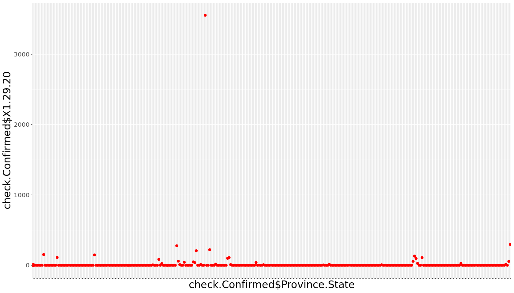


```R
# Let's find the name of this outlier:-

check.Confirmed[which(check.Confirmed$X1.29.20 > 400), c("Province.State", "Country.Region")]
#check.Deaths[which(check.Deaths$X1.29.20 > 15), c("Province.State", "Country.Region")]
#check.Recovered[which(check.Recovered$X1.29.20 > 20), c("Province.State", "Country.Region")]
```


<table>
<thead><tr><th></th><th scope=col>Province.State</th><th scope=col>Country.Region</th></tr></thead>
<tbody>
	<tr><th scope=row>155</th><td>Hubei</td><td>China</td></tr>
</tbody>
</table>


<br /> 
So, it's **Hubei**. <br />
We'll verify it by comparison of mean value on daily basis, including and excluding the Hubei province. 


```R
# Here we are trying to compare the mean values of everyday, including and excluding Hubei province
With.Hubei = as.numeric(apply(check.Confirmed[,5:ncol(check.Confirmed)], 2, mean))

exceptHubei = check.Confirmed[ which(str_detect(check.Confirmed$Province.State, "Hubei", negate = T)), ]
Without.Hubei = as.numeric(apply(exceptHubei[,5:ncol(exceptHubei)], 2, mean))

# creating a dataframe for comperision
Mean.Comparision.Table = data.frame(
              "Date" = as.character(colnames(check.Confirmed)[5:ncol(check.Confirmed)]),
              "With Hubei" = c(With.Hubei),
              "Without Hubei" = c(Without.Hubei))

tail(Mean.Comparision.Table, 10)
```


<table>
<thead><tr><th></th><th scope=col>Date</th><th scope=col>With.Hubei</th><th scope=col>Without.Hubei</th></tr></thead>
<tbody>
	<tr><th scope=row>49</th><td>X3.10.20</td><td>253.5824</td><td>108.7189</td></tr>
	<tr><th scope=row>50</th><td>X3.11.20</td><td>269.1563</td><td>124.2983</td></tr>
	<tr><th scope=row>51</th><td>X3.12.20</td><td>274.4625</td><td>129.5987</td></tr>
	<tr><th scope=row>52</th><td>X3.13.20</td><td>310.5567</td><td>165.7597</td></tr>
	<tr><th scope=row>53</th><td>X3.14.20</td><td>333.8865</td><td>189.1309</td></tr>
	<tr><th scope=row>54</th><td>X3.15.20</td><td>358.1949</td><td>213.4828</td></tr>
	<tr><th scope=row>55</th><td>X3.16.20</td><td>388.4154</td><td>243.7597</td></tr>
	<tr><th scope=row>56</th><td>X3.17.20</td><td>421.7794</td><td>277.1931</td></tr>
	<tr><th scope=row>57</th><td>X3.18.20</td><td>459.9315</td><td>315.4249</td></tr>
	<tr><th scope=row>58</th><td>X3.19.20</td><td>519.3191</td><td>374.9399</td></tr>
</tbody>
</table>


<br />

So it's clear that the Hubei is the outlier..<br />


```R
# let's remove Hubei from our dataset:
Hubei.Confirmed = check.Confirmed[ which(str_detect(check.Confirmed$Province.State, "Hubei", negate = F)), ]
check.Confirmed = check.Confirmed[ which(str_detect(check.Confirmed$Province.State, "Hubei", negate = T)), ]

Hubei.Deaths = check.Deaths[ which(str_detect(check.Deaths$Province.State, "Hubei", negate = F)),]
check.Deaths = check.Deaths[ which(str_detect(check.Deaths$Province.State, "Hubei", negate = T)), ]

Hubei.Recovered = check.Recovered[ which(str_detect(check.Recovered$Province.State, "Hubei", negate = F)), ]
check.Recovered = check.Recovered[ which(str_detect(check.Recovered$Province.State, "Hubei", negate = T)), ]


## Rectifying Row sequences
row.names(check.Confirmed) <- NULL
row.names(check.Deaths) <- NULL
row.names(check.Recovered) <- NULL
```


```R
Hubei.Confirmed
```


<table>
<thead><tr><th></th><th scope=col>Province.State</th><th scope=col>Country.Region</th><th scope=col>Lat</th><th scope=col>Long</th><th scope=col>X1.22.20</th><th scope=col>X1.23.20</th><th scope=col>X1.24.20</th><th scope=col>X1.25.20</th><th scope=col>X1.26.20</th><th scope=col>X1.27.20</th><th scope=col>...</th><th scope=col>X3.10.20</th><th scope=col>X3.11.20</th><th scope=col>X3.12.20</th><th scope=col>X3.13.20</th><th scope=col>X3.14.20</th><th scope=col>X3.15.20</th><th scope=col>X3.16.20</th><th scope=col>X3.17.20</th><th scope=col>X3.18.20</th><th scope=col>X3.19.20</th></tr></thead>
<tbody>
	<tr><th scope=row>155</th><td>Hubei   </td><td>China   </td><td>30.9756 </td><td>112.2707</td><td>444     </td><td>444     </td><td>549     </td><td>761     </td><td>1058    </td><td>1423    </td><td>...     </td><td>67760   </td><td>67773   </td><td>67781   </td><td>67786   </td><td>67790   </td><td>67794   </td><td>67798   </td><td>67799   </td><td>67800   </td><td>67800   </td></tr>
</tbody>
</table>


```R
# Let's check the once dimention more

# also checking dimention
cat("\nEarlier dimention: 467 X 62\n\n")    # after removing Cruis Ship

cat("New dimention: ", dim(check.Confirmed))
```

    
    Earlier dimention: 467 X 62
    
    New dimention:  466 62


```R
# Let's visualize once more
library(ggplot2)

options(repr.plot.width=14, repr.plot.height=8)
ggplot(check.Confirmed) +
  geom_point(aes(x=check.Confirmed$Province.State, y=check.Confirmed$X1.29.20), color="red", size=2) +
  theme(
          text = element_text(family = "Gill Sans")
          ,plot.title = element_text(size = 20, face = "bold", hjust = 0.5)
          ,plot.subtitle = element_text(size = 25, family = "Courier", face = "bold", hjust = 0.5)
          ,axis.text = element_text(size = 12)
          ,axis.title = element_text(size = 20)
          ,axis.text.x = element_blank()
  )

cat("\n\n")

```


<br />

Although now it's comparatively better, still have some outliers...


```R
# Let's find them out, too:-
check.Confirmed[which(check.Confirmed$X1.29.20 > 100), c("Province.State", "Country.Region")]
```


<table>
<thead><tr><th></th><th scope=col>Province.State</th><th scope=col>Country.Region</th></tr></thead>
<tbody>
	<tr><th scope=row>158</th><td>Guangdong</td><td>China    </td></tr>
	<tr><th scope=row>159</th><td>Henan    </td><td>China    </td></tr>
	<tr><th scope=row>160</th><td>Zhejiang </td><td>China    </td></tr>
	<tr><th scope=row>161</th><td>Hunan    </td><td>China    </td></tr>
	<tr><th scope=row>162</th><td>Anhui    </td><td>China    </td></tr>
	<tr><th scope=row>163</th><td>Jiangxi  </td><td>China    </td></tr>
	<tr><th scope=row>164</th><td>Shandong </td><td>China    </td></tr>
	<tr><th scope=row>166</th><td>Chongqing</td><td>China    </td></tr>
	<tr><th scope=row>167</th><td>Sichuan  </td><td>China    </td></tr>
	<tr><th scope=row>170</th><td>Beijing  </td><td>China    </td></tr>
</tbody>
</table>


```R
# Checking for mean comperision
With.China = as.numeric(apply(check.Confirmed[,5:ncol(check.Confirmed)], 2, mean))

exceptChina = check.Confirmed[ which(str_detect(check.Confirmed$Country.Region, "China", negate = T)), ]
Without.China = as.numeric(apply(exceptChina[,5:ncol(exceptChina)], 2, mean))

# comperision
Mean.Comparision.Table = data.frame(
              "Date" = as.character(colnames(check.Confirmed)[5:ncol(check.Confirmed)]),
              "With China" = c(With.China),
              "Without China" = c(Without.China))

head(Mean.Comparision.Table, 10)
```


<table>
<thead><tr><th scope=col>Date</th><th scope=col>With.China</th><th scope=col>Without.China</th></tr></thead>
<tbody>
	<tr><td>X1.22.20  </td><td>0.2381974 </td><td>0.01612903</td></tr>
	<tr><td>X1.23.20  </td><td>0.4506438 </td><td>0.02534562</td></tr>
	<tr><td>X1.24.20  </td><td>0.8412017 </td><td>0.04838710</td></tr>
	<tr><td>X1.25.20  </td><td>1.4442060 </td><td>0.06451613</td></tr>
	<tr><td>X1.26.20  </td><td>2.2746781 </td><td>0.09907834</td></tr>
	<tr><td>X1.27.20  </td><td>3.2274678 </td><td>0.11520737</td></tr>
	<tr><td>X1.28.20  </td><td>4.3433476 </td><td>0.15898618</td></tr>
	<tr><td>X1.29.20  </td><td>5.6051502 </td><td>0.18202765</td></tr>
	<tr><td>X1.30.20  </td><td>7.1480687 </td><td>0.21428571</td></tr>
	<tr><td>X1.31.20  </td><td>8.8454936 </td><td>0.29032258</td></tr>
</tbody>
</table>


```
So, while talking about the whole world, the complete mainland of China seems to be the outlier.
Although, we'll have to verify it first.
```
<br /><br />

But because, it's not a single row, we will perform this action later i.e. during data-transformation.<br />

<hr /><br />

#### * Data transformation


```R
# We've already saved the cleaned version of the all the files
# Loading the files in order to transform the dataset(s)

# loading raw data - from source
Confirmed = read.csv("Notebooks/syllabus/static/cleaned/time_series_19-covid-Confirmed.csv")
Deaths = read.csv("Notebooks/syllabus/static/cleaned/time_series_19-covid-Deaths.csv")
Recovered = read.csv("Notebooks/syllabus/static/cleaned/time_series_19-covid-Recovered.csv")

Hubei.Confirmed = read.csv("Notebooks/syllabus/static/cleaned/Hubei/time_series_19-covid-Confirmed.csv")
Hubei.Deaths = read.csv("Notebooks/syllabus/static/cleaned/Hubei/time_series_19-covid-Deaths.csv")
Hubei.Recovered = read.csv("Notebooks/syllabus/static/cleaned/Hubei/time_series_19-covid-Recovered.csv")

Diamond.Princess.Confirmed = read.csv("Notebooks/syllabus/static/cleaned/Diamond-Princess/time_series_19-covid-Confirmed.csv")
Diamond.Princess.Deaths = read.csv("Notebooks/syllabus/static/cleaned/Diamond-Princess/time_series_19-covid-Deaths.csv")
Diamond.Princess.Recovered = read.csv("Notebooks/syllabus/static/cleaned/Diamond-Princess/time_series_19-covid-Recovered.csv")
```


```R
# as known, all of these files have same set of columns,
# the only things that differ are data values in dates' columns

# Let's see any one dataset's structure (as all are similer)
str(Hubei.Recovered)
```

    'data.frame':	1 obs. of  62 variables:
     $ State         : Factor w/ 1 level "Hubei": 1
     $ Country.Region: Factor w/ 1 level "China": 1
     $ Lat           : num 31
     $ Long          : num 112
     $ X1.22.20      : int 28
     $ X1.23.20      : int 28
     $ X1.24.20      : int 31
     $ X1.25.20      : int 32
     $ X1.26.20      : int 42
     $ X1.27.20      : int 45
     $ X1.28.20      : int 80
     $ X1.29.20      : int 88
     $ X1.30.20      : int 90
     $ X1.31.20      : int 141
     $ X2.1.20       : int 168
     $ X2.2.20       : int 295
     $ X2.3.20       : int 386
     $ X2.4.20       : int 522
     $ X2.5.20       : int 633
     $ X2.6.20       : int 817
     $ X2.7.20       : int 1115
     $ X2.8.20       : int 1439
     $ X2.9.20       : int 1795
     $ X2.10.20      : int 2222
     $ X2.11.20      : int 2639
     $ X2.12.20      : int 2686
     $ X2.13.20      : int 3459
     $ X2.14.20      : int 4774
     $ X2.15.20      : int 5623
     $ X2.16.20      : int 6639
     $ X2.17.20      : int 7862
     $ X2.18.20      : int 9128
     $ X2.19.20      : int 10337
     $ X2.20.20      : int 11788
     $ X2.21.20      : int 11881
     $ X2.22.20      : int 15299
     $ X2.23.20      : int 15343
     $ X2.24.20      : int 16748
     $ X2.25.20      : int 18971
     $ X2.26.20      : int 20969
     $ X2.27.20      : int 23383
     $ X2.28.20      : int 26403
     $ X2.29.20      : int 28993
     $ X3.1.20       : int 31536
     $ X3.2.20       : int 33934
     $ X3.3.20       : int 36208
     $ X3.4.20       : int 38557
     $ X3.5.20       : int 40592
     $ X3.6.20       : int 42033
     $ X3.7.20       : int 43500
     $ X3.8.20       : int 45235
     $ X3.9.20       : int 46488
     $ X3.10.20      : int 47743
     $ X3.11.20      : int 49134
     $ X3.12.20      : int 50318
     $ X3.13.20      : int 51553
     $ X3.14.20      : int 52960
     $ X3.15.20      : int 54288
     $ X3.16.20      : int 55142
     $ X3.17.20      : int 56003
     $ X3.18.20      : int 56927
     $ X3.19.20      : int 57682


* Now, recalling the Problem Statement, we aim to find out the status of COVID-19 in China, within next 7 days
* In order to do so, we need to analyze the status of COVID-19 on all the previous days
 

### What would it tell us?
By this, we'd be capable enough to make an estimate by what RATE the Coronavirus is spreading since late January.<br /><br />
Hence, we need to transform the data in order:
> 1. such that rows hold every data Country wise, instead of State wise
> 2. to include a new column "Date" to store aggregate data (of 3 datasets) in a single place
> 3. remove unnecessary columns i.e. *States, Latitude & Longitude*

#### Arranging data Country-Wise

<br />

**Steps:**
```R
# We need Countries' data:

# It's because: many states have very few cases
tail(Confirmed)

# Most of the states' name is not identified
unknown = nrow(Recovered[which(str_detect(Recovered$Province.State, "Others")),])
cat(unknown, "/", nrow(Recovered), " States are NOT identified")

# Ultimatly, any precaution/cure or action is more likely be taken onto the country level, rather than the individual state, as it's the case of a severe Epidemic
# Only then it would be much easier for us to make any possible estimate for the world as well, due to not having really a huge data about each and every single state of the countries.
```


<table>
<thead><tr><th></th><th scope=col>Province.State</th><th scope=col>Country.Region</th><th scope=col>Lat</th><th scope=col>Long</th><th scope=col>X1.22.20</th><th scope=col>X1.23.20</th><th scope=col>X1.24.20</th><th scope=col>X1.25.20</th><th scope=col>X1.26.20</th><th scope=col>X1.27.20</th><th scope=col>...</th><th scope=col>X3.10.20</th><th scope=col>X3.11.20</th><th scope=col>X3.12.20</th><th scope=col>X3.13.20</th><th scope=col>X3.14.20</th><th scope=col>X3.15.20</th><th scope=col>X3.16.20</th><th scope=col>X3.17.20</th><th scope=col>X3.18.20</th><th scope=col>X3.19.20</th></tr></thead>
<tbody>
	<tr><th scope=row>461</th><td>New Caledonia </td><td>France        </td><td>-20.9043      </td><td>165.6180      </td><td>0             </td><td>0             </td><td>0             </td><td>0             </td><td>0             </td><td>0             </td><td>...           </td><td>0             </td><td>0             </td><td>0             </td><td>0             </td><td>0             </td><td>0             </td><td>0             </td><td>0             </td><td>0             </td><td>2             </td></tr>
	<tr><th scope=row>462</th><td>Bermuda       </td><td>United Kingdom</td><td> 32.3078      </td><td>-64.7505      </td><td>0             </td><td>0             </td><td>0             </td><td>0             </td><td>0             </td><td>0             </td><td>...           </td><td>0             </td><td>0             </td><td>0             </td><td>0             </td><td>0             </td><td>0             </td><td>0             </td><td>0             </td><td>0             </td><td>2             </td></tr>
	<tr><th scope=row>463</th><td>Others        </td><td>Chad          </td><td> 15.4542      </td><td> 18.7322      </td><td>0             </td><td>0             </td><td>0             </td><td>0             </td><td>0             </td><td>0             </td><td>...           </td><td>0             </td><td>0             </td><td>0             </td><td>0             </td><td>0             </td><td>0             </td><td>0             </td><td>0             </td><td>0             </td><td>1             </td></tr>
	<tr><th scope=row>464</th><td>Others        </td><td>El Salvador   </td><td> 13.7942      </td><td>-88.8965      </td><td>0             </td><td>0             </td><td>0             </td><td>0             </td><td>0             </td><td>0             </td><td>...           </td><td>0             </td><td>0             </td><td>0             </td><td>0             </td><td>0             </td><td>0             </td><td>0             </td><td>0             </td><td>0             </td><td>1             </td></tr>
	<tr><th scope=row>465</th><td>Others        </td><td>Fiji          </td><td>-17.7134      </td><td>178.0650      </td><td>0             </td><td>0             </td><td>0             </td><td>0             </td><td>0             </td><td>0             </td><td>...           </td><td>0             </td><td>0             </td><td>0             </td><td>0             </td><td>0             </td><td>0             </td><td>0             </td><td>0             </td><td>0             </td><td>1             </td></tr>
	<tr><th scope=row>466</th><td>Others        </td><td>Nicaragua     </td><td> 12.8654      </td><td>-85.2072      </td><td>0             </td><td>0             </td><td>0             </td><td>0             </td><td>0             </td><td>0             </td><td>...           </td><td>0             </td><td>0             </td><td>0             </td><td>0             </td><td>0             </td><td>0             </td><td>0             </td><td>0             </td><td>0             </td><td>1             </td></tr>
</tbody>
</table>


    146 / 466  States are NOT identified

<br /> 

As we know that Country column is a *Factor*, we can easily list those countries', who have reported Confirmed cases (on the daily basis):


```R
Countries = levels(Confirmed$Country.Region)

cat("\nTotal number of affected countries: ", nlevels(Confirmed$Country.Region), "\n\n\nCountries:")
head(as.matrix(Countries), 5) # top 5 countries (in sorted list-namewise)
```

    
    Total number of affected countries:  153 
    
    
    Countries:


<table>
<tbody>
	<tr><td>Afghanistan        </td></tr>
	<tr><td>Albania            </td></tr>
	<tr><td>Algeria            </td></tr>
	<tr><td>Andorra            </td></tr>
	<tr><td>Antigua and Barbuda</td></tr>
</tbody>
</table>


```R
## Functions for extracting required data


# finds the total cases reported in given country 
    # (by Adding all the data of different states in it)
country.aggregate.daily  <-  function(dfName, country) {
  
  df <- get(dfName)
  df = df[which(str_detect(df$Country.Region, country)),]
  df = cbind(States = df[,1], Country = df[,2], df[,5:ncol(df)])     # ELEMINATING LATITUDE/LONGITUDE Col.
  
  row.names(df) <- NULL    
    
  temp = df                                             # all states' data of a country
  df = temp[1,] 
  
  df[3:ncol(temp)] = apply(   temp[,3:ncol(temp)],
                            2,
                            sum
                        )                               # applying sum of all the states' values
  df = df[2:ncol(df)]                                   # removing column 'States'  
  row.names(df) <- NULL  
  return(df)
}


# generated a dataframe having required data arranged Country-Wise 
    # (by appending every single country's data)
countries.daily <-  function(dfName, cList) {
  
  n = length(cList)       # number of countries
  
  flag = 0
  
  for (i in cList) {
    
    if(flag == 0) {
      df = country.aggregate.daily(dfName, i)
      flag = 1
    } else {
      temp = country.aggregate.daily(dfName, i)
      df = rbind(df, temp)
    }    
  }
  
  row.names(df) <- NULL  
  return(df)
}
```


```R
China.Confirmed = country.aggregate.daily("Confirmed", "China")
World.Confirmed = countries.daily("Confirmed", Countries)

China.Confirmed
cat("\n\n")
head(World.Confirmed)

China.Deaths = country.aggregate.daily("Deaths", "China")
World.Deaths = countries.daily("Deaths", Countries)
China.Recovered = country.aggregate.daily("Recovered", "China")
World.Recovered = countries.daily("Recovered", Countries)
```


<table>
<thead><tr><th scope=col>Country</th><th scope=col>X1.22.20</th><th scope=col>X1.23.20</th><th scope=col>X1.24.20</th><th scope=col>X1.25.20</th><th scope=col>X1.26.20</th><th scope=col>X1.27.20</th><th scope=col>X1.28.20</th><th scope=col>X1.29.20</th><th scope=col>X1.30.20</th><th scope=col>...</th><th scope=col>X3.10.20</th><th scope=col>X3.11.20</th><th scope=col>X3.12.20</th><th scope=col>X3.13.20</th><th scope=col>X3.14.20</th><th scope=col>X3.15.20</th><th scope=col>X3.16.20</th><th scope=col>X3.17.20</th><th scope=col>X3.18.20</th><th scope=col>X3.19.20</th></tr></thead>
<tbody>
	<tr><td>China</td><td>104  </td><td>199  </td><td>371  </td><td>645  </td><td>1017 </td><td>1454 </td><td>1955 </td><td>2533 </td><td>3238 </td><td>...  </td><td>13127</td><td>13148</td><td>13151</td><td>13159</td><td>13187</td><td>13209</td><td>13235</td><td>13259</td><td>13303</td><td>13357</td></tr>
</tbody>
</table>


   
    


<table>
<thead><tr><th scope=col>Country</th><th scope=col>X1.22.20</th><th scope=col>X1.23.20</th><th scope=col>X1.24.20</th><th scope=col>X1.25.20</th><th scope=col>X1.26.20</th><th scope=col>X1.27.20</th><th scope=col>X1.28.20</th><th scope=col>X1.29.20</th><th scope=col>X1.30.20</th><th scope=col>...</th><th scope=col>X3.10.20</th><th scope=col>X3.11.20</th><th scope=col>X3.12.20</th><th scope=col>X3.13.20</th><th scope=col>X3.14.20</th><th scope=col>X3.15.20</th><th scope=col>X3.16.20</th><th scope=col>X3.17.20</th><th scope=col>X3.18.20</th><th scope=col>X3.19.20</th></tr></thead>
<tbody>
	<tr><td>Afghanistan        </td><td>0                  </td><td>0                  </td><td>0                  </td><td>0                  </td><td>0                  </td><td>0                  </td><td>0                  </td><td>0                  </td><td>0                  </td><td>...                </td><td> 5                 </td><td> 7                 </td><td> 7                 </td><td> 7                 </td><td>11                 </td><td>16                 </td><td>21                 </td><td>22                 </td><td>22                 </td><td>22                 </td></tr>
	<tr><td>Albania            </td><td>0                  </td><td>0                  </td><td>0                  </td><td>0                  </td><td>0                  </td><td>0                  </td><td>0                  </td><td>0                  </td><td>0                  </td><td>...                </td><td>10                 </td><td>12                 </td><td>23                 </td><td>33                 </td><td>38                 </td><td>42                 </td><td>51                 </td><td>55                 </td><td>59                 </td><td>64                 </td></tr>
	<tr><td>Algeria            </td><td>0                  </td><td>0                  </td><td>0                  </td><td>0                  </td><td>0                  </td><td>0                  </td><td>0                  </td><td>0                  </td><td>0                  </td><td>...                </td><td>20                 </td><td>20                 </td><td>24                 </td><td>26                 </td><td>37                 </td><td>48                 </td><td>54                 </td><td>60                 </td><td>74                 </td><td>87                 </td></tr>
	<tr><td>Andorra            </td><td>0                  </td><td>0                  </td><td>0                  </td><td>0                  </td><td>0                  </td><td>0                  </td><td>0                  </td><td>0                  </td><td>0                  </td><td>...                </td><td> 1                 </td><td> 1                 </td><td> 1                 </td><td> 1                 </td><td> 1                 </td><td> 1                 </td><td> 2                 </td><td>39                 </td><td>39                 </td><td>53                 </td></tr>
	<tr><td>Antigua and Barbuda</td><td>0                  </td><td>0                  </td><td>0                  </td><td>0                  </td><td>0                  </td><td>0                  </td><td>0                  </td><td>0                  </td><td>0                  </td><td>...                </td><td> 0                 </td><td> 0                 </td><td> 0                 </td><td> 1                 </td><td> 1                 </td><td> 1                 </td><td> 1                 </td><td> 1                 </td><td> 1                 </td><td> 1                 </td></tr>
	<tr><td>Argentina          </td><td>0                  </td><td>0                  </td><td>0                  </td><td>0                  </td><td>0                  </td><td>0                  </td><td>0                  </td><td>0                  </td><td>0                  </td><td>...                </td><td>17                 </td><td>19                 </td><td>19                 </td><td>31                 </td><td>34                 </td><td>45                 </td><td>56                 </td><td>68                 </td><td>79                 </td><td>97                 </td></tr>
</tbody>
</table>


<br />

### Moving to next step

#### We need datewise data:

* It's so because, we aim to analyze data on the daily basis
>  Hence we'd have to add another column "Date" or simply "Day" (to hold day-> 1, 2...)

* in order to do so, we'd have to transform our data into Cross-sectional (China, Hubei & Diamond Princess) or Pooled data (Countries of world other than China)

<br /> 

#### Let's understand what a Cross-sectional & a Pooled data is:-
> * **Cross-sectional data:** Data of one or more variables, collected at the same point in time. <br />
> * **Pooled data:** A combination of time series data and cross-sectional data.<br />


```R
## Functions

countries.daily.bulk.summary = function(cList) { # date wise country data
  
  # structure of resulting dataset (initially blank)
  df <- data.frame(
    Country = NULL,
    Day = NULL,           # day no.
    Date = NULL,
    Confirmed = NULL,
    Deaths = NULL,
    Recovered = NULL
  )
  
  # calculating all countries' data (date wise) through iteration
  for(i in cList) {
    this.one.confirmed = country.aggregate.daily("Confirmed", i)
    this.one.deaths = country.aggregate.daily("Deaths", i)
    this.one.recovered = country.aggregate.daily("Recovered", i)
    
    times = ncol(this.one.confirmed)-1      # no. of days
    day = 1:times
    d = as.Date("21-01-2020", format(c("%d-%m-%Y")))
    
    date = as.character((day + d), format(c("%d-%m-%Y")))      # its lenngth is equal to --> no. of days
    date = factor(c(date), levels = date)
    
    #max(Deaths.temp[1,5:ncol(Deaths.temp)])
    confirmed = as.numeric(this.one.confirmed[1,2:ncol(this.one.confirmed)])
    
    deaths = as.numeric(this.one.deaths[1,2:ncol(this.one.deaths)])
    
    recovered = as.numeric(this.one.recovered[1,2:ncol(this.one.recovered)])
    
    dataset <- data.frame(
      Country = rep(i, times),
      Day = factor(c(1:length(date)), levels = 1:length(date)),
      Date = date,
      Confirmed = confirmed,
      Deaths = deaths,
      Recovered = recovered
    )
    
    # joining this country
    df = rbind(df, dataset)
  }
    
  return(df)
}

```


```R
bulk = countries.daily.bulk.summary(Countries)
head(bulk)
```


<table>
<thead><tr><th scope=col>Country</th><th scope=col>Day</th><th scope=col>Date</th><th scope=col>Confirmed</th><th scope=col>Deaths</th><th scope=col>Recovered</th></tr></thead>
<tbody>
	<tr><td>Afghanistan</td><td>1          </td><td>22-01-2020 </td><td>0          </td><td>0          </td><td>0          </td></tr>
	<tr><td>Afghanistan</td><td>2          </td><td>23-01-2020 </td><td>0          </td><td>0          </td><td>0          </td></tr>
	<tr><td>Afghanistan</td><td>3          </td><td>24-01-2020 </td><td>0          </td><td>0          </td><td>0          </td></tr>
	<tr><td>Afghanistan</td><td>4          </td><td>25-01-2020 </td><td>0          </td><td>0          </td><td>0          </td></tr>
	<tr><td>Afghanistan</td><td>5          </td><td>26-01-2020 </td><td>0          </td><td>0          </td><td>0          </td></tr>
	<tr><td>Afghanistan</td><td>6          </td><td>27-01-2020 </td><td>0          </td><td>0          </td><td>0          </td></tr>
</tbody>
</table>


<br /> <br /> 

For better analysis, let's add 2 more columns:
> **1. Closed.Cases** = consists all cases, that are Expired or Recovered<br />
> **2. Active.Cases** = cases that are neither Expired nor Recovered


```R
bulk$Active.Cases = bulk$Confirmed - (bulk$Deaths + bulk$Recovered)
bulk$Closed.Cases = bulk$Deaths + bulk$Recovered
tail(bulk)
```


<table>
<thead><tr><th></th><th scope=col>Country</th><th scope=col>Day</th><th scope=col>Date</th><th scope=col>Confirmed</th><th scope=col>Deaths</th><th scope=col>Recovered</th><th scope=col>Active.Cases</th><th scope=col>Closed.Cases</th></tr></thead>
<tbody>
	<tr><th scope=row>8869</th><td>Zambia    </td><td>53        </td><td>14-03-2020</td><td>0         </td><td>0         </td><td>0         </td><td>0         </td><td>0         </td></tr>
	<tr><th scope=row>8870</th><td>Zambia    </td><td>54        </td><td>15-03-2020</td><td>0         </td><td>0         </td><td>0         </td><td>0         </td><td>0         </td></tr>
	<tr><th scope=row>8871</th><td>Zambia    </td><td>55        </td><td>16-03-2020</td><td>0         </td><td>0         </td><td>0         </td><td>0         </td><td>0         </td></tr>
	<tr><th scope=row>8872</th><td>Zambia    </td><td>56        </td><td>17-03-2020</td><td>0         </td><td>0         </td><td>0         </td><td>0         </td><td>0         </td></tr>
	<tr><th scope=row>8873</th><td>Zambia    </td><td>57        </td><td>18-03-2020</td><td>2         </td><td>0         </td><td>0         </td><td>2         </td><td>0         </td></tr>
	<tr><th scope=row>8874</th><td>Zambia    </td><td>58        </td><td>19-03-2020</td><td>2         </td><td>0         </td><td>0         </td><td>2         </td><td>0         </td></tr>
</tbody>
</table>


<br /> 

So, our Pooled dataset ready.<br /><br />
Let's understand this dataset:-


```R
# Analysing the Pooled data
str(bulk)
```

    'data.frame':	8874 obs. of  8 variables:
     $ Country     : Factor w/ 153 levels "Afghanistan",..: 1 1 1 1 1 1 1 1 1 1 ...
     $ Day         : Factor w/ 58 levels "1","2","3","4",..: 1 2 3 4 5 6 7 8 9 10 ...
     $ Date        : Factor w/ 58 levels "22-01-2020","23-01-2020",..: 1 2 3 4 5 6 7 8 9 10 ...
     $ Confirmed   : num  0 0 0 0 0 0 0 0 0 0 ...
     $ Deaths      : num  0 0 0 0 0 0 0 0 0 0 ...
     $ Recovered   : num  0 0 0 0 0 0 0 0 0 0 ...
     $ Active.Cases: num  0 0 0 0 0 0 0 0 0 0 ...
     $ Closed.Cases: num  0 0 0 0 0 0 0 0 0 0 ...


## Explanation of Pooled Datasets (bulk & four)

<br />

* Pooled data is a combination of time series data and cross-sectional data <br /><br />
 
 
   Number of columns: 8 <br /> 
   Here we are discussing about the _**Bulk** dataset_
   
> #### Country:
   > * Datatype: **Factor** with 153-levels <br /> 
   > * Holds the name of Countries for daily data<br /> 
   > * Eg.: Japan
>
> #### Day:
   > * Datatype: **Factor** with 58-levels <br /> 
   > * Holds days numbered from 1 upto the last day <br /> 
   > * Eg.: for Jan 22<sup>nd</sup>, Day is 1, Jan 23<sup>rd</sup>, Day is 2 and so on..
>
> #### Date:
   > * Datatype: **Factor** with 58-levels <br /> 
   > * Holds dates in format **dd-mm-yyyy** and where individual level has the datatype _Date_ <br /> 
   > * Eg.: 22-01-2020
>
> #### Confirmed:
   > * Datatype: **num** <br /> 
   > * Holds total number of confirm cases in a country, upto the given date/day <br /> 
   > * Eg.: upto 01-02-2020, Japan reported	20 COVID-19 cases
>
> #### Deaths:
   > * Datatype: **num** <br /> 
   > * Holds total number of deaths in a country, upto the given date/day <br /> 
   > * Eg.: upto 01-02-2020, Japan reported	no Deaths
>
> #### Recovered:
   > * Datatype: **num** <br /> 
   > * Holds total number of recoveries in a county, upto the given date/day <br /> 
   > * Eg.: upto 01-02-2020, Japan reported	1 Recoveries
>
> #### Active.Cases:
   > * Datatype: **num** <br /> 
   > * Holds total Confirmed cases, except Deaths & Recoveries in a country, upto the given date/day <br /> 
   > * Eg.: upto 01-02-2020, Japan had 19 Active cases
>
> #### Closed.Cases:
   > * Datatype: **num** <br /> 
   > * Holds total number of Recoveries or Deaths in a country, upto the given date/day <br /> 
   > * Eg.: upto 01-02-2020, Japan had closed 1 COVID-19 case
   
   
#### Now we are all set to filter out China from this dataset!


```R
# filtering out the China
China.dataset = bulk[which(str_detect(bulk$Country, 'China')),]

# World Pooled dataset (except china)
bulk = bulk[which(str_detect(bulk$Country, 'China', negate=T)),] # updating bulk itself
```


```R
head(China.dataset)
```


<table>
<thead><tr><th></th><th scope=col>Country</th><th scope=col>Day</th><th scope=col>Date</th><th scope=col>Confirmed</th><th scope=col>Deaths</th><th scope=col>Recovered</th><th scope=col>Active.Cases</th><th scope=col>Closed.Cases</th></tr></thead>
<tbody>
	<tr><th scope=row>1741</th><td>China     </td><td>1         </td><td>22-01-2020</td><td> 104      </td><td>0         </td><td> 0        </td><td> 104      </td><td> 0        </td></tr>
	<tr><th scope=row>1742</th><td>China     </td><td>2         </td><td>23-01-2020</td><td> 199      </td><td>1         </td><td> 2        </td><td> 196      </td><td> 3        </td></tr>
	<tr><th scope=row>1743</th><td>China     </td><td>3         </td><td>24-01-2020</td><td> 371      </td><td>2         </td><td> 5        </td><td> 364      </td><td> 7        </td></tr>
	<tr><th scope=row>1744</th><td>China     </td><td>4         </td><td>25-01-2020</td><td> 645      </td><td>2         </td><td> 7        </td><td> 636      </td><td> 9        </td></tr>
	<tr><th scope=row>1745</th><td>China     </td><td>5         </td><td>26-01-2020</td><td>1017      </td><td>4         </td><td> 7        </td><td>1006      </td><td>11        </td></tr>
	<tr><th scope=row>1746</th><td>China     </td><td>6         </td><td>27-01-2020</td><td>1454      </td><td>6         </td><td>13        </td><td>1435      </td><td>19        </td></tr>
</tbody>
</table>


<br /> 

In the same manner, we create two datasets
* holds **all** the data of all the countries except Hubei in China
* holds whole data categorized into four locations.
<br /><br /> 
These four locations are:
> 1. Diamond Princess 
> 2. Hubei province (alone) same as Diamond Princess Cruise Ship
> 3. China alone data (Except Hubei province)
> 4. World (Except China), collectively
    
<br />
    
The 2<sup>nd</sup> type of dataset is very necessary because it consists of all the outliers as well...
<br />
* Actually, here we can take them into consideration because:
> 1. Here we are comparing them with the whole World's data collectively
> 2. It's that kind of MEDICAL Data, where outliers can not be ignored! In-fact this single country and that ship are spreading the disease, rapidly.
> 3. This 2nd dataset alone keeps track on the whole data, reported till the last date


<hr />

* We've already saved this dataset

<br />


```R
## Load both datewise-datasets (world & FOUR)
# includes data of all the countries
all = read.csv('Notebooks/syllabus/static/pooled/countryWise_bulk_summary.csv')

# includes data of four majour location
four = read.csv('Notebooks/syllabus/static/pooled/Four_dataset_locationWise.csv')
```


```R
str(all)

cat("\n\n")

str(four)
```

    'data.frame':	8874 obs. of  8 variables:
     $ Country     : Factor w/ 153 levels "Afghanistan",..: 1 1 1 1 1 1 1 1 1 1 ...
     $ Day         : int  1 2 3 4 5 6 7 8 9 10 ...
     $ Date        : Factor w/ 58 levels "01-02-2020","01-03-2020",..: 41 43 45 47 49 51 53 55 57 58 ...
     $ Confirmed   : int  0 0 0 0 0 0 0 0 0 0 ...
     $ Deaths      : int  0 0 0 0 0 0 0 0 0 0 ...
     $ Recovered   : int  0 0 0 0 0 0 0 0 0 0 ...
     $ Active.Cases: int  0 0 0 0 0 0 0 0 0 0 ...
     $ Closed.Cases: int  0 0 0 0 0 0 0 0 0 0 ...
    
    
    'data.frame':	232 obs. of  8 variables:
     $ Location    : Factor w/ 4 levels "China","Diamond Princess",..: 3 3 3 3 3 3 3 3 3 3 ...
     $ Day         : int  1 2 3 4 5 6 7 8 9 10 ...
     $ Date        : Factor w/ 58 levels "01-02-2020","01-03-2020",..: 41 43 45 47 49 51 53 55 57 58 ...
     $ Confirmed   : int  444 444 549 761 1058 1423 3554 3554 4903 5806 ...
     $ Deaths      : int  17 17 24 40 52 76 125 125 162 204 ...
     $ Recovered   : int  28 28 31 32 42 45 80 88 90 141 ...
     $ Active.Cases: int  399 399 494 689 964 1302 3349 3341 4651 5461 ...
     $ Closed.Cases: int  45 45 55 72 94 121 205 213 252 345 ...


<br /> <br />

In the __*all dataset*__, everything is same as in 'Bulk' dataset <br />

In the __*four dataset*__: <br />

> #### Location:
   > * Datatype: **Factor** with 4-levels <br /> 
   > * Holds the name of Locations (as Countries in 'Bulk') for daily data <br /> 
   > * Levels: World, China, Hubei & Diamond Princess <br /> <br />
Rest **7** columns are same as those of 'Bulk' dataset


### Let's analyze that how China differ from rest of the data using Boxplots
#### Why Boxplot:-  <br /> 
> * It's a single visualization that tells about many statistical quantifiers <br />
> 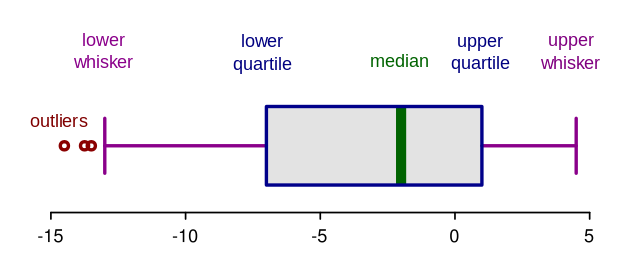 <br />
> * It's very easy to detect Outliers through boxplot <br />


```R
# Initially we plot dataset with majour Locations
options(repr.plot.width=16, repr.plot.height=8)
withChina<-ggplot(four, aes(x=Day, y=Confirmed, color=Day)) +
  geom_boxplot(aes(group=Day)) +
  labs(title="Including China") +
  theme_classic() +
  theme(
          text = element_text(family = "Gill Sans")
          ,plot.title = element_text(size = 20, face = "bold", hjust = 0.5)
          ,plot.subtitle = element_text(size = 25, family = "Courier", face = "bold", hjust = 0.5)
          ,axis.text = element_text(size = 12)
          ,axis.title = element_text(size = 20)
  )

cat("\n\n")
withChina
```

    
    


<br /><br /> 

Here we get a continuous sequence of **outliers**, for roughly upto 45 days<br />
Now, as per our previous analysis (through word-clouds and mean-comparison, we assumed the China as this outlier)<br /><br /> 
In order to Test our hypothesis, let's plot China alone, as well as Rest of all data except China


```R
options(repr.plot.width=16, repr.plot.height=8)

chinaAlone <- ggplot(four[which(str_detect(four$Location, "China", negate=F)),], aes(x=Day, y=Confirmed, color=Day)) +
  geom_point(aes(group=Day)) +
  labs(title="Only China") +
  theme_classic() +
  theme(
          text = element_text(family = "Gill Sans")
          ,plot.title = element_text(size = 20, face = "bold", hjust = 0.5)
          ,plot.subtitle = element_text(size = 25, family = "Courier", face = "bold", hjust = 0.5)
          ,axis.text = element_text(size = 12)
          ,axis.title = element_text(size = 20)
  )

withoutChina <- ggplot(four[which(str_detect(four$Location, "China", negate=T)),], aes(x=Day, y=Confirmed, color=Day)) +
  geom_boxplot(aes(group=Day)) +
  labs(title="Excluding China") +
  theme_classic() +
  theme(
          text = element_text(family = "Gill Sans")
          ,plot.title = element_text(size = 20, face = "bold", hjust = 0.5)
          ,plot.subtitle = element_text(size = 25, family = "Courier", face = "bold", hjust = 0.5)
          ,axis.text = element_text(size = 12)
          ,axis.title = element_text(size = 20)
  )

cat("\n\n")
chinaAlone
cat("\n\n")
withoutChina
```

    
    
    
    


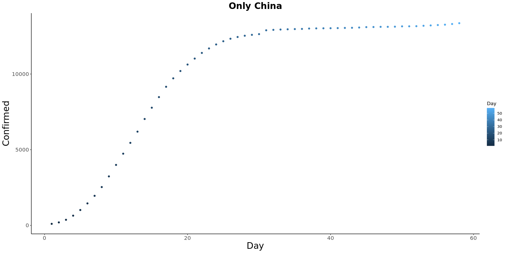


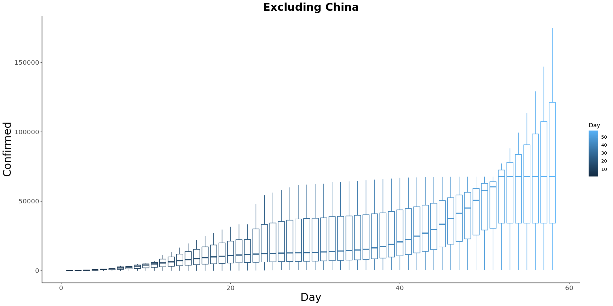


<br /> 
#### Comparing above 2 plots with our previous single plot of the whole (4) data categorize, collectively:-
 
1. First box plots resembles the sequence, that is far more similar to the Outliers' sequence
2. Along with this, when we try plotting the whole data again, after removing the China, we find that there is no outlier, at all
<br /> 
    
So, finally we can say that the **China is an outlier**, and hence we'll study China, separately!


```R
# Let's view few of the rows in existing datasets
head(all)
head(four)
```


<table>
<thead><tr><th scope=col>Country</th><th scope=col>Day</th><th scope=col>Date</th><th scope=col>Confirmed</th><th scope=col>Deaths</th><th scope=col>Recovered</th><th scope=col>Active.Cases</th><th scope=col>Closed.Cases</th></tr></thead>
<tbody>
	<tr><td>Afghanistan</td><td>1          </td><td>22-01-2020 </td><td>0          </td><td>0          </td><td>0          </td><td>0          </td><td>0          </td></tr>
	<tr><td>Afghanistan</td><td>2          </td><td>23-01-2020 </td><td>0          </td><td>0          </td><td>0          </td><td>0          </td><td>0          </td></tr>
	<tr><td>Afghanistan</td><td>3          </td><td>24-01-2020 </td><td>0          </td><td>0          </td><td>0          </td><td>0          </td><td>0          </td></tr>
	<tr><td>Afghanistan</td><td>4          </td><td>25-01-2020 </td><td>0          </td><td>0          </td><td>0          </td><td>0          </td><td>0          </td></tr>
	<tr><td>Afghanistan</td><td>5          </td><td>26-01-2020 </td><td>0          </td><td>0          </td><td>0          </td><td>0          </td><td>0          </td></tr>
	<tr><td>Afghanistan</td><td>6          </td><td>27-01-2020 </td><td>0          </td><td>0          </td><td>0          </td><td>0          </td><td>0          </td></tr>
</tbody>
</table>


<table>
<thead><tr><th scope=col>Location</th><th scope=col>Day</th><th scope=col>Date</th><th scope=col>Confirmed</th><th scope=col>Deaths</th><th scope=col>Recovered</th><th scope=col>Active.Cases</th><th scope=col>Closed.Cases</th></tr></thead>
<tbody>
	<tr><td>Hubei     </td><td>1         </td><td>22-01-2020</td><td> 444      </td><td>17        </td><td>28        </td><td> 399      </td><td> 45       </td></tr>
	<tr><td>Hubei     </td><td>2         </td><td>23-01-2020</td><td> 444      </td><td>17        </td><td>28        </td><td> 399      </td><td> 45       </td></tr>
	<tr><td>Hubei     </td><td>3         </td><td>24-01-2020</td><td> 549      </td><td>24        </td><td>31        </td><td> 494      </td><td> 55       </td></tr>
	<tr><td>Hubei     </td><td>4         </td><td>25-01-2020</td><td> 761      </td><td>40        </td><td>32        </td><td> 689      </td><td> 72       </td></tr>
	<tr><td>Hubei     </td><td>5         </td><td>26-01-2020</td><td>1058      </td><td>52        </td><td>42        </td><td> 964      </td><td> 94       </td></tr>
	<tr><td>Hubei     </td><td>6         </td><td>27-01-2020</td><td>1423      </td><td>76        </td><td>45        </td><td>1302      </td><td>121       </td></tr>
</tbody>
</table>


<hr /> <br /> 
Now, as we aim to analyze the status of COVID-19 within next 10 days, which means that we basically want to analyze the active or closed cases within that time duration.<br /><br />
But, as these 2 are just discrete figures and hence can vary depending upon the Confirmed, Recovery & Death cases<br />
It means all these figures can vary dynamically
<br /><br /> 
So, in this situation, finding any internal relation between the columns Confirmed/Recovery/Death and Active/Closed cases ain't an easy task.<br />
Now, in order to establish a relationship between these, the can take **Rate of Increase** in Active/Closed cases
```
i.e. what percent (%) of Confirmed cases are Active/Closed, and which would simply be depend upon total Confirmed cases
```

<br /> 

Hence, before we move towards creating a suitable model for our problem form available dataset, we'd have to do one last transformation, by adding two more columns to our existing dataset i.e.
    1. Active Cases(%)
    2. Closed Cases(%)


```R
# calculate the percent (using Confirmed cases as total)
percent <- function(dfName){
    get(dfName) -> df
    part <- NULL
    
    for(i in 1:nrow(df)) {
        val = df[i,"Active.Cases"]
        Total = df[i,"Confirmed"]
        
        
        if(i == 1)
            if(val==0)
                part = 0
            else
                part = as.numeric((val*100)/Total)
        else
            if(val==0)
                part = c(part, 0)
            else
                part <- c(part, as.numeric((val*100)/Total))
    }
        
    return(part)
}
```


```R
# CASES -> percentage
four$'percent_active' = percent("four")     # Active cases, out of every 100 Confirmed cases
four$'percent_closed' = 100-percent("four") # Closed cases, out of every 100 Confirmed cases


all$'percent_active' = percent("all")     # Active cases, out of every 100 Confirmed cases
all$'percent_closed' = 100-percent("all") # Closed cases, out of every 100 Confirmed cases

```


```R
# Look onto the structure whether the things are updated or not
str(all)

cat("\n\n")

str(four)
```

    'data.frame':	8874 obs. of  10 variables:
     $ Country       : Factor w/ 153 levels "Afghanistan",..: 1 1 1 1 1 1 1 1 1 1 ...
     $ Day           : int  1 2 3 4 5 6 7 8 9 10 ...
     $ Date          : Factor w/ 58 levels "01-02-2020","01-03-2020",..: 41 43 45 47 49 51 53 55 57 58 ...
     $ Confirmed     : int  0 0 0 0 0 0 0 0 0 0 ...
     $ Deaths        : int  0 0 0 0 0 0 0 0 0 0 ...
     $ Recovered     : int  0 0 0 0 0 0 0 0 0 0 ...
     $ Active.Cases  : int  0 0 0 0 0 0 0 0 0 0 ...
     $ Closed.Cases  : int  0 0 0 0 0 0 0 0 0 0 ...
     $ percent_active: num  0 0 0 0 0 0 0 0 0 0 ...
     $ percent_closed: num  100 100 100 100 100 100 100 100 100 100 ...
    
    
    'data.frame':	232 obs. of  10 variables:
     $ Location      : Factor w/ 4 levels "China","Diamond Princess",..: 3 3 3 3 3 3 3 3 3 3 ...
     $ Day           : int  1 2 3 4 5 6 7 8 9 10 ...
     $ Date          : Factor w/ 58 levels "01-02-2020","01-03-2020",..: 41 43 45 47 49 51 53 55 57 58 ...
     $ Confirmed     : int  444 444 549 761 1058 1423 3554 3554 4903 5806 ...
     $ Deaths        : int  17 17 24 40 52 76 125 125 162 204 ...
     $ Recovered     : int  28 28 31 32 42 45 80 88 90 141 ...
     $ Active.Cases  : int  399 399 494 689 964 1302 3349 3341 4651 5461 ...
     $ Closed.Cases  : int  45 45 55 72 94 121 205 213 252 345 ...
     $ percent_active: num  89.9 89.9 90 90.5 91.1 ...
     $ percent_closed: num  10.14 10.14 10.02 9.46 8.88 ...


### *OK! Everything is set. Now we can go for themodel creation...*

<br /><hr /><br />

## Modeling:

> * [EXTRACTING CHINA](#Extracting-China)
> * [CHOOSING THE RIGHT ALGO.](#Choosing-the-Right-Algo)
> * [DATA SPLITTING: Train-Test](#Data-Splitting-train-test)
> * [ALGORITHMS](#Selection-of-an-algorithm)
>   - [SVMK Regression](#1-support-vector-machine---kernel-regression)
>   - [KNN Regression](#2-k-nearest-neighbours-regression)
>   - [Linear Regression](#3-Linear-Regression)
>   - [Polynomial Regression](#4-Polynomial-regression)


* Now we have the data of all the different countries as well as the aggregate date-wise data of the whole world, too.
* Also, we have data of some special locations, lying far away from the trend (say outliers)
<br /><br /> 
* So, we have to decide that which Country, we are going to do our analysis
    * It can be chosen with the help of the following function


```R

# extracting the desired dataset
extractDatases <- function(region){
    if(region %in% c("Hubei", "World", "Diamond Princess")) {
    temp = four[which(str_detect(four$Location, region)),]
    row.names(temp) <- NULL
} else {
    temp = all[which(str_detect(all$Country, region)),]
    row.names(temp) <- NULL
}

return(temp)
}

```

<br /> 
### Extracting China


```R
# country i.e. to be used throughout the analysis
rName = "China" # without hubei
```


```R
# filtering out desired country/location 
region1 = extractDatases(rName)
```


```R
# so we are missing something, when we have outliers saperatly,
    # better is that we join Hubei data in China so that our Countries' dataset don't have any vulnarability

# joining Hubei for complete data of china
region2 = extractDatases("Hubei")
region = cbind(region1[,1:3], region1[,4:8]+region2[,4:8])
```


```R
# filtering out desired country/location 

region$'percent_active' = percent("region")     # Active cases, out of every 100 Confirmed cases
region$'percent_closed' = 100-percent("region") # Closed cases, out of every 100 Confirmed cases

head(region)
```


<table>
<thead><tr><th scope=col>Country</th><th scope=col>Day</th><th scope=col>Date</th><th scope=col>Confirmed</th><th scope=col>Deaths</th><th scope=col>Recovered</th><th scope=col>Active.Cases</th><th scope=col>Closed.Cases</th><th scope=col>percent_active</th><th scope=col>percent_closed</th></tr></thead>
<tbody>
	<tr><td>China     </td><td>1         </td><td>22-01-2020</td><td> 548      </td><td>17        </td><td>28        </td><td> 503      </td><td> 45       </td><td>91.78832  </td><td>8.211679  </td></tr>
	<tr><td>China     </td><td>2         </td><td>23-01-2020</td><td> 643      </td><td>18        </td><td>30        </td><td> 595      </td><td> 48       </td><td>92.53499  </td><td>7.465008  </td></tr>
	<tr><td>China     </td><td>3         </td><td>24-01-2020</td><td> 920      </td><td>26        </td><td>36        </td><td> 858      </td><td> 62       </td><td>93.26087  </td><td>6.739130  </td></tr>
	<tr><td>China     </td><td>4         </td><td>25-01-2020</td><td>1406      </td><td>42        </td><td>39        </td><td>1325      </td><td> 81       </td><td>94.23898  </td><td>5.761024  </td></tr>
	<tr><td>China     </td><td>5         </td><td>26-01-2020</td><td>2075      </td><td>56        </td><td>49        </td><td>1970      </td><td>105       </td><td>94.93976  </td><td>5.060241  </td></tr>
	<tr><td>China     </td><td>6         </td><td>27-01-2020</td><td>2877      </td><td>82        </td><td>58        </td><td>2737      </td><td>140       </td><td>95.13382  </td><td>4.866180  </td></tr>
</tbody>
</table>


<br /> 
Because, it is the dataset of China, the **Country** column is not necessary.<br />
Simillarly, there is no need of **Date**, when we have Day


```R
region=region[,c(-1, -3)]
head(region, 10)
```


<table>
<thead><tr><th scope=col>Day</th><th scope=col>Confirmed</th><th scope=col>Deaths</th><th scope=col>Recovered</th><th scope=col>Active.Cases</th><th scope=col>Closed.Cases</th><th scope=col>percent_active</th><th scope=col>percent_closed</th></tr></thead>
<tbody>
	<tr><td> 1      </td><td> 548    </td><td> 17     </td><td> 28     </td><td> 503    </td><td> 45     </td><td>91.78832</td><td>8.211679</td></tr>
	<tr><td> 2      </td><td> 643    </td><td> 18     </td><td> 30     </td><td> 595    </td><td> 48     </td><td>92.53499</td><td>7.465008</td></tr>
	<tr><td> 3      </td><td> 920    </td><td> 26     </td><td> 36     </td><td> 858    </td><td> 62     </td><td>93.26087</td><td>6.739130</td></tr>
	<tr><td> 4      </td><td>1406    </td><td> 42     </td><td> 39     </td><td>1325    </td><td> 81     </td><td>94.23898</td><td>5.761024</td></tr>
	<tr><td> 5      </td><td>2075    </td><td> 56     </td><td> 49     </td><td>1970    </td><td>105     </td><td>94.93976</td><td>5.060241</td></tr>
	<tr><td> 6      </td><td>2877    </td><td> 82     </td><td> 58     </td><td>2737    </td><td>140     </td><td>95.13382</td><td>4.866180</td></tr>
	<tr><td> 7      </td><td>5509    </td><td>131     </td><td>101     </td><td>5277    </td><td>232     </td><td>95.78871</td><td>4.211291</td></tr>
	<tr><td> 8      </td><td>6087    </td><td>133     </td><td>120     </td><td>5834    </td><td>253     </td><td>95.84360</td><td>4.156399</td></tr>
	<tr><td> 9      </td><td>8141    </td><td>171     </td><td>135     </td><td>7835    </td><td>306     </td><td>96.24125</td><td>3.758752</td></tr>
	<tr><td>10      </td><td>9802    </td><td>213     </td><td>214     </td><td>9375    </td><td>427     </td><td>95.64375</td><td>4.356254</td></tr>
</tbody>
</table>


<br /> 

_Now our Dataset is ready for modling_ 

<br />

### Choosing the Right Algo.


```R
# setting the theme
theme_set(theme_classic())
# setting plot size
options(repr.plot.width=8, repr.plot.height=8)
```

<br /> <br /> 
We are working onto a **Predictive Data Analysis** (as discussed earlier) project.<br />
So, in this situation, we can choose between two types of predictive algorithms, based on our objective.<br />
<br /> 

These 2 categories are:-<br />
    
1. Classification
2. Regression


To estimate the future status of COVID-19 cases in China - we'll be using **Regression**


<br /> 

## * Why Regression and not Classification?

<br /> 

* Classification:
    * It is used to categorize the given data-points, there are discrete (i.e. selective) number of the categories.<br />
    * Every new data point (for which the estimation is being made) must belong to any of the existing class/category, only.<br />
<br /><br /> 
* Regression:
    * It predicts the new possible outcome, based on the earlier trend.<br />
    * There is NO such necessity for the predicted value that it must be one among the given set of categories.<br />


<hr /><br /> <br /> 

_We want to calculate that what might be the upcoming figure for _Active Cases' %_ in China, particularly; that ain't be limited values._

<br /> <br /> 
    
That's why, Regression has to be used!!
    


<br /> 

We will compare mainly 3 regression algorithms to predict the required value from rest all of the columns.<br />
Then based onto the accuracy of the prediction using different columns, we'll choose the column that has to be used for prediction.


```R
## REGRASSIONs

# converting from Factor
region$Day <- as.numeric(as.character(region$Day))

x <- as.matrix(region[,1:6, 8])
y <- as.matrix(region[,7])

end = "\n\n#############################################################\n\n\n"

cat("\n\nLinear Regression:\n------------------\n")
# fit model
fit <- lm(percent_active~., region)
# summarize the fit
summary(fit)
# make predictions
predictions <- predict(fit, region)
# summarize accuracy
mse <- sqrt(mean((region$percent_active - predictions)^2))
cat("RMSE: ", mse)


cat(end, "k-Nearest Neighbors:\n--------------------\n")
# load the libraries
# fit model
fit <- knnreg(x, y, k=3)
# summarize the fit
summary(fit)
# make predictions
predictions <- predict(fit, x)
# summarize accuracy
mse <- sqrt(mean((y - predictions)^2))
cat("RMSE: ", mse)


cat(end, "Support Vector Machine:\n-----------------------\n")
# fit model
fit <- ksvm(percent_active~., region, kernel="rbfdot")
# summarize the fit
summary(fit)
# make predictions
predictions <- predict(fit, region)
# summarize accuracy
mse <- sqrt(mean((y - predictions)^2))
cat("RMSE: ", mse)


#############################################################
```

    
    
    Linear Regression:
    ------------------


    
    Call:
    lm(formula = percent_active ~ ., data = region)
    
    Residuals:
           Min         1Q     Median         3Q        Max 
    -1.142e-13 -5.385e-15 -1.048e-15  7.607e-15  5.031e-14 
    
    Coefficients: (2 not defined because of singularities)
                     Estimate Std. Error    t value Pr(>|t|)    
    (Intercept)     1.000e+02  2.119e-14  4.718e+15  < 2e-16 ***
    Day             6.411e-15  1.560e-15  4.109e+00 0.000141 ***
    Confirmed      -1.740e-18  9.716e-19 -1.791e+00 0.079073 .  
    Deaths          2.854e-17  2.979e-17  9.580e-01 0.342505    
    Recovered       1.375e-17  4.069e-18  3.379e+00 0.001385 ** 
    Active.Cases           NA         NA         NA       NA    
    Closed.Cases           NA         NA         NA       NA    
    percent_closed -1.000e+00  3.169e-15 -3.155e+14  < 2e-16 ***
    ---
    Signif. codes:  0 ‘***’ 0.001 ‘**’ 0.01 ‘*’ 0.05 ‘.’ 0.1 ‘ ’ 1
    
    Residual standard error: 2.061e-14 on 52 degrees of freedom
    Multiple R-squared:      1,	Adjusted R-squared:      1 
    F-statistic: 2.615e+31 on 5 and 52 DF,  p-value: < 2.2e-16


    RMSE:  4.812696e-14
    
    #############################################################
    
    
     k-Nearest Neighbors:
    --------------------


            Length Class  Mode   
    learn   2      -none- list   
    k       1      -none- numeric
    theDots 0      -none- list   


    RMSE:  0.5710865
    
    #############################################################
    
    
     Support Vector Machine:
    -----------------------


    Length  Class   Mode 
         1   ksvm     S4 


    RMSE:  2.849818

<hr />
<br /><br /> 

From the summary of different regression algorithms above, we find that **Day** column should be given the priority.

As inn the summary of linear regression:<br /><br /> 
```
                  | Estimate Std.|  Error    |  t value  |  Pr(>|t|)  
     -------------|--------------|-----------|-----------|-----------
     (Intercept)  |  1.000e+02   | 1.202e-14 | 8.319e+15 |   < 2e-16  ***
     Day          |  5.221e-15   | 1.270e-15 | 4.112e+00 |  0.000140  ***
```
<br /> 

* Though, Active Case(%) can easily be calculated if we know Closed Case(%) or data About Confirmed/Death/Recovered cases data
    * but we actually don't have any of these things, because once we know that we'd have the future estimate as well.
    * and won't even this whole analysis.
<br /><br /> 
* So, finally we know that we should choose **Days** for Active Case(%).<br />


```R
# Visualizing the available data as a scatter plot to see how the Active Cases(%) in China has varied over days, since 22nd January, 2020

# Day vs Active Cases(%)
region.scatter.plot <- ggplot(region, aes(x = region$Day, y = region$percent_active)) +
                        geom_point() +
                        labs( x = "Days", y = "Active Cases (%)") +
                        theme(
                              text = element_text(family = "Gill Sans")
                              ,plot.title = element_text(size = 20, face = "bold", hjust = 0.5)
                              ,plot.subtitle = element_text(size = 25, family = "Courier", face = "bold", hjust = 0.5)
                              ,axis.text = element_text(size = 12)
                              ,axis.title = element_text(size = 20)
                              )
              
region.scatter.plot
```


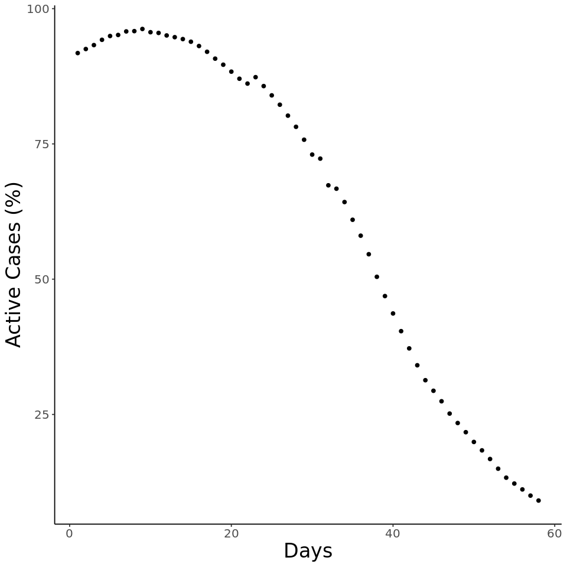


<br /> 
From the above visualization, it's clear that on an average, the active case percentage has kept on decreasing over the days<br />

Now we'll **split** our China dataset for *training(80%) &amp; testing(20%)* 

<br />

### Data Splitting: train-test


```R
set.seed(20) # generages same set of random sample every time

training.samples <- region$Day %>%
  createDataPartition(p = 0.8, list = FALSE)

train.data  <- region[training.samples, ]
test.data <- region[-training.samples, ]

# Dimentions of the splitted datasets
dim(train.data)
dim(test.data)
```


<ol class=list-inline>
	<li>48</li>
	<li>8</li>
</ol>


<ol class=list-inline>
	<li>10</li>
	<li>8</li>
</ol>


```R
head(train.data, 3)
head(test.data, 3)
```


<table>
<thead><tr><th scope=col>Day</th><th scope=col>Confirmed</th><th scope=col>Deaths</th><th scope=col>Recovered</th><th scope=col>Active.Cases</th><th scope=col>Closed.Cases</th><th scope=col>percent_active</th><th scope=col>percent_closed</th></tr></thead>
<tbody>
	<tr><td>1       </td><td>548     </td><td>17      </td><td>28      </td><td>503     </td><td>45      </td><td>91.78832</td><td>8.211679</td></tr>
	<tr><td>2       </td><td>643     </td><td>18      </td><td>30      </td><td>595     </td><td>48      </td><td>92.53499</td><td>7.465008</td></tr>
	<tr><td>3       </td><td>920     </td><td>26      </td><td>36      </td><td>858     </td><td>62      </td><td>93.26087</td><td>6.739130</td></tr>
</tbody>
</table>


<table>
<thead><tr><th></th><th scope=col>Day</th><th scope=col>Confirmed</th><th scope=col>Deaths</th><th scope=col>Recovered</th><th scope=col>Active.Cases</th><th scope=col>Closed.Cases</th><th scope=col>percent_active</th><th scope=col>percent_closed</th></tr></thead>
<tbody>
	<tr><th scope=row>4</th><td> 4      </td><td> 1406   </td><td> 42     </td><td>  39    </td><td> 1325   </td><td>  81    </td><td>94.23898</td><td>5.761024</td></tr>
	<tr><th scope=row>13</th><td>13      </td><td>19716   </td><td>425     </td><td> 615    </td><td>18676   </td><td>1040    </td><td>94.72510</td><td>5.274904</td></tr>
	<tr><th scope=row>15</th><td>15      </td><td>27440   </td><td>563     </td><td>1115    </td><td>25762   </td><td>1678    </td><td>93.88484</td><td>6.115160</td></tr>
</tbody>
</table>


<br />

### Selection of an algorithm
As our training & testing datasets are ready, now we have to select the right regression algorithm to train our model<br /> 
<br />


For this, we will compare four regression algorithms i.e.
    1. Support Vector Machines Regression
    2. k-Nearest Neighbor Regression
    3. Linear Regression
    4. Polynomial Regression
    
<br />

### What should be compared?
* Errors (should be minimized)
* Accuracy (should be maximized)
* R-Squared (R<sup>2</sup>)
* How perfectly the model fits while testing (as in the graphs) etc..


<hr /><br /> 

We'll be comparing 4 regression algorithms including **SVMK** and **kNN**, although these two are mainly known for classification problems.

### 1. Support Vector Machine - Kernel Regression


```R
# model
fit.svmk <- ksvm(percent_active~Day, train.data, kernel="rbfdot")
#summary(fit.svmk)
```


```R
predictions <- fit.svmk %>% predict(train.data)
```


```R
# Model performance
svm.predictions <- data.frame(
  RMSE = RMSE(predictions, train.data$Day),
  R2 = R2(predictions, train.data$Day)
)
```


```R
svmk.trained = cbind( # Prediction for training data
            train.data[,c("Day", "percent_active")],
            Pridicted_percent_active = predict(fit.svmk, train.data)
          )

svmk.tested = cbind(  # Prediction for tested data
            test.data[,c("Day", "percent_active")],
            Pridicted_percent_active = predict(fit.svmk, test.data)
         )


tail(svmk.trained, 5)
tail(svmk.tested, 5)
```


<table>
<thead><tr><th></th><th scope=col>Day</th><th scope=col>percent_active</th><th scope=col>Pridicted_percent_active</th></tr></thead>
<tbody>
	<tr><th scope=row>53</th><td>53       </td><td>14.972153</td><td>17.26605 </td></tr>
	<tr><th scope=row>55</th><td>55       </td><td>12.224649</td><td>13.81184 </td></tr>
	<tr><th scope=row>56</th><td>56       </td><td>11.140171</td><td>12.97371 </td></tr>
	<tr><th scope=row>57</th><td>57       </td><td> 9.995931</td><td>13.09887 </td></tr>
	<tr><th scope=row>58</th><td>58       </td><td> 9.084860</td><td>14.37292 </td></tr>
</tbody>
</table>


<table>
<thead><tr><th></th><th scope=col>Day</th><th scope=col>percent_active</th><th scope=col>Pridicted_percent_active</th></tr></thead>
<tbody>
	<tr><th scope=row>39</th><td>39      </td><td>46.87610</td><td>49.87923</td></tr>
	<tr><th scope=row>41</th><td>41      </td><td>40.39133</td><td>43.38354</td></tr>
	<tr><th scope=row>47</th><td>47      </td><td>25.15992</td><td>28.07431</td></tr>
	<tr><th scope=row>50</th><td>50      </td><td>19.91572</td><td>23.13298</td></tr>
	<tr><th scope=row>54</th><td>54      </td><td>13.31185</td><td>15.34209</td></tr>
</tbody>
</table>


```R
# Visualizations

svmk.trainer <- ggplot(train.data, aes(Day, percent_active) ) +
              geom_point() +
              geom_smooth(data=svmk.trained, method="loess", size=0) +
              geom_line(data = svmk.trained, aes(Day, Pridicted_percent_active), color="#3366fe", size=1) +   # polynomial function
  
              # decoration
              labs( x = "Days", y = "Active Cases (%)", title = paste("\nTraining plot", rName, sep = " - ") ) +
              theme( plot.title = element_text(size = 20, face = "bold")) 

svmk.tester <- ggplot(test.data, aes(Day, percent_active) ) +
              geom_point() +
              geom_smooth(data=svmk.tested, method="loess", size=0) +
              geom_line(data = svmk.tested, aes(Day, Pridicted_percent_active), color="#3366fe", size=1) +   # polynomial function
  
              # decoration
              labs( x = "Days", y = "Active Cases (%)", title = paste("\nTesting plot", rName, sep = " - ") ) +
              theme( plot.title = element_text(size = 20, face = "bold")) 


```


```R
#  Plotting
svmk.trainer
svmk.tester
```


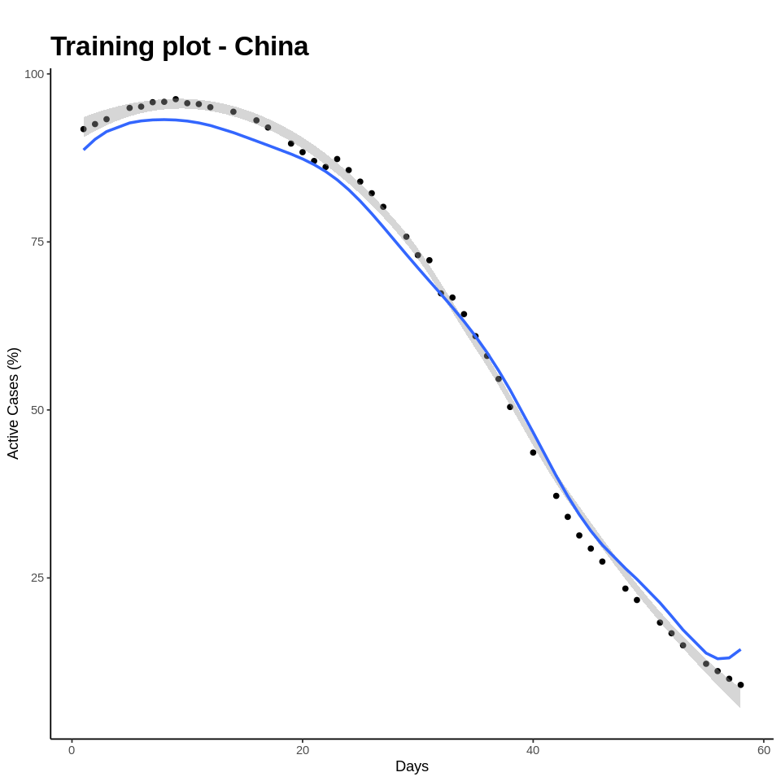


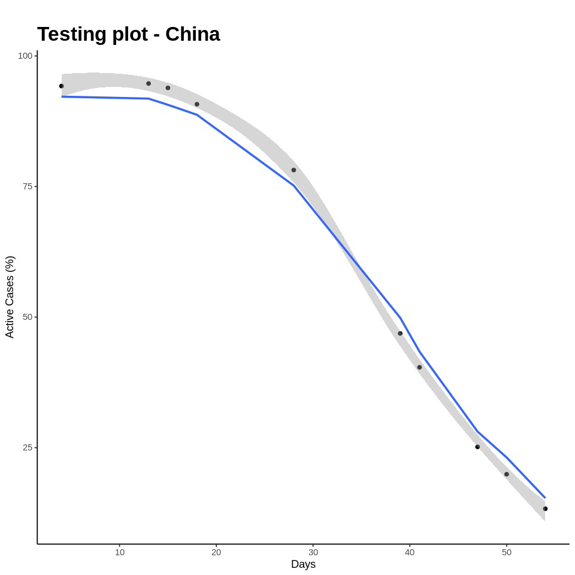


<br /><br /> 

### 2. k-Nearest Neighbours Regression


```R
x <- as.matrix(train.data[,1])
y <- as.matrix(train.data[,7])

# fit model
fit.knn <- knnreg(x, y, k=3)
#summary(fit.knn)
```


```R
predictions <- fit.knn %>% predict(x)
```


```R
knn.predictions <- data.frame(
  RMSE = RMSE(predictions, x),
  R2 = R2(predictions, x)
)
```


```R
knn.trained = cbind( # Prediction for training data
            train.data[,c("Day", "percent_active")],
            Pridicted_percent_active = predict(fit.knn, as.matrix(train.data[,1]))
          )

knn.tested = cbind(  # Prediction for tested data
            test.data[,c("Day", "percent_active")],
            Pridicted_percent_active = predict(fit.knn, as.matrix(test.data[,1]))
         )


tail(knn.trained, 5)
tail(knn.tested, 5)
```


<table>
<thead><tr><th></th><th scope=col>Day</th><th scope=col>percent_active</th><th scope=col>Pridicted_percent_active</th></tr></thead>
<tbody>
	<tr><th scope=row>53</th><td>53       </td><td>14.972153</td><td>15.57997 </td></tr>
	<tr><th scope=row>55</th><td>55       </td><td>12.224649</td><td>12.08323 </td></tr>
	<tr><th scope=row>56</th><td>56       </td><td>11.140171</td><td>11.12025 </td></tr>
	<tr><th scope=row>57</th><td>57       </td><td> 9.995931</td><td>10.07365 </td></tr>
	<tr><th scope=row>58</th><td>58       </td><td> 9.084860</td><td>10.07365 </td></tr>
</tbody>
</table>


<table>
<thead><tr><th></th><th scope=col>Day</th><th scope=col>percent_active</th><th scope=col>Pridicted_percent_active</th></tr></thead>
<tbody>
	<tr><th scope=row>39</th><td>39      </td><td>46.87610</td><td>49.56913</td></tr>
	<tr><th scope=row>41</th><td>41      </td><td>40.39133</td><td>38.31875</td></tr>
	<tr><th scope=row>47</th><td>47      </td><td>25.15992</td><td>25.48533</td></tr>
	<tr><th scope=row>50</th><td>50      </td><td>19.91572</td><td>20.06390</td></tr>
	<tr><th scope=row>54</th><td>54      </td><td>13.31185</td><td>13.77505</td></tr>
</tbody>
</table>


```R
# Visualizations
knn.trainer <- ggplot(train.data, aes(Day, percent_active) ) +
              geom_point() +
              geom_smooth(data=knn.tested, method="loess", size=0) +
              geom_line(data = knn.trained, aes(Day, Pridicted_percent_active), color="#3366fe", size=1) +   # polynomial function
  
              # decoration
              labs( x = "Days", y = "Active Cases (%)", title = paste("\nTraining plot", rName, sep = " - ") ) +
              theme( plot.title = element_text(size = 20, face = "bold")) 

knn.tester <- ggplot(test.data, aes(Day, percent_active) ) +
              geom_point() +
              geom_smooth(data=knn.tested, method="loess", size=0) +
              geom_line(data = knn.tested, aes(Day, Pridicted_percent_active), color="#3366fe", size=1) +   # polynomial function
  
              # decoration
              labs( x = "Days", y = "Active Cases (%)", title = paste("\nTesting plot", rName, sep = " - ") ) +
              theme( plot.title = element_text(size = 20, face = "bold")) 


```


```R
# Plotting
knn.trainer
knn.tester
```


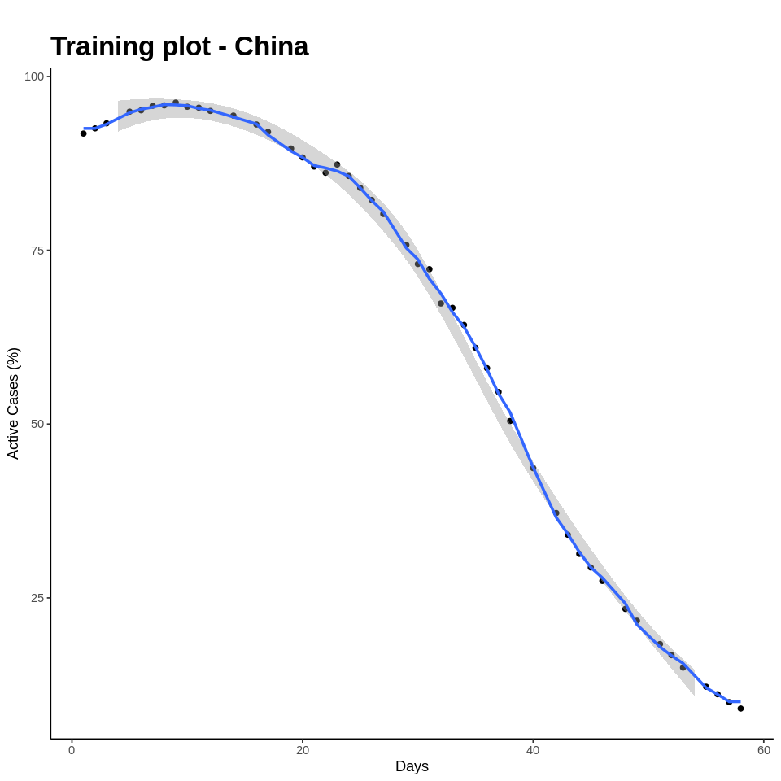


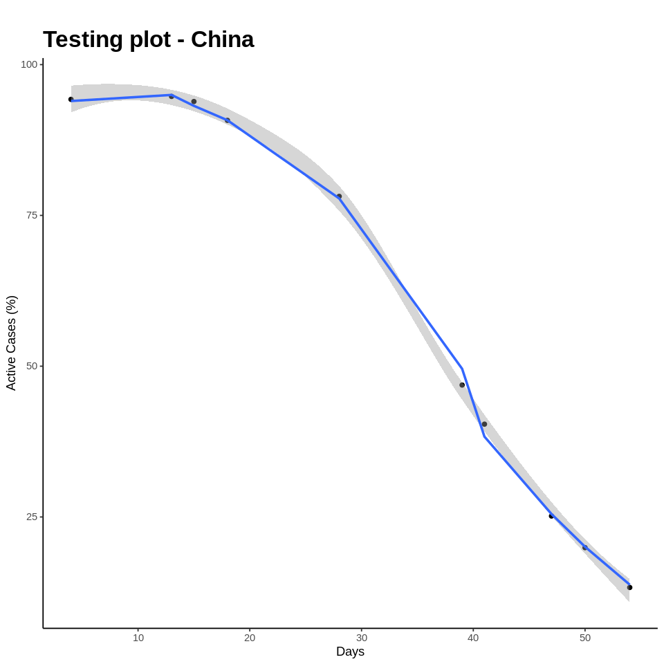


<br /><br />

### 3. Linear Regression


```R
# building linear model
fit.lm = lm(Day ~ percent_active, data = train.data)
#summary(fit.lm)
```


```R
# Predicting
predictions <- fit.lm %>% predict(train.data)
```


```R
# Model performance
lm.predictions <- data.frame(
  RMSE = RMSE(predictions, train.data$Day),
  R2 = R2(predictions, train.data$Day)
)
```


```R
lm.trained = cbind( # Prediction for training data
            train.data[,c("Day", "percent_active")],
            Pridicted_percent_active = predict(fit.lm, train.data)
          )

lm.tested = cbind(  # Prediction for tested data
            test.data[,c("Day", "percent_active")],
            Pridicted_percent_active = predict(fit.lm, test.data)
         )


tail(lm.trained, 5)
tail(lm.tested, 5)
```


<table>
<thead><tr><th></th><th scope=col>Day</th><th scope=col>percent_active</th><th scope=col>Pridicted_percent_active</th></tr></thead>
<tbody>
	<tr><th scope=row>53</th><td>53       </td><td>14.972153</td><td>54.83990 </td></tr>
	<tr><th scope=row>55</th><td>55       </td><td>12.224649</td><td>56.27379 </td></tr>
	<tr><th scope=row>56</th><td>56       </td><td>11.140171</td><td>56.83977 </td></tr>
	<tr><th scope=row>57</th><td>57       </td><td> 9.995931</td><td>57.43693 </td></tr>
	<tr><th scope=row>58</th><td>58       </td><td> 9.084860</td><td>57.91241 </td></tr>
</tbody>
</table>


<table>
<thead><tr><th></th><th scope=col>Day</th><th scope=col>percent_active</th><th scope=col>Pridicted_percent_active</th></tr></thead>
<tbody>
	<tr><th scope=row>39</th><td>39      </td><td>46.87610</td><td>38.18960</td></tr>
	<tr><th scope=row>41</th><td>41      </td><td>40.39133</td><td>41.57392</td></tr>
	<tr><th scope=row>47</th><td>47      </td><td>25.15992</td><td>49.52302</td></tr>
	<tr><th scope=row>50</th><td>50      </td><td>19.91572</td><td>52.25991</td></tr>
	<tr><th scope=row>54</th><td>54      </td><td>13.31185</td><td>55.70639</td></tr>
</tbody>
</table>


```R
# Visualizations
lm.trainer <- ggplot(train.data, aes(Day, percent_active) ) +
              geom_point() +
              stat_smooth(method = lm, formula = y ~ x) +   # linear function
  
              # decoration
              labs( x = "Days", y = "Active Cases (%)", title = paste("\nTraining plot", rName, sep = " - ") ) +
              theme( plot.title = element_text(size = 20, face = "bold")) 

lm.tester <- ggplot(test.data, aes(Day, percent_active) ) +
              geom_point() +
              stat_smooth(method = lm, formula = y ~ x) +   # linear function
  
              # decoration
              labs( x = "Days", y = "Active Cases (%)", title = paste("\nTesting plot", rName, sep = " - ") ) +
              theme( plot.title = element_text(size = 20, face = "bold")) 
```


```R
# Plotting
lm.trainer
lm.tester
```


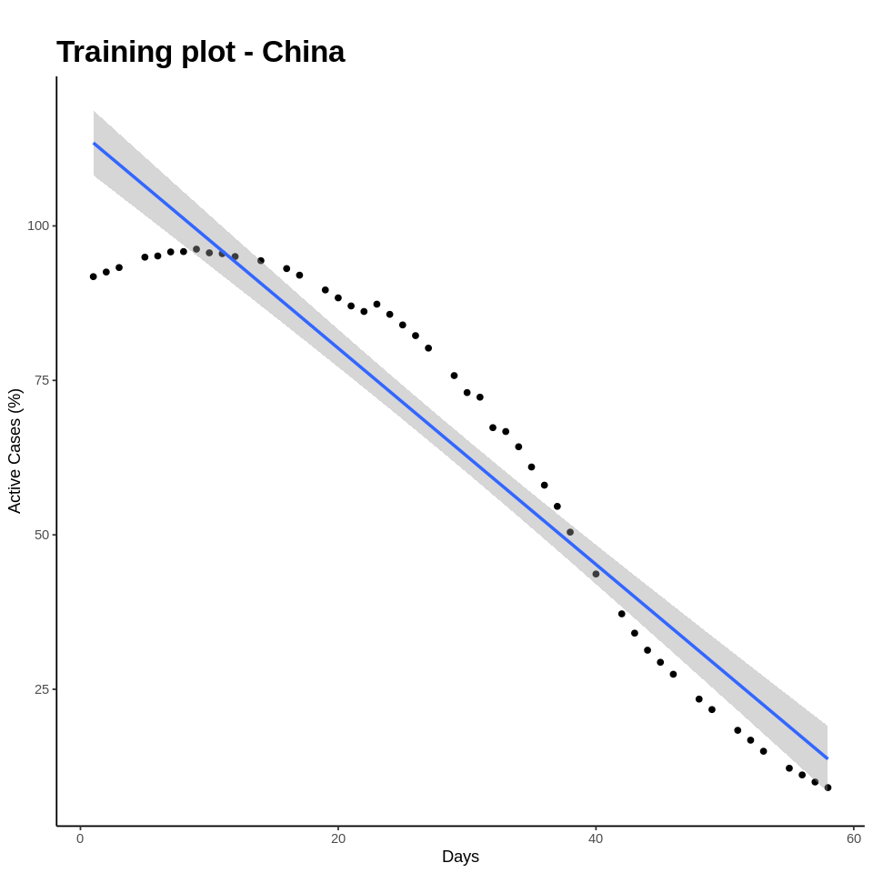


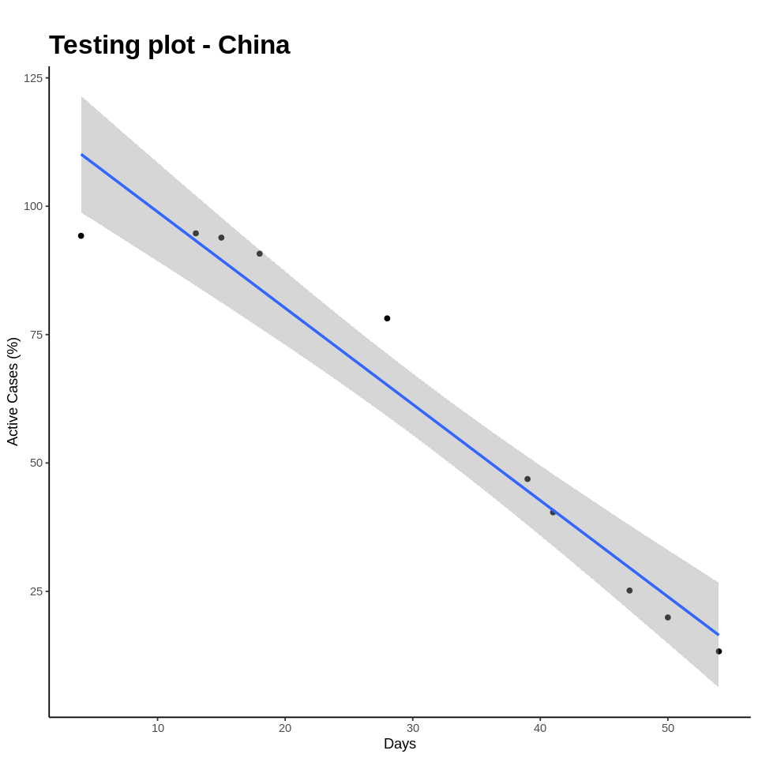


<br /><br />

### 4. Polynomial regression

Checking for the best degree..


```R
# Model performance
plm.predictions = data.frame(
  Degree = NULL,
  RMSE = NULL,
  RSE = NULL,
  R2 = NULL
)


for(deg in 1:20){
    
    # building polynomial model
    fit.plm = lm(percent_active ~ poly(Day, deg, raw = TRUE), data = train.data)
    #summary(fit.plm)

    
    #Residual Standard error (Like Standard Deviation)
    k=length(fit.plm$coefficients)-1
    #Multiple R-Squared (Coefficient of Determination)
    SSyy=sum((train.data$percent_active-mean(train.data$percent_active))**2)
    
    SSE=sum(fit.plm$residuals**2)
    n=length(fit.plm$residuals)
    
    
    # final
    rmse = sqrt(SSE/(n-1))
    rse = sqrt(SSE/(n-(1+k))) #Residual Standard Error
    r2 = (SSyy-SSE)/SSyy
    
    temp <- data.frame(
                        Degree = deg,
                        RMSE = rmse,
                        RSE = rse,
                        R2 = r2
                      )
    
    plm.predictions = rbind(plm.predictions, temp)
}

plm.predictions
```


<table>
<thead><tr><th scope=col>Degree</th><th scope=col>RMSE</th><th scope=col>RSE</th><th scope=col>R2</th></tr></thead>
<tbody>
	<tr><td> 1       </td><td>9.1213834</td><td>9.2199958</td><td>0.9131809</td></tr>
	<tr><td> 2       </td><td>4.6663640</td><td>4.7689337</td><td>0.9772778</td></tr>
	<tr><td> 3       </td><td>2.2460160</td><td>2.3213223</td><td>0.9947360</td></tr>
	<tr><td> 4       </td><td>1.2378209</td><td>1.2941140</td><td>0.9984011</td></tr>
	<tr><td> 5       </td><td>1.2360031</td><td>1.3075064</td><td>0.9984058</td></tr>
	<tr><td> 6       </td><td>0.7801015</td><td>0.8352339</td><td>0.9993650</td></tr>
	<tr><td> 7       </td><td>0.7221723</td><td>0.7828161</td><td>0.9994558</td></tr>
	<tr><td> 8       </td><td>0.6092638</td><td>0.6688397</td><td>0.9996126</td></tr>
	<tr><td> 9       </td><td>0.5836966</td><td>0.6491489</td><td>0.9996445</td></tr>
	<tr><td>10       </td><td>0.5823322</td><td>0.6563249</td><td>0.9996461</td></tr>
	<tr><td>11       </td><td>0.5819927</td><td>0.6649901</td><td>0.9996465</td></tr>
	<tr><td>12       </td><td>0.5591038</td><td>0.6478991</td><td>0.9996738</td></tr>
	<tr><td>13       </td><td>0.5591038</td><td>0.6573579</td><td>0.9996738</td></tr>
	<tr><td>14       </td><td>0.5386723</td><td>0.6428603</td><td>0.9996972</td></tr>
	<tr><td>15       </td><td>0.5386723</td><td>0.6528277</td><td>0.9996972</td></tr>
	<tr><td>16       </td><td>0.5051696</td><td>0.6220214</td><td>0.9997337</td></tr>
	<tr><td>17       </td><td>0.5051696</td><td>0.6323034</td><td>0.9997337</td></tr>
	<tr><td>18       </td><td>0.4912791</td><td>0.6254293</td><td>0.9997481</td></tr>
	<tr><td>19       </td><td>0.4912791</td><td>0.6364997</td><td>0.9997481</td></tr>
	<tr><td>20       </td><td>0.4912791</td><td>0.6481795</td><td>0.9997481</td></tr>
</tbody>
</table>


Form above, at around Degree 16, model attains R-Squared score = 0.999733, as well as the RMSE is also very low
So we'd try taking degree = 16

At **Degree = 16**
> * R<sup>2</sup> = 0.999733
> * RMSE = 0.5051696

<br /> 
So, taking degree of polynomial regression as **16**


```R
deg = 16
```


```R
# building polynomial model
fit.plm = lm(percent_active ~ poly(Day, deg, raw = TRUE), data = train.data)
#summary(fit.plm)
```


```R
plm.trained = cbind( # Prediction for training data
            train.data[,c("Day", "percent_active")],
            Pridicted_percent_active = predict(fit.plm, train.data)  # predicting the values
          )

plm.tested = cbind(  # Prediction for tested data
            test.data[,c("Day", "percent_active")],
            Pridicted_percent_active = predict(fit.plm, test.data)   # predicting the values
         )


tail(plm.trained, 5)
tail(plm.tested, 5)
```


<table>
<thead><tr><th></th><th scope=col>Day</th><th scope=col>percent_active</th><th scope=col>Pridicted_percent_active</th></tr></thead>
<tbody>
	<tr><th scope=row>53</th><td>53       </td><td>14.972153</td><td>14.966792</td></tr>
	<tr><th scope=row>55</th><td>55       </td><td>12.224649</td><td>12.244624</td></tr>
	<tr><th scope=row>56</th><td>56       </td><td>11.140171</td><td>11.129915</td></tr>
	<tr><th scope=row>57</th><td>57       </td><td> 9.995931</td><td>10.013176</td></tr>
	<tr><th scope=row>58</th><td>58       </td><td> 9.084860</td><td> 9.076924</td></tr>
</tbody>
</table>


<table>
<thead><tr><th></th><th scope=col>Day</th><th scope=col>percent_active</th><th scope=col>Pridicted_percent_active</th></tr></thead>
<tbody>
	<tr><th scope=row>39</th><td>39      </td><td>46.87610</td><td>47.44498</td></tr>
	<tr><th scope=row>41</th><td>41      </td><td>40.39133</td><td>40.45985</td></tr>
	<tr><th scope=row>47</th><td>47      </td><td>25.15992</td><td>25.26067</td></tr>
	<tr><th scope=row>50</th><td>50      </td><td>19.91572</td><td>20.17564</td></tr>
	<tr><th scope=row>54</th><td>54      </td><td>13.31185</td><td>13.49354</td></tr>
</tbody>
</table>


```R
# Visualizations of the predictions for Training as well as Testing datasets to see fit
plm.trainer <- ggplot(train.data, aes(Day, percent_active) ) +
              geom_point() +
              stat_smooth(method = lm, formula = y ~ poly(x, deg, raw = TRUE)) +   # polynomial function
  
              # decoration
              labs( x = "Days", y = "Active Cases (%)", title = paste("\nTraining plot", rName, sep = " - ") ) +
              theme( plot.title = element_text(size = 20, face = "bold")) 

plm.tester <- ggplot(test.data, aes(Day, percent_active) ) +
              geom_point() +
              stat_smooth(method = lm, formula = y ~ poly(x, deg, raw = TRUE)) +   # polynomial function
  
              # decoration
              labs( x = "Days", y = "Active Cases (%)", title = paste("\nTesting plot", rName, sep = " - ") ) +
              theme( plot.title = element_text(size = 20, face = "bold")) 

```


```R
# Plotting
plm.trainer
plm.tester
```


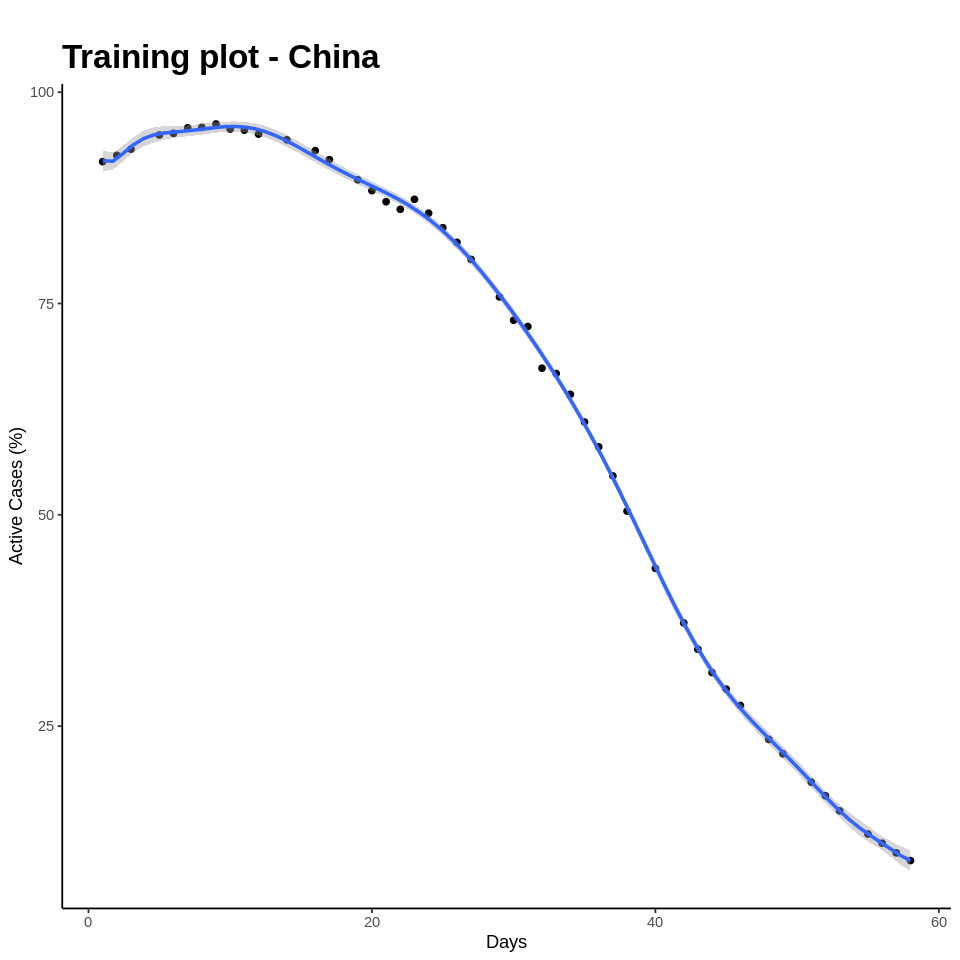


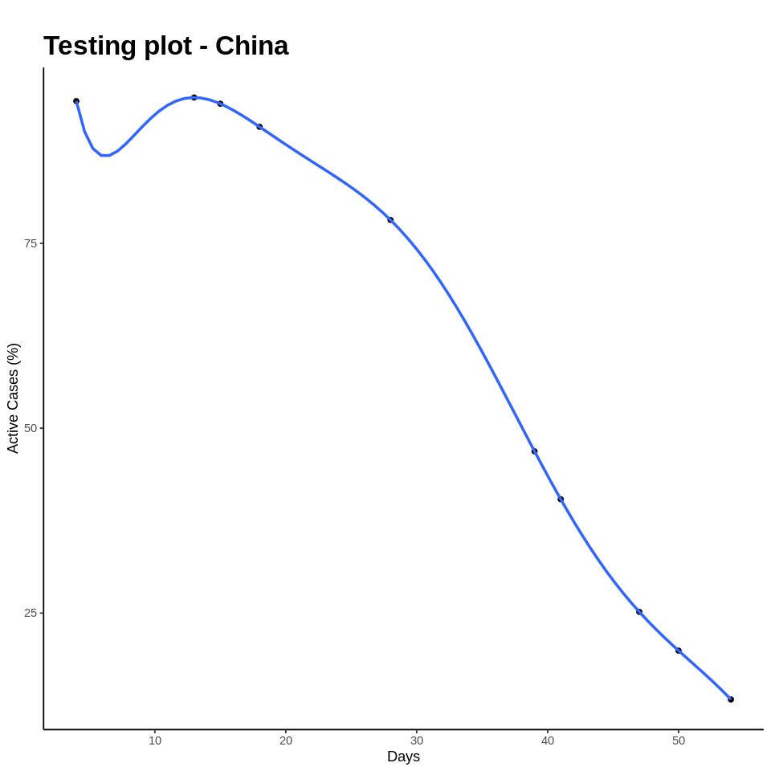


<br /> 

So we can see, here our model fits best for a polynomial regression having degree = 16<br />

> We already have the data of **Day 59: i.e. 8.285436**<br />
> To finalize the model, we will perform a final testing by predicting the Active Cases(%) for Day: 59, 60, 61


Creating A temporary dataset for this prediction


```R
# Available data for 59th day (i.e. 20-03-2020)
temp.test = data.frame(
                        Day = 59:61,
                        Confirmed = c(81251, NaN, NaN),
                        Deaths = c(3253, NaN, NaN),
                        Recovered = c(71266, NaN, NaN),
                        Active.Cases = c(6732, NaN, NaN),
                        Closed.Cases = c(74519, NaN, NaN),
                        percent_active =  c(8.285436, NaN, NaN),
                        percent_closed = c(91.7145, NaN, NaN)
                     )

temp.test
```


<table>
<thead><tr><th scope=col>Day</th><th scope=col>Confirmed</th><th scope=col>Deaths</th><th scope=col>Recovered</th><th scope=col>Active.Cases</th><th scope=col>Closed.Cases</th><th scope=col>percent_active</th><th scope=col>percent_closed</th></tr></thead>
<tbody>
	<tr><td>59      </td><td>81251   </td><td>3253    </td><td>71266   </td><td>6732    </td><td>74519   </td><td>8.285436</td><td>91.7145 </td></tr>
	<tr><td>60      </td><td>  NaN   </td><td> NaN    </td><td>  NaN   </td><td> NaN    </td><td>  NaN   </td><td>     NaN</td><td>    NaN </td></tr>
	<tr><td>61      </td><td>  NaN   </td><td> NaN    </td><td>  NaN   </td><td> NaN    </td><td>  NaN   </td><td>     NaN</td><td>    NaN </td></tr>
</tbody>
</table>


```R
# Now, we'll find the Active case(%) from all the four algorithms
temp.required <- temp.test[,c(1, 7)]
temp.required$"Polynomial Model" <- predict(fit.plm, temp.test)
```


```R
temp.required
```


<table>
<thead><tr><th scope=col>Day</th><th scope=col>percent_active</th><th scope=col>Polynomial Model</th></tr></thead>
<tbody>
	<tr><td>59       </td><td>8.285436 </td><td> 9.781559</td></tr>
	<tr><td>60       </td><td>     NaN </td><td>16.898091</td></tr>
	<tr><td>61       </td><td>     NaN </td><td>42.345397</td></tr>
</tbody>
</table>


<br /> 
Here we see a high rise in the predicted values of Active Case(%), which seems very strange because we already know that China has been very successful to have control over this epidemic.<br />
* It means that - although our model fits best in this scenario, yet there's some problem behind this sudden rise in new Cases.<br /><br />

### Then how our model fits so perfectly??
> * Here comes the term: **Model Overfitting**!
> * Because, we have trained our model to perform such a higher degree, it predicts almost the actual values.
> * That's why, though our model fits very accurate on the training and testing (that has value of dependent variable belonging to the same domain i.e. **[1,58]**) 
    * Yet, whenever it gets any new value (60, 61..) due to **overfitting**, our model fails to give right prediction.
    
<br />


In overfitting, a model works with almost 100% accuracy, but fails to give right output on unseen data.


<br /><br /> 
Hence, we'll have to choose some other degree..<br />
From the degree accuracy table (we generated early), having a look for **Degree = 11**


```R
plm.predictions[which(plm.predictions$Degree == 11),]
```


<table>
<thead><tr><th></th><th scope=col>Degree</th><th scope=col>RMSE</th><th scope=col>RSE</th><th scope=col>R2</th></tr></thead>
<tbody>
	<tr><th scope=row>11</th><td>11       </td><td>0.5819927</td><td>0.6649901</td><td>0.9996465</td></tr>
</tbody>
</table>


<br /> 
It seems a little better, so we'll choose 11 as our degree of polynomial regression.


```R
deg = 11
```


```R
# building polynomial model
fit.plm = lm(percent_active ~ poly(Day, deg, raw = TRUE), data = train.data)
#summary(fit.plm)

########################

## Prediction table
plm.trained = cbind( # Prediction for training data
            train.data[,c("Day", "percent_active")],
            Pridicted_percent_active = predict(fit.plm, train.data)  # predicting the values
          )

plm.tested = cbind(  # Prediction for tested data
            test.data[,c("Day", "percent_active")],
            Pridicted_percent_active = predict(fit.plm, test.data)   # predicting the values
         )


########################

# Graphs for prediction
plm.trainer <- ggplot(train.data, aes(Day, percent_active) ) +
              geom_point() +
              stat_smooth(method = lm, formula = y ~ poly(x, deg, raw = TRUE)) +   # polynomial function
  
              # decoration
              labs( x = "Days", y = "Active Cases (%)", title = paste("\nTraining plot", rName, sep = " - ") ) +
              theme( plot.title = element_text(size = 20, face = "bold")) 

plm.tester <- ggplot(test.data, aes(Day, percent_active) ) +
              geom_point() +
              stat_smooth(method = lm, formula = y ~ poly(x, deg, raw = TRUE)) +   # polynomial function
  
              # decoration
              labs( x = "Days", y = "Active Cases (%)", title = paste("\nTesting plot", rName, sep = " - ") ) +
              theme( plot.title = element_text(size = 20, face = "bold")) 

```


```R
# Prediction table at degree = 6
tail(plm.trained, 5)
tail(plm.tested, 5)
```


<table>
<thead><tr><th></th><th scope=col>Day</th><th scope=col>percent_active</th><th scope=col>Pridicted_percent_active</th></tr></thead>
<tbody>
	<tr><th scope=row>53</th><td>53       </td><td>14.972153</td><td>15.369157</td></tr>
	<tr><th scope=row>55</th><td>55       </td><td>12.224649</td><td>12.339328</td></tr>
	<tr><th scope=row>56</th><td>56       </td><td>11.140171</td><td>10.925893</td></tr>
	<tr><th scope=row>57</th><td>57       </td><td> 9.995931</td><td> 9.793102</td></tr>
	<tr><th scope=row>58</th><td>58       </td><td> 9.084860</td><td> 9.238991</td></tr>
</tbody>
</table>


<table>
<thead><tr><th></th><th scope=col>Day</th><th scope=col>percent_active</th><th scope=col>Pridicted_percent_active</th></tr></thead>
<tbody>
	<tr><th scope=row>39</th><td>39      </td><td>46.87610</td><td>47.21327</td></tr>
	<tr><th scope=row>41</th><td>41      </td><td>40.39133</td><td>40.63074</td></tr>
	<tr><th scope=row>47</th><td>47      </td><td>25.15992</td><td>24.96403</td></tr>
	<tr><th scope=row>50</th><td>50      </td><td>19.91572</td><td>19.83759</td></tr>
	<tr><th scope=row>54</th><td>54      </td><td>13.31185</td><td>13.85174</td></tr>
</tbody>
</table>


```R
# New visualization for prediction
plm.trainer
plm.tester
```


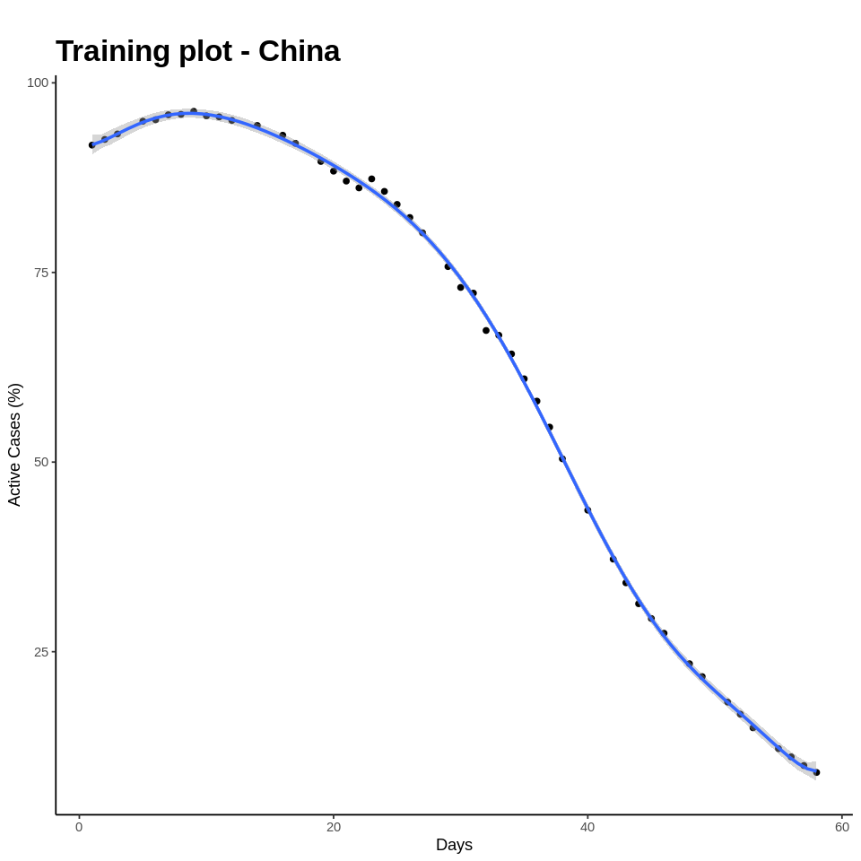


```R
temp.required$"Polynomial Model" <- predict(fit.plm, temp.test)
temp.required
```


<table>
<thead><tr><th scope=col>Day</th><th scope=col>percent_active</th><th scope=col>Polynomial Model</th></tr></thead>
<tbody>
	<tr><td>59       </td><td>8.285436 </td><td> 9.710642</td></tr>
	<tr><td>60       </td><td>     NaN </td><td>11.840712</td></tr>
	<tr><td>61       </td><td>     NaN </td><td>16.487469</td></tr>
</tbody>
</table>


### _So, now it's much better!_

<hr /><br />

## Evaluation:

> * [COMPARISION](#-Comparision-Among-Algorithms)
> * [FINALIZED ALGO.](#-Finalized-Algo)

<br /><br />

### Understanding R<sup>2</sup> & RMSE

#### R vs R<sup>2</sup>
> ### R:
> 1. Correlation b/w **independent** & **dependent** 
> 2. Varies between \[-1, 1\]
> 3. Masures Linear Relation b/w 2 (x,y) quantitative var based on Diection & Strength
> 
> 
> ### R<sup>2</sup>:
> It's nothing other than **R**x**R**
> 1. Corelation b/w x(independent var) & y(dependent var)
> 2. Varies between \[0, 1\]
> 3. How close the data points are to the Regression line i.e. Goodness of fit that further means that how good/correct the predictions are.


#### RMSE
> 1. **This is:**
    * Root Mean Squared Error or
    * Root Mean Squared Devietion or
    * Standered Deviation from the Residuals
> 2. Varies between \[0, 1\]
> 3. Works on the calculation of _how far the **Actual data-points** are as compared to the **Regression Line**_.


### It means:
> 1. When R<sup>2</sup> becomes as close as to 1, **Predicted value** becomes **more accurate**.
> 2. **Daviation** between Predicted & Actual data points **reduces with the reduction of RMSE** value

### * Comparison: Among Algorithms


```R
# Let's evaluate and compare the 4 model algorithms

# Performance (Accurecy) table
Accuracy.Table = data.frame(
                    Algo = c("Support Vector Machine Regression",
                             "k-Nearest Neighbour Regression",
                             "Linear Regression",
                             "Polynomial Regression"),
                    RMSE = c(svm.predictions$RMSE[1],
                             knn.predictions$RMSE[1],
                             lm.predictions$RMSE[1],
                             plm.predictions[deg, 'RMSE']),
                    R2 = c(svm.predictions$R2[1],
                             knn.predictions$R2[1],
                             lm.predictions$R2[1],
                             plm.predictions[deg, 'R2'])
                 )

Accuracy.Table
```


<table>
<thead><tr><th scope=col>Algo</th><th scope=col>RMSE</th><th scope=col>R2</th></tr></thead>
<tbody>
	<tr><td>Support Vector Machine Regression</td><td>56.3856139                       </td><td>0.9164658                        </td></tr>
	<tr><td>k-Nearest Neighbour Regression   </td><td>58.3887824                       </td><td>0.9141718                        </td></tr>
	<tr><td>Linear Regression                </td><td> 4.9293341                       </td><td>0.9131809                        </td></tr>
	<tr><td>Polynomial Regression            </td><td> 0.5819927                       </td><td>0.9996465                        </td></tr>
</tbody>
</table>


```R
# Creating a comparision table to compare the predicted values by all four models
Prediction = cbind(
                "Day" = test.data$Day,
                "Actual Active Case(%)" = test.data$percent_active,
                "Predicted by SVMK" = svmk.tested$Pridicted_percent_active,
                "Predicted by kNN" = knn.tested$Pridicted_percent_active,
                "Predicted by LM" = lm.tested$Pridicted_percent_active,
                "Predicted by Poly LM" = plm.tested$Pridicted_percent_active
             )
Prediction
```


<table>
<thead><tr><th scope=col>Day</th><th scope=col>Actual Active Case(%)</th><th scope=col>Predicted by SVMK</th><th scope=col>Predicted by kNN</th><th scope=col>Predicted by LM</th><th scope=col>Predicted by Poly LM</th></tr></thead>
<tbody>
	<tr><td> 4      </td><td>94.23898</td><td>92.20595</td><td>93.96736</td><td>13.47147</td><td>94.08485</td></tr>
	<tr><td>13      </td><td>94.72510</td><td>91.83658</td><td>94.97576</td><td>13.21776</td><td>94.64569</td></tr>
	<tr><td>15      </td><td>93.88484</td><td>90.64834</td><td>93.16354</td><td>13.65628</td><td>93.36389</td></tr>
	<tr><td>18      </td><td>90.75623</td><td>88.73618</td><td>90.77715</td><td>15.28907</td><td>90.96662</td></tr>
	<tr><td>28      </td><td>78.15822</td><td>75.18151</td><td>77.81573</td><td>21.86382</td><td>78.35243</td></tr>
	<tr><td>39      </td><td>46.87610</td><td>49.87923</td><td>49.56913</td><td>38.18960</td><td>47.21327</td></tr>
	<tr><td>41      </td><td>40.39133</td><td>43.38354</td><td>38.31875</td><td>41.57392</td><td>40.63074</td></tr>
	<tr><td>47      </td><td>25.15992</td><td>28.07431</td><td>25.48533</td><td>49.52302</td><td>24.96403</td></tr>
	<tr><td>50      </td><td>19.91572</td><td>23.13298</td><td>20.06390</td><td>52.25991</td><td>19.83759</td></tr>
	<tr><td>54      </td><td>13.31185</td><td>15.34209</td><td>13.77505</td><td>55.70639</td><td>13.85174</td></tr>
</tbody>
</table>


<br /><br /> 
### * Finalized Algo
<br />


Among these **four** algorithms, our study leads us to choose the Polynomial Regression for modeling.<br /><br />
    
**It is so because:**
> * Based on all four models' performance, it has:
    1. Comparatively better values Root Mean Squared Error (**RMSE**) and R-Squared values (**R<sup>2</sup>**)
    2. Comparatively better predictions  
><br /> 
> * In general:
    1. Polynomial provides the **best approximation of the relationship** between the dependent and independent variable.
    2. A Broad range of function can be fit under it.
    3. Polynomial basically **fits a wide range of curvature**, hence has a better fit.


<br />
 

**We have NOT chosen kNN-Regression because:**
> 1. It is a complex algorithm
> 2. kNN usually works better for classification, because it mainly focuses on its surrounding values, for prediction.


```R
# Appending 59th day's data to our training dataset
train.data = rbind(train.data, temp.test[1,])            # RUN ONCE!!
```


```R
# Renaming row sequence
row.names(train.data) <- NULL
tail(train.data)
```


<table>
<thead><tr><th></th><th scope=col>Day</th><th scope=col>Confirmed</th><th scope=col>Deaths</th><th scope=col>Recovered</th><th scope=col>Active.Cases</th><th scope=col>Closed.Cases</th><th scope=col>percent_active</th><th scope=col>percent_closed</th></tr></thead>
<tbody>
	<tr><th scope=row>44</th><td>53       </td><td>80977    </td><td>3193     </td><td>65660    </td><td>12124    </td><td>68853    </td><td>14.972153</td><td>85.02785 </td></tr>
	<tr><th scope=row>45</th><td>55       </td><td>81033    </td><td>3217     </td><td>67910    </td><td> 9906    </td><td>71127    </td><td>12.224649</td><td>87.77535 </td></tr>
	<tr><th scope=row>46</th><td>56       </td><td>81058    </td><td>3230     </td><td>68798    </td><td> 9030    </td><td>72028    </td><td>11.140171</td><td>88.85983 </td></tr>
	<tr><th scope=row>47</th><td>57       </td><td>81103    </td><td>3241     </td><td>69755    </td><td> 8107    </td><td>72996    </td><td> 9.995931</td><td>90.00407 </td></tr>
	<tr><th scope=row>48</th><td>58       </td><td>81157    </td><td>3249     </td><td>70535    </td><td> 7373    </td><td>73784    </td><td> 9.084860</td><td>90.91514 </td></tr>
	<tr><th scope=row>49</th><td>59       </td><td>81251    </td><td>3253     </td><td>71266    </td><td> 6732    </td><td>74519    </td><td> 8.285436</td><td>91.71450 </td></tr>
</tbody>
</table>


```R
# training once more on updated training dataset
fit.plm = lm(percent_active ~ poly(Day, deg, raw = TRUE), data = train.data)
```


```R
# At this point, we can clearly see that we should one among Polynomial Regession and KNN algo.
# But, we also know that Polynomial Regression better fits into trend as compared to KNN, as per the visualization, above.
# So, we find that Polynomial regression is best

# Hence, we'll be choosing Polynomial Regression with Degree = 16

# now we are ready to go for the last step in our COVID-19 analysis i.e. Deployment & hence, to get the status of China, in few of the upcoming days:
```

<hr /><br /><br />

## Deployment:

> * [SUMMARY](#-Summary)
> * [FINAL RESULT](#Viewing-the-result)

### * Summary
<br />

    
We have trained our model by Polynomial Regression Algorithm<br />
@**Degree:** 11


```R
# Summary of trained model
summary(fit.plm)
```


    
    Call:
    lm(formula = percent_active ~ poly(Day, deg, raw = TRUE), data = train.data)
    
    Residuals:
         Min       1Q   Median       3Q      Max 
    -1.95787 -0.18752  0.02621  0.30405  1.48238 
    
    Coefficients:
                                   Estimate Std. Error t value Pr(>|t|)    
    (Intercept)                   9.194e+01  2.239e+00  41.071   <2e-16 ***
    poly(Day, deg, raw = TRUE)1  -5.966e-01  2.646e+00  -0.226    0.823    
    poly(Day, deg, raw = TRUE)2   6.316e-01  1.065e+00   0.593    0.557    
    poly(Day, deg, raw = TRUE)3  -1.298e-01  2.102e-01  -0.618    0.541    
    poly(Day, deg, raw = TRUE)4   1.396e-02  2.373e-02   0.588    0.560    
    poly(Day, deg, raw = TRUE)5  -9.612e-04  1.661e-03  -0.579    0.566    
    poly(Day, deg, raw = TRUE)6   4.437e-05  7.521e-05   0.590    0.559    
    poly(Day, deg, raw = TRUE)7  -1.374e-06  2.243e-06  -0.613    0.544    
    poly(Day, deg, raw = TRUE)8   2.786e-08  4.370e-08   0.638    0.528    
    poly(Day, deg, raw = TRUE)9  -3.523e-10  5.353e-10  -0.658    0.515    
    poly(Day, deg, raw = TRUE)10  2.507e-12  3.738e-12   0.671    0.507    
    poly(Day, deg, raw = TRUE)11 -7.650e-15  1.135e-14  -0.674    0.504    
    ---
    Signif. codes:  0 ‘***’ 0.001 ‘**’ 0.01 ‘*’ 0.05 ‘.’ 0.1 ‘ ’ 1
    
    Residual standard error: 0.6593 on 37 degrees of freedom
    Multiple R-squared:  0.9997,	Adjusted R-squared:  0.9996 
    F-statistic: 1.005e+04 on 11 and 37 DF,  p-value: < 2.2e-16


```R
# Accurecy
plm.predictions[which(plm.predictions$Degree == deg),]
```


<table>
<thead><tr><th></th><th scope=col>Degree</th><th scope=col>RMSE</th><th scope=col>RSE</th><th scope=col>R2</th></tr></thead>
<tbody>
	<tr><th scope=row>11</th><td>11       </td><td>0.5819927</td><td>0.6649901</td><td>0.9996465</td></tr>
</tbody>
</table>


<br /> <hr />


    
**It was all about the overview of our model!**<br />

    Now we ready to find the estimate of next one week's status of China about Active Case(%)


```R
# Preparing our dataset to store next 7 days' estimate

d = as.Date("21/01/2020", format(c("%d/%m/%Y")))
date = as.character((c(1:7) + d), format(c("%d/%m/%Y")))

finalEstimate <- data.frame(
                             Day = 59:65,
                             Date = date
                           )

```

<br />
Predicting the estimate for the Active Case percentage, that is likely to be on the next 1 week:


```R
finalEstimate$"Estimated Active Case(%)" = predict(fit.plm, finalEstimate)
```

<br />

###  Finally! We have estimated the possible % of Active Cases for next 7 week for China 

#### Viewing the result: 


```R
finalEstimate
```


<table>
<thead><tr><th scope=col>Day</th><th scope=col>Date</th><th scope=col>Estimated Active Case(%)</th></tr></thead>
<tbody>
	<tr><td>59        </td><td>22/01/2020</td><td> 8.400352 </td></tr>
	<tr><td>60        </td><td>23/01/2020</td><td> 8.311558 </td></tr>
	<tr><td>61        </td><td>24/01/2020</td><td> 8.699806 </td></tr>
	<tr><td>62        </td><td>25/01/2020</td><td> 9.441795 </td></tr>
	<tr><td>63        </td><td>26/01/2020</td><td>10.174679 </td></tr>
	<tr><td>64        </td><td>27/01/2020</td><td>10.159197 </td></tr>
	<tr><td>65        </td><td>28/01/2020</td><td> 8.096655 </td></tr>
</tbody>
</table>


<br />

#### As per the sources, we can verify that -
on **25 March**: Hubei lift the lockdown outside of Wuhan that was the most affected state in the whole China.
and on 8th Aplril the total lockdown will be removed. [[source]](https://en.wikipedia.org/wiki/2020_Hubei_lockdowns)

<br /><hr /><br />

# Conclusion:

<br /> 


So by this whole analysis, we come to a conclusion that:

1. there will be a little increase in  the new cases
2. by the end of this week, rate of new confirmed cases will decrease in China
3. after there the rate of Active Cases(%) will decrease more fastly i.e. China will attain the control over the COVID-19 in it's provinces


Hence now China should start to focus on:
1. taking precautions in most sensitive areas in order to ensure no new COVID-19 case.
2. should focus even more to maintain the current status, else new cases might increase again within a few days
3. the majors, that the country has taken till date, should be followed more strictly, for a few more days

Now, a far more COVID-19 cases are closing as compared to those that are being reported, newly.<br />
It is supposed to decrease even more if China focused onto the precautions.<br />
<br />
By the end of this week, the cure of infected patient will prove to be more beneficial then construction even more hospitals/isolation centers etc..


### Following word-cloud Visualization tells how fastly, the China is overcoming the COVID-19


<hr /><br />

# Bibliography:

### Data Sources:


    
> 1. [World Health Organization](https://www.who.int/emergencies/diseases/novel-coronavirus-2019)
> 2. [Johns Hopkins University](https://www.arcgis.com/apps/opsdashboard/index.html#/bda7594740fd40299423467b48e9ecf6)
> 3. [Ministry of Human Resource & Developmant - India](https://www.mohfw.gov.in/)
> 4. [Imperial College of London](https://www.imperial.ac.uk/about/covid-19/)
> 5. [Worldometers](https://www.worldometers.info/coronavirus/)


<hr />
