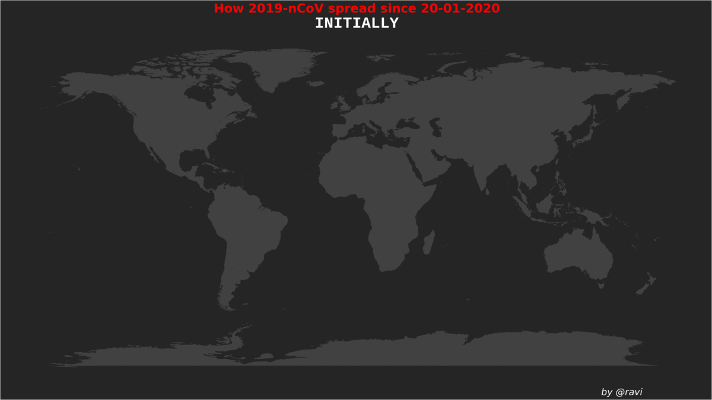
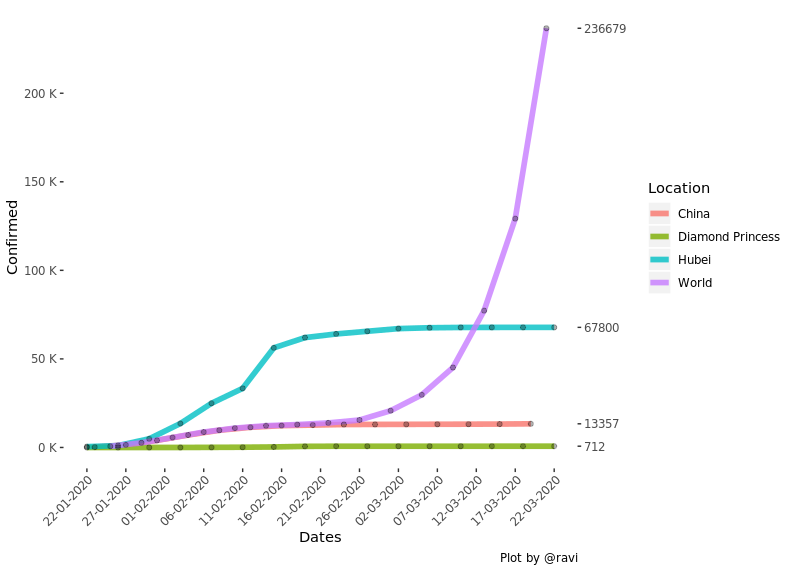
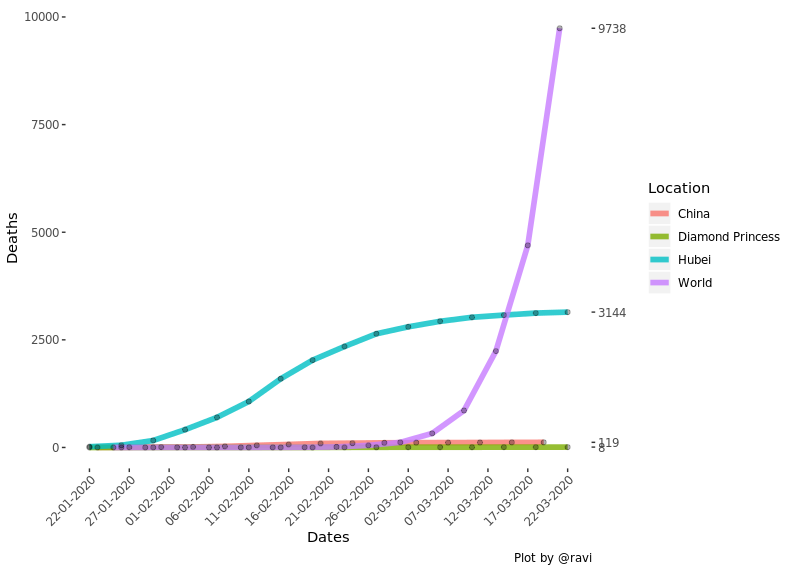
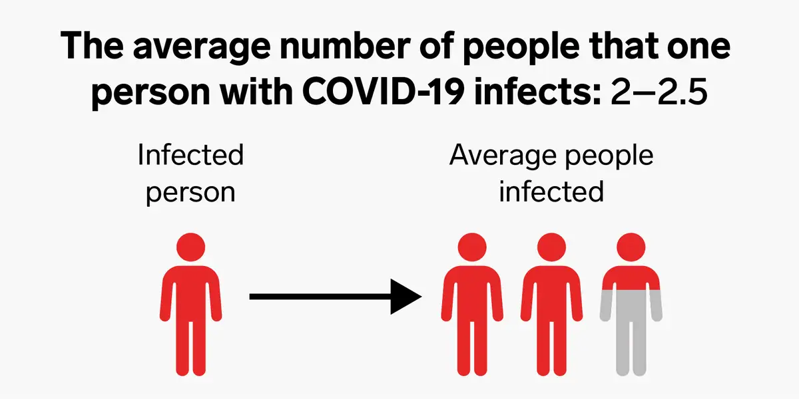
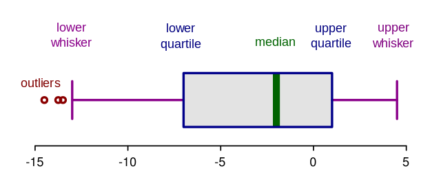

<center>

(A **Data-Science** &amp; **Data-Mining** project for B.Sc. (H) Computer Science) <br />

University Of Delhi

</center>

<hr /><br /><br />


<!----------------------------------------------------------------->
<!----------------------------------------------------------------->

<font size="4">
    
A <font color="#0879b1"><u> **Predictive Data Analysis** </u></font> is a type of data-analysis where after the complete statistical study of the data, the model predicts some estimate when it receives a new datum.
It can be for various types of predictions categorization.

* Some other types of data-analysis can be _Descriptive, Diagnostic or Prescriptive Analysis._

<br />

This <b>Data Mining Project</b> involves a sequence of (<i>six</i>) steps i.e. <br />
    
> <i>a) Business Understanding <br />
> b) Data Understanding <br />
> c) Data Preparation <br />
> d) Modelling <br />
> e) Evaluation <br />
> f) Deployment </i>

</font>


<br /><br />

<center>
## **<u>Main Data-Mining Concepts Used</u>**
</center>

<br />

In this project, I will be using the _**time series dataset(s)**_ that will consist of the data values of different locations, worldwide.

### [DATA PREPROCESSIG](#Data-Understanding) &amp; [POSTPROCESSING](#Data-Preparation)
* Anomaly/Outliers - identification, verification & removal
* Unit Scaling for Normalization
* Identification of the type of **distribution**
* Data Reduction
* Exploratory Data Analysis (EDA) - using __boxplots__ & __scatter-plots__

### [MODELLING](#Modelling)
* Regression
* Model __overfitting__
* SVMK, kNN, Linear &amp; Polynomial Regression Algorithms

### [RESULT EVALUATION](#Evaluation)
* Root Mean Squared Error _(RMSE)_
* R-Squared _(R^2^)_

<br /><hr /><br />

<font size="3">

## **<u>Table of Contents</u>**

> **1. [Introduction](#Introduction)** <br />
> **2. [Business Understanding](#Business-Understanding)** <br />
> **3. [Data Understanding](#Data-Understanding)** <br />
> **4. [Data Preparation](#Data-Preparation)** <br />
> **5. [Modelling](#Modelling)** <br />
> **6. [Evaluation](#Evaluation)** <br />
> **7. [Deployment](#Deployment)** <br />
> **8. [Conclusion](#Conclusion)** <br />
> **9. [Bibliography](#Bibliography)**

</font>


<br /><hr /><br /><br />

#### _The Problem Statement..._

<center>
<font color="#0879b1" size="5">
**~<u>Rate of growth of COVID-19 in China : within next one week</u>~**
</font>
</center>

### **<u id="Introduction">Introduction</u>**

> * [History of Pandemics](#History-of-Pendemics)
> * [novel Coronavirus Diseases: 2020](#novel-Coronavirus-2020)
> * [The Outbreak - COVID-19](#The-Outbreak---COVID-19)


<br /><br /><br />

### <u id="History-of-Pendemics">History of Pandemics:</u>

> * #### Great Plague of Marseille: __1720__
> <font size="3" style="padding: 2%;"> 
As per the records <u>Great Plague of Marseille</u> started when a ship called <u>Grand-Saint-Antoine</u> docked in Marseille, France, carrying a cargo of goods from the eastern Mediterranean. <br />
It continued for the next three years, <u>killing up to <b>30%</b> of the population of Marseille</u>.<br /> 
</font>
> <br />
> * #### First Cholera Pandemic: __1820__
> <font size="3" style="padding: 2%;"> 
In 1820 the <i>First Cholera Pandemic</i> occurred, in <u>Asia</u>, affecting countries, mainly <u>Indonesia, Thailand and the Philippines</u>. This pandemic has also <u>killed about <b>100,000</b></u> as declared officially. It was a bacterial infection caused due to the contaminated water.
<br />
</font>
> <br />
> * #### Spanish Influenza/Flu: __1920__
> <font size="3" style="padding: 2%;"> 
<u>Spanish Flu</u> was the most recent and the most unrelenting pandemics. It has infected about half <u>a billion people</u> and <b>killed 100 million</b>. The Spanish flu holds the official record for the deadliest pandemic officially recorded in history.
</font>

<br />


### <u id="novel-Coronavirus-2020">novel Coronavirus Disease: **2020**</u> 

<font size="4" style="padding: 2%;">
In the 21^st^ century, novel **Co**rona**vi**rus **D**isease (COVID-19) has appeared as the most severe pandemic, originated from **Hubei** province of China.<br /><br /> 
Caused by: **novel Coronavirus - 2**
</font>

### <u>Story of its origin</u>  -

> <font size="3" style="padding: 2%;"> During November, 2019 - a severe viral infection was noticed in **Wuhan**, a city in <u>Hubei provinces of China</u>. On November 17^th^ 2019, the first case of this infection was reported. Doctor's initially took it lightly as if it was a normal fever/cold. But, when a wide range of patients reported similar kind of symptoms, a doctor - **Dr. Li Wenliang** of <u>Chinese Academy of Sciences (**CAS**)</u> Lab, claimed that it was a type of _<u>severe acute respiratory syndrome</u>_, spreading through a new coronavirus transmission in the whole Hubei province, very rapidly. Reportedly, many attempts were made not to leak this, anywhere. But anyhow, this news got exposed during the late December, 2019. In January, Dr. Li himself died suffering with the same deadly viral infection. <br /><br />
As per the sources, in 2003, the same lab found first deadly SARS Coronavirus, leading to 813 casualties, all over the world, within two months! <br /><br />
Initially, it was named as "<u>Wuhan Virus</u>". But, as it started spreading rapidly from Hubei to the whole mainland of China, its name got replaced by term "<u>China Virus</u>".
</font>

<br />


Finally, on **Feb. 11^th^ 2020**, the World Health Organization (WHO) gave the disease an official name: <u>**COVID-19**</u>.<br />
WHO has also declared the COVID-19 as a <u>**pandemic**</u>. 
<br /><br /> 

Since the outbreak of COVID-19, over 350,000 people have been infected throughout the world and **over 15,000 people** have been **killed**.<br /><br />


<center>
*This map shows the daily spread of the 2019-nCoV*
</center>



<br />

### <u id="The-Outbreak---COVID-19">COVID-19: Outbreak in world</u> -

> <font size="3" style="padding: 2%;"> A grand Cruise Ship called <b>Diamond Princess</b> was all set for it's two weeks' journey from <u><b>Yokohama</b> (Japan) to China, Vietnam, Taiwan and back to Japan</u>. Guests boarded it on January 20^th^, but as the journey was about to end, on <b>February 1^st^</b> tested positive for coronavirus, who disembarked in <u>Hong Kong on January 25^th^</u>.<br /><br />
> The cruise was cancelled from sailing as Japanese health instructors asked to check all the passengers, along with the crew.<br /><br />
And since then, the number of confirmed cases for COVID-19 kept increasing. Currently, the ship was carrying over 3500 people.
</font>

<br />

<font size="3">
_**As per the data available, following graphs show the 2019-nCoV cases have increased since Jan. 22^nd^:**_
</font>

<br />

* __Confirmed Cases:__
  
* __Death Cases:__
  
  
<br /><br />


### <u>About the Disease:</u>

<font size="3"> 
The COVID-19 is spread as rapidly as it has the <u>**Reproduction Number** (R-naught) **2.5**</u>.



**Reproduction Number:** is meant for the number of average persons, whom an infected person is further infecting. In more generalized language, on an average, from every COVID-19 patient, virus are getting transmitted to at least 2.5 fit persons.<br />
For <u>Ebola</u>, this number is <u>appx. 1.7</u><br /><br />

In order to have control on any epidemic, the reproducibility score has to be decreased as much as possible.<br /><br />

That's why, most of the highly countries are locked down. In many of them, there are the shortage of hospitals/beds/doctors, too.<br />

Due to the lockdown, the market is also going down.
</font>


<br />

### **Symptoms:** 

<font size="3">
    The _severe acute respiratory syndrome COVID-19_ **(SARS-CoV-19)**, which is often termed as <u>2019-nCoV</u>, as well, is basically a viral disease spread by the <u>novel coronavirus</u> in which the virus tend to attack onto the respiratory system of the patient.<br />

Though the studies are still going on, following are some most common symptoms of COVID-19, known so far:

> 1. Fever
> 2. Dry Cough
> 3. Fatigue
> 4. Shortness of Breath
> 5. Nasal Congestion etc....

<br />

These are the symptoms that are reported by most of the patients. Apart from these, few patients also found to develop <u>aches and pains</u> and <u>get the sniffles</u>, according to data from China.
</font>

<hr /><br />


<!--  ----------------------------------------------------------  -->
<!--  ----------------------------------------------------------  -->


## **<u id="Business-Understanding">Business Understanding:</u>**

<font size="3">
    Now we all are well aware that this is a very severe pandemic i.e. the <u>pandemic of 21^st^ century</u>. Not only this but another major problem is that it has been around **5 months**, since when the _2019-nCoV_ appeared, first.<br /><br /> 
    Scientists are still trying to create the vaccine as soon as possible, but for now, no final cure is up.<br /><br />
</font>

<center>
### <u>**What's the significance of this analysis?**</u>
</center>

<font size="3">
**Due to this pandemic:**
</font>

> 1. Almost every country in the world has at least one confirm case of COVID-19<br />
> 2. The diseases is spreading very rapidly<br />
> 3. Economy of various countries is going down<br />
> 4. Casualties are increasing even more, etc....<br />

China, being the origin of the COVID-19, is the most affected country, in the world.

<br />

#### * This becomes more clear from the following  word-clouds
(total confirmed cases & deaths due to coronavirus till 21/03/2020)

<br /><br />

<center> 


_* Here we find the China to be the most affected country!_ 
</center>

<br /><br />

<center>
<font color="#B40404" size="6">
__\*<u>CONTRIBUTION OF THIS PROJECT</u>\*__
</font>
</center>

<font size="4">
<u>_Finds an estimate about the rate of increase/decrease in appearance of new cases for next one week, in case of China._</u><br /><br />

> 1. This estimate can help the country to know how much new beds/hospitals are going to be required within next few days.<br />
> 2. Helpful for the country in terms of the financial planning, as the economy is also going down.<br />
> 3. Directs where the **focus** has to be driven **first**.
> 4. It would convey a more precise information for deciding that how the money has to be divided for the constructions of new hospitals/isolation centres, COVID-19 test kits, other medical equipments, caring and treatments, etc....

<u>This all would be helpful for other countries as well, in order to bring the Reproduction Number (**R-naught**) down to an acceptable limit.</u> (by applying useful strategies of China)
</font>

<br />
* We'll be preparing separate datasets for generating few of these visualizations, while data-preparation phase.<br />
* For understanding how these visuals are developed from scratch, please refer to [map.R](https://github.com/ravi-prakash1907/A-tracking-of-2019-nCoV/blob/master/COVID-19/map.R) and [visualizer.R](https://github.com/ravi-prakash1907/A-tracking-of-2019-nCoV/blob/master/COVID-19/visualizer.R).


<hr /><br /><br /><br />

<!--  ------------------------------------------------  -->
<!--  ------------------------------------------------  -->


## **<u id="Data-Understanding">Data Understanding:</u>**

> * [DATA &AMP; PROBLEM STATEMENT](#Data--Problem-Statement)
> * [BEGINNING WITH THE CODING SECTION](#Beginning-with-the-coading-section)
> * [DATA COLLECTION](#Data-Collection)


### <span id="Data--Problem-Statement">* Data & Problem Statement</span>

Our aim is to analyse that what would be the status of the epidemic will change, within a week and hence, how log it might take to China to have its control over this infection<br />
Further, we'd aim to generalize it for any of the country, so that we could find the status of the same, whenever required. Obviously, we'd have to change few parameters, tho' we won't have to waste our time again and again in data preparation for a particular country.

<br />

**Hence, we need the data about:**

> 1. <u>Confirmed</u> cases of COVID-19, throughout the world
> 2. <u>Death</u> cases due to COVID-19, throughout the world
> 3. Total <u>Recovery</u> from COVID-19, throughout the world

We've collected this data from various sources including [Johns Hopkins University](https://www.arcgis.com/apps/opsdashboard/index.html), [WHO](https://www.who.int/emergencies/diseases/novel-coronavirus-2019) & [MoHFW - India](https://www.mohfw.gov.in/).

<br />


#### <span id="Beginning-with-the-coading-section">Beginning with the coding section:</span>

_Let's start with setting-up our working directory and load all the required packages, that we would be required:_

<br />


### **Initial Project Setup**

```{r message=FALSE, warning=FALSE, paged.print=FALSE}
#####  Loading LIBRARIES  #####
library(stringr)
library(ggplot2)
library(AUCRF)
library(randomForest)
library(RFmarkerDetector)
library(caret)
library(mlbench)
library(kernlab)
```

<br />

### <span id="Data-Collection">* Data Collection</span>

Basically, we have collected the <b>raw data</b> from websites and GitHub repository.

```{r}
# loading raw data
check.Confirmed = read.csv("static/raw/time_series_19-covid-Confirmed.csv")
check.Deaths = read.csv("static/raw/time_series_19-covid-Deaths.csv")
check.Recovered = read.csv("static/raw/time_series_19-covid-Recovered.csv")
```

The data, that we have collected is in the <b>CSV</b> (i.e. "<u><i>comma-separated values</i></u>") format.<br />
A CSV file is used to store the <i>structured data</i> row-wise, where the data elements in each row is separated by a comma (,).

It's pretty similar to the following:
```
Belinda Jameson,2017,Cushing House,148,3.52
Jeff Smith,2018,Prescott House,17-D,3.20
```
<br />
Let's view the head portion of our raw data:


```{r}
# view sample
head(check.Confirmed)
head(check.Deaths)
head(check.Recovered)
```

<br /><br />

#### We can see that type of collected data is: <u>time-series</u>
> A <b>Time series data</b> of a variable have a set of observations on values at different points of time. They are usually collected at fixed intervals, such as daily, weekly, monthly, annually, quarterly, etc.

<br />
We observe that all the three datasets have same columns as well as the same type of data.

```{r}
# columns
cat("Number of columns in all 3 datasets:-\n\n")

matrix(
    c("Confirmed", "Deaths", "Recovered", ncol(check.Confirmed), ncol(check.Deaths), ncol(check.Recovered)),
    nrow = 2, ncol = 3, byrow = T
)

# Dimention
cat("Dimentions of datasets:-\n")   # same for all 3
dim(check.Confirmed)


######################
# columns' name
#cat("Name of columns in all 3 datasets:-\n")

#colnames(check.Confirmed)
#colnames(check.Deaths)
#colnames(check.Recovered)
```

<br />
Let's see the structure of these datasets:

```{r}
str(check.Confirmed)
#str(check.Deaths)
#str(check.Recovered)
```

<br />

### <u>Explanation of each columns in fetched data:</u>
* There are 3 dedicated databases for data about Confirmed/Death/Recovery cases, all around the world

> #### Province.State:
   > * Data-type: __factor__ they can be specific, unique and valid names
   > * Holds name of City/Province/State, where the data is coming from
   > * Eg.: _Hubei_
>
> #### Country.Region:
   > * Data-type: __factor__ they can be specific, unique and valid names
   > * Holds name of the country, in which the reported area comes
   > * Eg.: _China_ (Hubei is a Province of China)
>
> #### Lat:
   > * Data-type: __numeric__ (i.e. can have values in decimals, too)
   > * Holds the Latitude position of the given place(as in col1)
   > * Eg.: _Latitude_ position of Hubei = 30.9756
>
> #### Long:
   > * Data-type: __numeric__ (i.e. can have values in decimals, too)
   > * Holds the longitude position of the given place(as in col1)
   > * Eg.: _Longitude_ position of Hubei = 112.2707
>
> #### Col. 5 to 62:
   > * Data-type: __integer__ (i.e. discrete) and remains _always positive_ as it determines  the _no, of individuals_
   > * It's a time series data where the data is collected at various interval of time
   > * Each datum value is represented, based on the different days in series (from 22/01/2020)
   > * The constant entity is the location, whose data is represented in every row
   
<br />

```{r}
# showing data of Hubei
cat("A sample data of a location from \"Confirmed Cases\'\" dataset:\n")
check.Confirmed[which(str_detect(check.Confirmed$Province.State, "Hubei")),]
```


<hr /><br /><br /><br />

<!--  ------------------------------------------------  -->
<!--  ------------------------------------------------  -->


## **<u id="Data-Preparation">Data Preparation:</u>**

> * [DATA CLEANING](#Data-Cleaning)
> * [DATA REDUCTION](#Data-Reduction)
>   * [Scaling](#Scaling)
> * [DATA TRANSFORMATION](#Data-transformation)
>   * [Arranging data Country-Wise](#Arrenging-data-Country-Wise)
>   * [Pooled Datasets](#Explaination-of-Pooled-Datasets)
    
<br />

Now, as we have the raw data for our analysis, we can move forward for our next phase i.e. Data-Preparation.<br />
* The data-preparation is considered to be the <u>most time-consuming phase</u> of any data science project.<br />
* On an average, an ideal data-science project's <b>90%</b> of time is spent during Data-Collection and Data-Preparation.<br /><br />


#### <span id="Data-Cleaning">* <u>Data Cleaning</u></span>

Whenever we collect any kind of the raw-data from various sources, it has a lot of the vulnerabilities.<br />

Most often, these are of following types:

1. NAs and NaNs
2. Missing data values
3. Incorrect data values

<br /><br />
Checking for these flaws in our data:


```{r}
# sample NA values
check.Confirmed[which(str_detect(check.Confirmed$Country.Region, "Cruise Ship")),]

# sample wrong data "french guiana" the data value can not decrease on next day
check.Confirmed[which(str_detect(check.Confirmed$Province.State, "French Guiana")),]

# sample blank data ---> State (to be replaced by 'Others')
head(check.Recovered)
```


<br />
So, there are also many issues (like <u>blanks in the place of states' name</u> and data of a <u>Cruise Ship among countries' data</u>) with our available datasets.<br />
To get rid of these issues, the data-cleaning is performed.<br />

For data cleaning, we consider either of these two methods (or both, too):

1. **Removal:**<br />
    Here we usually remove or delete those rows/columns, where we find the vulnerabilities.<br />
    These rows/columns might include NAs.<br /><br />
2. **Replacement/Filling:**<br />
    Here we replace the NAs or incorrect or blanks data values with some acceptable value.<br />
    Mostly, values are replaced by Mean or Mode values, so that the overall statistical structure may remain the same.<br />
    Sometimes, we also fill them on the basis of some specific calculations.

<br />
    
### **What will we do?**

Because we have the time-series dataset populated with discrete data values, storing the total count of the total people (having COVID-19 confirmed, have died due to COVID-19 or have recovered from COVID-19), the issues:

> 1. <u>can NOT be resolved by MEAN</u><br />
>     because in our case, either the Data value can remain CONSTANT or can INCREASE, on every next day.<br />
>     the MEAN need not be discrete<br />
>     MEAN can also be less than the previous data, for any particular day etc...<br /><br />
> 2. <u>can NOT be resolved by MODE</u><br />
>     because it's a medical data and hence, any most often occurring number cannot be blindly replaced with a missing value etc...<br />

Hence, we'll **NOT** be using any of the **replacement of MEAN/MODE/MEDIAN** 


#### <u>We'll replace with maximum values</u>

We will be replacing the missing values or NAs with the maximum value up to a day before the current day.<br />
It means that - the values are carried constant for the next day whose data is missing.


```{r}
# removing NAs, replacing incorrect values

for (i in 1:nrow(check.Confirmed)) {
  for (j in 5:ncol(check.Confirmed)) {
    if(j==5) {
      check.Confirmed[i,j] = ifelse(is.na(check.Confirmed[i, j]), 0, check.Confirmed[i,j])
    } else {
      if(is.na(check.Confirmed[i, j])){
        check.Confirmed[i,j] = check.Confirmed[i, (j-1)]
      } else if(check.Confirmed[i, (j-1)] > check.Confirmed[i, j]){
        check.Confirmed[i,j] = check.Confirmed[i, (j-1)]
      }
    }
  }
}

for (i in 1:nrow(check.Deaths)) {
  for (j in 5:ncol(check.Deaths)) {
    if(j==5) {
      check.Deaths[i,j] = ifelse(is.na(check.Deaths[i, j]), 0, check.Deaths[i,j])
    } else {
      if(is.na(check.Deaths[i, j])){
        check.Deaths[i,j] = check.Deaths[i, (j-1)]
      } else if(check.Deaths[i, (j-1)] > check.Deaths[i, j]){
        check.Deaths[i,j] = check.Deaths[i, (j-1)]
      }
    }
  }
}

for (i in 1:nrow(check.Recovered)) {
  for (j in 5:ncol(check.Recovered)) {
    if(j==5) {
      check.Recovered[i,j] = ifelse(is.na(check.Recovered[i, j]), 0, check.Recovered[i,j])
    } else {
      if(is.na(check.Recovered[i, j])){
        check.Recovered[i,j] = check.Recovered[i, (j-1)]
      } else if(check.Recovered[i, (j-1)] > check.Recovered[i, j]){
        check.Recovered[i,j] = check.Recovered[i, (j-1)]
      }
    }
  }
}

```


```{r}
# replace blanks and incorrect country/state names

# replacing in states
states = as.character(check.Confirmed$Province.State)
states.levels = as.character(levels(check.Confirmed$Province.State))

states[states %in% ""] = "Others"
states.levels[states.levels %in% ""] = "Others"


#######
states[states %in% "From Diamond Princess"] = "Diamond Princess"
states.levels = states.levels[!states.levels %in% "From Diamond Princess"]


# replacing in countries
countries = as.character(check.Confirmed$Country.Region)
countries.levels = as.character(levels(check.Confirmed$Country.Region))

countries[countries %in% "US"] = "United States"
countries[countries %in% "UK"] = "United Kingdom"
countries[countries %in% "Taiwan*"] = "Taiwan"
countries[countries %in% "The Bahamas"] = "Bahamas"
countries[countries %in% "Gambia, The"] = "Gambia"
countries[countries %in% "Korea, South"] = "South Korea"
countries[countries %in% c("Congo (Brazzaville)", "Congo (Kinshasa)", "Republic of the Congo")] = "Democratic Republic of the Congo"
###
countries.levels[countries.levels %in% "US"] = "United States"
countries.levels[countries.levels %in% "UK"] = "United Kingdom"
countries.levels[countries.levels %in% "Taiwan*"] = "Taiwan"
countries.levels[countries.levels %in% "The Bahamas"] = "Bahamas"
countries.levels[countries.levels %in% "Gambia, The"] = "Gambia"
countries.levels[countries.levels %in% "Korea, South"] = "South Korea"

countries.levels = countries.levels[!countries.levels %in% c("Congo (Brazzaville)", "Congo (Kinshasa)", "Republic of the Congo")]
countries.levels = c(countries.levels, "Democratic Republic of the Congo")
###############################
```


```{r}
# rectified fectors
states.factor  = factor(c(states), levels = c(states.levels))
countries.factor  = factor(countries, levels = countries.levels)


## CUZ' INITIAL 4 COLUMNS ARE COMMON IN ALL 3 DATASETS ##

# editing factors in datasets
check.Confirmed = cbind(
                    Province.State = states.factor,
                    Country.Region = countries.factor,
                    check.Confirmed[,3:ncol(check.Confirmed)]
                  )

check.Deaths = cbind(
                    Province.State = states.factor,
                    Country.Region = countries.factor,
                    check.Deaths[,3:ncol(check.Deaths)]
                  )

check.Recovered = cbind(
                    Province.State = states.factor,
                    Country.Region = countries.factor,
                    check.Recovered[,3:ncol(check.Recovered)]
                  )


```


**Now our data has been cleaned.**<br />
Viewing the cleaned data.

```{r}
# sample NA val
check.Confirmed[which(str_detect(check.Confirmed$Country.Region, "Cruise Ship")),]

# sample wrong data "french guiana"
check.Confirmed[which(str_detect(check.Confirmed$Province.State, "French Guiana")),]

# sample blank data ---> State (replaced by 'Other')
head(check.Recovered)
```

<br />
**<u>Identification of the Distribution</u>**<br />

```{r}
# total cases of different catagories on the daily basis
dailyConfirmed = apply(check.Confirmed[,5:ncol(check.Confirmed)], 2, sum)
dailyDeaths = apply(check.Deaths[,5:ncol(check.Deaths)], 2, sum)
dailyRecovered = apply(check.Recovered[,5:ncol(check.Recovered)], 2, sum)

# active cases
dailyActiveCases = dailyConfirmed - (dailyDeaths + dailyRecovered)

# day count till March 21st
days = 1:length(dailyConfirmed)
```

```{r}
trendDF = data.frame(
                Day = days,
                Confirmed = dailyConfirmed,
                Deaths = dailyDeaths,
                Recovered = dailyRecovered,
                Active.Cases = dailyActiveCases)
head(trendDF, 5)
```

**Visualizing this trend**

```{r}
options(repr.plot.width=12, repr.plot.height=10)


ggplot(trendDF, aes(x = Day, y = Active.Cases)) +
    # Active cases in LIGHTBLUE
    geom_point(color = "lightblue") +
    geom_line(color = "lightblue") +

    # Confirmed Cases - RED
    geom_point(aes(y = Confirmed), color = "red") +
    geom_line(aes(y = Confirmed), color = "red") +
    # Death Cases - BLACK
    geom_point(aes(y = Deaths), color = "black") +
    geom_line(aes(y = Deaths), color = "black") +
    # Recovered Cases - GREEN
    geom_point(aes(y = Recovered), color = "green") +
    geom_line(aes(y = Recovered), color = "green") +

    labs(x="Days Count", y="Cases Count") +
    theme_classic() +
    theme(
              text = element_text(family = "Gill Sans")
              ,plot.title = element_text(size = 20, face = "bold", hjust = 0.5)
              ,plot.subtitle = element_text(size = 25, family = "Courier", face = "bold", hjust = 0.5)
              ,axis.text = element_text(size = 12)
              ,axis.title = element_text(size = 20)
      )

```

Here we see that all the main **three** catagories of cases have kept increasing with days!

```{r}
allConfirmed = as.numeric(check.Confirmed[,ncol(check.Confirmed)])
allDeaths = as.numeric(check.Deaths[,ncol(check.Deaths)])
allRecoveries = as.numeric(check.Recovered[,ncol(check.Recovered)])
```

Checking for the mean of Active Cases till **21<sup>st</sup> March**:

```{r}
# finding the mean of each catagories
meanConfirmed = mean(allConfirmed)
meanDeaths = mean(allDeaths)
meanRecovered = mean(allRecoveries)

meanConfirmed
meanDeaths
meanRecovered
```

**This indicates that:**<br />
meanActiveCases = ${\mu}$ = `r 374.93991416309`

<br />

Calculating 1/${\mu}$ using following equation:<br />
**${\lambda}$ = 1/${\mu}$**

```{r}
# once for Confirmed Cases
lambda = 1/meanConfirmed
lambda
```

Here we see that:<br />
**${\lambda}$ > 0**
<br />
_The same thing is also true for rest of the two catagories._
<br /><br />

#### As per our studies till now:

> <u>We find that- at a lot extent, the ternd follows an **Exponential Distribution**, as:</u>
> 
> 1. The Cases are increasing with the Days
> 2. **${\lambda}$ > 0** etc...
> 
> 
> <u>It becomes clear as we look onto the main properties of an *Exponential Distribution*:</u>
> 
> 1. ${\lambda}$ > 0
> 2. mean = ${\mu}$ = 1/${\lambda}$
> 3. x-axis (corresponding to Days) belongs to the \[ 0, ${\infty}$ \)
> 4. y value increases with x

<br />

**_So, we have the data distributed <u>Exponentially</u>_**<br />
Although, we see that trend of active cases do NOT always increase, and hence, it is not distributed exponentially:

```{r}
ggplot(trendDF, aes(x = Day, y = Active.Cases)) +
    # Active cases in BLUE
    geom_point(color = "blue") +
    geom_line(color = "blue") +
    theme_classic()
```

So, we'll have to do modelling that we wiil do later on.

<br />

#### <span id="Data-Reduction">* <u>Data Reduction</u></span>


Though we have cleaned the dataset, yet we see that **'Diamond Princess'** Cruise is still therein among the countries' data.<br />
Hence, it's an outlier, and hence, has to be separated.

**So, now we'll start the process of data reduction**


```{r}
# removing diamond princess
Diamond.Princess.Confirmed = check.Confirmed[ which(str_detect(check.Confirmed$Country.Region, "Cruise Ship", negate = F)), ]
check.Confirmed = check.Confirmed[ which(str_detect(check.Confirmed$Country.Region, "Cruise Ship", negate = T)), ]

Diamond.Princess.Deaths = check.Deaths[ which(str_detect(check.Deaths$Country.Region, "Cruise Ship", negate = F)),]
check.Deaths = check.Deaths[ which(str_detect(check.Deaths$Country.Region, "Cruise Ship", negate = T)), ]

Diamond.Princess.Recovered = check.Recovered[ which(str_detect(check.Recovered$Country.Region, "Cruise Ship", negate = F)), ]
check.Recovered = check.Recovered[ which(str_detect(check.Recovered$Country.Region, "Cruise Ship", negate = T)), ]

## Rectifying Row sequences
row.names(check.Confirmed) <- NULL
row.names(check.Deaths) <- NULL
row.names(check.Recovered) <- NULL
```

**Verifying if it is removed or not:**

```{r}
# Let's check whether Diamond Princess is still at row 166 or not
check.Confirmed[166,]
#check.Deaths[166,]
#check.Recovered[166,]


# also checking dimention
cat("\nEarlier dimention: 468 X 62\n\n")    # as we saw initially

cat("New dimention: ", dim(check.Confirmed))
```

<br />

_**OK! So it's gone!**_

<br />

#### **<u id="Scaling">Scaling</u>**

Now we have the dataset that hold the counts of the COVID-19 cases of different geographical locations.<br />
Hence, we can now create a dataset to generate the map for every unique day.(that we saw early in this project)<br /><br />

* It means, we want to <u>plot all the countries/regions</u> that are affected on a particular day
* It gives us an idea that - among all the given countries, <u>either we are going to plot a selected country on world-map, or not</u>, for a specific day
* the **factor** on which basis we'll be deciding is - <u>whether country has any confirmed case</u> till that day <u>or not</u>

* So, We'd also **need** the _Latitude and Longitude_ position for those country
<br /><br />

Finally, we can roughly estimate that we can have only 2 choices for any region, say **0** & **1**, such that:

> **0**:  don't plot on map, if it has no (total) confirm cases
> <br />
> **1**:  plot on map, if it has some confirm cases i.e. there is at least 1 confirm case on that day

<br />

<font size="3">
    Therefore, We're going to use **Unit Scaling** to set all the values from <u>5^th^ to last column</u>
</font>
<br /> 

```{r}

# in UNIT SCALING, all the data has either 0 or 1 value

ever.Affected = check.Confirmed

# Unit scaling
for (i in row.names(ever.Affected)) {
  for (j in 5:ncol(ever.Affected)) {
    if(ever.Affected[i,j] != 0)
      ever.Affected[i,j] = 1
  }
}

head(ever.Affected)

```


<br />

#### _Next step is to find and remove the outliers:_

We'll use **scatter plots** & **box plots** to _identify_ and **compare the MEAN** of every day to _verify_ these outliers, so that we can remove them, successfully.

```{r warning=FALSE}
# Let's visualize our data to varify:
options(repr.plot.width=12, repr.plot.height=10)

ggplot(check.Confirmed) +
  geom_point(aes(x=check.Confirmed$Province.State, y=check.Confirmed$X1.29.20), color="red", size=2) +
  theme(
          text = element_text(family = "Gill Sans")
          ,plot.title = element_text(size = 20, face = "bold", hjust = 0.5)
          ,plot.subtitle = element_text(size = 25, family = "Courier", face = "bold", hjust = 0.5)
          ,axis.text = element_text(size = 12)
          ,axis.title = element_text(size = 20)
          ,axis.text.x = element_blank()
  )


#ggplot(check.Deaths) +
#  geom_point(aes(x=check.Deaths$Province.State, y=check.Deaths$X1.29.20), color="red", size=2)#

#ggplot(check.Recovered) +
#  geom_point(aes(x=check.Recovered$Province.State, y=check.Recovered$X1.29.20), color="red", size=2)
  
```


```{r}
# Let's find the name of this outlier:-

check.Confirmed[which(check.Confirmed$X1.29.20 > 400), c("Province.State", "Country.Region")]
#check.Deaths[which(check.Deaths$X1.29.20 > 15), c("Province.State", "Country.Region")]
#check.Recovered[which(check.Recovered$X1.29.20 > 20), c("Province.State", "Country.Region")]
```

So, it's **Hubei**.<br />
We'll verify it by comparison of mean value on daily basis, <u>including and excluding the Hubei province</u>. 


```{r}
# Here we are trying to compare the mean values of everyday, including and excluding Hubei province
With.Hubei = as.numeric(apply(check.Confirmed[,5:ncol(check.Confirmed)], 2, mean))

exceptHubei = check.Confirmed[ which(str_detect(check.Confirmed$Province.State, "Hubei", negate = T)), ]
Without.Hubei = as.numeric(apply(exceptHubei[,5:ncol(exceptHubei)], 2, mean))

# creating a dataframe for comperision
Mean.Comparison.Table = data.frame(
              "Date" = as.character(colnames(check.Confirmed)[5:ncol(check.Confirmed)]),
              "With Hubei" = c(With.Hubei),
              "Without Hubei" = c(Without.Hubei))

tail(Mean.Comparison.Table, 10)
```


<br />

So it's clear that the Hubei is the outlier!

```{r}
# let's remove Hubei from our dataset:
Hubei.Confirmed = check.Confirmed[ which(str_detect(check.Confirmed$Province.State, "Hubei", negate = F)), ]
check.Confirmed = check.Confirmed[ which(str_detect(check.Confirmed$Province.State, "Hubei", negate = T)), ]

Hubei.Deaths = check.Deaths[ which(str_detect(check.Deaths$Province.State, "Hubei", negate = F)),]
check.Deaths = check.Deaths[ which(str_detect(check.Deaths$Province.State, "Hubei", negate = T)), ]

Hubei.Recovered = check.Recovered[ which(str_detect(check.Recovered$Province.State, "Hubei", negate = F)), ]
check.Recovered = check.Recovered[ which(str_detect(check.Recovered$Province.State, "Hubei", negate = T)), ]


## Rectifying Row sequences
row.names(check.Confirmed) <- NULL
row.names(check.Deaths) <- NULL
row.names(check.Recovered) <- NULL
```

```{r}
Hubei.Confirmed
```

```{r}
# Let's check the once dimention more

# also checking dimention
cat("\nEarlier dimention: 467 X 62\n\n")    # after removing Cruis Ship

cat("New dimention: ", dim(check.Confirmed))
```

```{r warning=FALSE}
# Let's visualize once more
options(repr.plot.width=12, repr.plot.height=10)

ggplot(check.Confirmed) +
  geom_point(aes(x=check.Confirmed$Province.State, y=check.Confirmed$X1.29.20), color="red", size=2) +
  theme(
          text = element_text(family = "Gill Sans")
          ,plot.title = element_text(size = 20, face = "bold", hjust = 0.5)
          ,plot.subtitle = element_text(size = 25, family = "Courier", face = "bold", hjust = 0.5)
          ,axis.text = element_text(size = 12)
          ,axis.title = element_text(size = 20)
          ,axis.text.x = element_blank()
  )

cat("\n\n")

```

Although now it's comparatively better, still have some outliers...


```{r}
# Let's find them out, too:-
check.Confirmed[which(check.Confirmed$X1.29.20 > 100), c("Province.State", "Country.Region")]
```

```{r}
# Checking for mean comperision
With.China = as.numeric(apply(check.Confirmed[,5:ncol(check.Confirmed)], 2, mean))

exceptChina = check.Confirmed[ which(str_detect(check.Confirmed$Country.Region, "China", negate = T)), ]
Without.China = as.numeric(apply(exceptChina[,5:ncol(exceptChina)], 2, mean))

# comperision
Mean.Comparison.Table = data.frame(
              "Date" = as.character(colnames(check.Confirmed)[5:ncol(check.Confirmed)]),
              "With China" = c(With.China),
              "Without China" = c(Without.China))

head(Mean.Comparison.Table, 10)
```

So, while talking about the whole world, the complete mainland of China seems to be the outlier.
Although, we'll have to verify it first.

<br />
_<u>But because, it's not a single row, we will perform this action later i.e. during data-transformation.</u>_

#### <span id="Data-transformation">* <u>Data transformation</u></span>

```{r}
# We've already saved the cleaned version of the all the files
# Loading the files in order to transform the dataset(s)

# loading raw data - from source
Confirmed = read.csv("../static/cleaned/time_series_19-covid-Confirmed.csv")
Deaths = read.csv("../static/cleaned/time_series_19-covid-Deaths.csv")
Recovered = read.csv("../static/cleaned/time_series_19-covid-Recovered.csv")

Hubei.Confirmed = read.csv("../static/cleaned/Hubei/time_series_19-covid-Confirmed.csv")
Hubei.Deaths = read.csv("../static/cleaned/Hubei/time_series_19-covid-Deaths.csv")
Hubei.Recovered = read.csv("../static/cleaned/Hubei/time_series_19-covid-Recovered.csv")

Diamond.Princess.Confirmed = read.csv("../static/cleaned/Diamond-Princess/time_series_19-covid-Confirmed.csv")
Diamond.Princess.Deaths = read.csv("../static/cleaned/Diamond-Princess/time_series_19-covid-Deaths.csv")
Diamond.Princess.Recovered = read.csv("../static/cleaned/Diamond-Princess/time_series_19-covid-Recovered.csv")
```

```{r}
# as known, all of these files have same set of columns,
# the only things that differ are data values in dates' columns

# Let's see any one dataset's structure (as all are similer)
str(Hubei.Recovered)
```

<font size="3">

* Now, recalling the Problem Statement, we aim to find out the status of COVID-19 in China, within next 7 days
* In order to do so, we need to analyse the status of COVID-19 on all the previous days

</font> 


### _What would it tell us?_
By this, we'd be capable enough to make an estimate by what RATE the Coronavirus is spreading since late January.<br />

Hence, we need to transform the data in order:

> 1. such that rows hold every data <u>Country wise, instead of State wise</u>
> 2. to include a <u>new column "Date"</u> to store aggregate data (of 3 datasets) in a single place
> 3. <u>remove unnecessary columns</u> i.e. *States, Latitude & Longitude*

#### <span id="Arrenging-data-Country-Wise">Arranging data Country-Wise</span>
 
**Steps:**

```{r}
# We need Countries' data:

# It's because: many states have very few cases
tail(Confirmed)

# Most of the states' name is not identified
unknown = nrow(Recovered[which(str_detect(Recovered$Province.State, "Others")),])
cat(unknown, "/", nrow(Recovered), " States are NOT identified")

# Ultimatly, any precaution/cure or action is more likely be taken onto the country level, rather than the individual state, as it's the case of a severe Epidemic
# Only then it would be much easier for us to make any possible estimate for the world as well, due to not having really a huge data about each and every single state of the countries.
```

As we know that Country column is a *Factor*, we <u>can easily list those countries'</u>, who have reported Confirmed cases (on the daily basis):

```{r}
Countries = levels(Confirmed$Country.Region)

cat("\nTotal number of affected countries: ", nlevels(Confirmed$Country.Region), "\n\n\nCountries:", head(as.matrix(Countries), 5) )
# top 5 countries (in sorted list-namewise)
```

```{r}
## Functions for extracting required data


# finds the total cases reported in given country 
    # (by Adding all the data of different states in it)
country.aggregate.daily  <-  function(dfName, country) {
  
  df <- get(dfName)
  df = df[which(str_detect(df$Country.Region, country)),]
  df = cbind(States = df[,1], Country = df[,2], df[,5:ncol(df)])     # ELEMINATING LATITUDE/LONGITUDE Col.
  
  row.names(df) <- NULL    
    
  temp = df                                             # all states' data of a country
  df = temp[1,] 
  
  df[3:ncol(temp)] = apply(   temp[,3:ncol(temp)],
                            2,
                            sum
                        )                               # applying sum of all the states' values
  df = df[2:ncol(df)]                                   # removing column 'States'  
  row.names(df) <- NULL  
  return(df)
}


# generated a dataframe having required data arranged Country-Wise 
    # (by appending every single country's data)
countries.daily <-  function(dfName, cList) {
  
  n = length(cList)       # number of countries
  
  flag = 0
  
  for (i in cList) {
    
    if(flag == 0) {
      df = country.aggregate.daily(dfName, i)
      flag = 1
    } else {
      temp = country.aggregate.daily(dfName, i)
      df = rbind(df, temp)
    }    
  }
  
  row.names(df) <- NULL  
  return(df)
}
```

```{r}
China.Confirmed = country.aggregate.daily("Confirmed", "China")
World.Confirmed = countries.daily("Confirmed", Countries)

China.Confirmed

head(World.Confirmed)

China.Deaths = country.aggregate.daily("Deaths", "China")
World.Deaths = countries.daily("Deaths", Countries)
China.Recovered = country.aggregate.daily("Recovered", "China")
World.Recovered = countries.daily("Recovered", Countries)
```


### **Moving to the next step**

#### We need date wise data:

* It's so because, we aim to analyse data on the daily basis
>  Hence, we'd have to add another column "Date" or simply "Day" (to hold day-> 1, 2...)

* in order to do so, we'd have to transform our data into Cross-sectional (China, Hubei & Diamond Princess) or Pooled data (Countries of world other than China)

#### Let's understand what a <u>Cross-sectional</u> & a <u>Pooled data</u> is:

> * __Cross-sectional data:__ Data of one or more variables, collected at the same point in time.
> * __Pooled data:__ A combination of time series data and cross-sectional data.


```{r}
## Functions

countries.daily.bulk.summary = function(cList) { # date wise country data
  
  # structure of resulting dataset (initially blank)
  df <- data.frame(
    Country = NULL,
    Day = NULL,           # day no.
    Date = NULL,
    Confirmed = NULL,
    Deaths = NULL,
    Recovered = NULL
  )
  
  # calculating all countries' data (date wise) through iteration
  for(i in cList) {
    this.one.confirmed = country.aggregate.daily("Confirmed", i)
    this.one.deaths = country.aggregate.daily("Deaths", i)
    this.one.recovered = country.aggregate.daily("Recovered", i)
    
    times = ncol(this.one.confirmed)-1      # no. of days
    day = 1:times
    d = as.Date("21-01-2020", format(c("%d-%m-%Y")))
    
    date = as.character((day + d), format(c("%d-%m-%Y")))      # its lenngth is equal to --> no. of days
    date = factor(c(date), levels = date)
    
    #max(Deaths.temp[1,5:ncol(Deaths.temp)])
    confirmed = as.numeric(this.one.confirmed[1,2:ncol(this.one.confirmed)])
    
    deaths = as.numeric(this.one.deaths[1,2:ncol(this.one.deaths)])
    
    recovered = as.numeric(this.one.recovered[1,2:ncol(this.one.recovered)])
    
    dataset <- data.frame(
      Country = rep(i, times),
      Day = factor(c(1:length(date)), levels = 1:length(date)),
      Date = date,
      Confirmed = confirmed,
      Deaths = deaths,
      Recovered = recovered
    )
    
    # joining this country
    df = rbind(df, dataset)
  }
    
  return(df)
}

```


```{r}
bulk = countries.daily.bulk.summary(Countries)
head(bulk)
```

<font size="3">
<u>For better analysis, let's add 2 more columns:</u>

> **1. Closed.Cases** = consists all cases, that are Expired or Recovered <br />
> **2. Active.Cases** = cases that are neither Expired nor Recovered

</font>

```{r}
bulk$Active.Cases = bulk$Confirmed - (bulk$Deaths + bulk$Recovered)
bulk$Closed.Cases = bulk$Deaths + bulk$Recovered
tail(bulk)
```

<br /> 
<font size="3">
So, our Pooled dataset is ready.<br />
<u>Let's understand this dataset</u>:-
</font>

```{r}
# Analysing the Pooled data
str(bulk)
```

<br />

## <u id="Explaination-of-Pooled-Datasets">Explanation of Pooled Datasets (bulk & four)</u>

 \* _Pooled data is a combination of time series data and cross-sectional data_ <br /><br />
 
 
Number of columns: 8 <br /> 
Here we are discussing the _**Bulk** dataset_
   
> #### Country:
   > * Datatype: __Factor__ with 153-levels <br /> 
   > * Holds the name of Countries for daily data<br /> 
   > * Eg.: Japan
>
> #### Day:
   > * Datatype: __Factor__ with 58-levels <br /> 
   > * Holds days numbered from 1 up to the last day <br /> 
   > * Eg.: for Jan 22^nd^, Day is 1, Jan 23^rd^, Day is 2 and so on..
>
> #### Date:
   > * Datatype: __Factor__ with 58-levels <br /> 
   > * Holds dates in format __dd-mm-yyyy__ and where individual level has the datatype _Date_ <br /> 
   > * Eg.: 22-01-2020
>
> #### Confirmed:
   > * Datatype: __num__ <br /> 
   > * Holds total number of confirm cases in a country, up to the given date/day <br /> 
   > * Eg.: up to 01-02-2020, Japan reported	20 COVID-19 cases
>
> #### Deaths:
   > * Datatype: __num__ <br /> 
   > * Holds total number of deaths in a country, up to the given date/day <br /> 
   > * Eg.: up to 01-02-2020, Japan reported	no Deaths
>
> #### Recovered:
   > * Datatype: __num__ <br /> 
   > * Holds total number of recoveries in a county, up to the given date/day <br /> 
   > * Eg.: up to 01-02-2020, Japan reported	1 Recoveries
>
> #### Active.Cases:
   > * Datatype: __num__ <br /> 
   > * Holds total Confirmed cases, except Deaths & Recoveries in a country, up to the given date/day <br /> 
   > * Eg.: up to 01-02-2020, Japan had 19 Active cases
>
> #### Closed.Cases:
   > * Datatype: __num__ <br /> 
   > * Holds total number of Recoveries or Deaths in a country, up to the given date/day <br /> 
   > * Eg.: up to 01-02-2020, Japan had closed 1 COVID-19 case
   

#### Now we are all set to filter out China from this dataset!


```{r}
# filtering out the China
China.dataset = bulk[which(str_detect(bulk$Country, 'China')),]

# World Pooled dataset (except china)
bulk = bulk[which(str_detect(bulk$Country, 'China', negate=T)),] # updating bulk itself
```

```{r}
head(China.dataset)
```

<br /> 

<font size="3">

In the same manner, we create <u>two</u> datasets:

* holds <u>**all** the data of all the countries except Hubei in China</u>
* holds whole data categorized into <u>four locations</u>.

<br /><br /> 

**These four locations are:**

> 1. Diamond Princess 
> 2. Hubei province (alone) same as Diamond Princess Cruise Ship
> 3. China alone data (Except Hubei province)
> 4. World (Except China), collectively

The 2^nd^ type of dataset is very necessary because it consists of all the outliers as well...
<br />
* Actually, here we can take them into consideration because:

> 1. Here we are comparing them with the whole World's data collectively
> 2. It's that kind of MEDICAL Data, where outliers can not be ignored! In-fact this single country and that ship are spreading the disease, rapidly.
> 3. This 2^nd^ dataset alone keeps track on the whole data, reported till the last date

</font>

* We've already saved this dataset <br />


```{r}
## Load both date wise-datasets (world & FOUR)
# includes data of all the countries
all = read.csv('../static/pooled/countryWise_bulk_summary.csv')

# includes data of four majour location
four = read.csv('../static/pooled/Four_dataset_locationWise.csv')
```

```{r}
str(all)

cat("\n\n")

str(four)
```

<br />
In the __*all dataset*__, everything is same as in 'Bulk' dataset <br />
In the __*four dataset*__: <br />

> #### **Location:**
   > * Datatype: __Factor__ with 4-levels <br /> 
   > * Holds the name of Locations (as Countries in 'Bulk') for daily data <br /> 
   > * Levels: World, China, Hubei & Diamond Princess <br /> <br />
Rest __7__ columns are same as those of 'Bulk' dataset


### Let's analyse that how China differ from rest of the data using Boxplots

#### **Why Boxplot:-**

> * It's a single visualization that tells about many statistical quantifiers <br />
>  <br />
> * It's very easy to detect Outliers through boxplot <br />


```{r}
# Initially we plot dataset with majour Locations
options(repr.plot.width=12, repr.plot.height=10)
withChina<-ggplot(four, aes(x=Day, y=Confirmed, color=Day)) +
  geom_boxplot(aes(group=Day)) +
  labs(title="Including China") +
  theme_classic() +
  theme(
          text = element_text(family = "Gill Sans")
          ,plot.title = element_text(size = 20, face = "bold", hjust = 0.5)
          ,plot.subtitle = element_text(size = 25, family = "Courier", face = "bold", hjust = 0.5)
          ,axis.text = element_text(size = 12)
          ,axis.title = element_text(size = 20)
  )

cat("\n\n")
withChina
```

<br />
<font size="3">
Here we get a <u>continuous sequence of **outliers**</u>, for roughly up to 45 days<br />
Now, as per our previous analysis (through word-clouds and mean-comparison, we assumed the China as this outlier)<br /><br /> 
In order to Test our hypothesis, let's plot China alone, as well as Rest of all data except China
</font>


```{r}
options(repr.plot.width=12, repr.plot.height=10)

chinaAlone <- ggplot(four[which(str_detect(four$Location, "China", negate=F)),], aes(x=Day, y=Confirmed, color=Day)) +
  geom_point(aes(group=Day)) +
  labs(title="Only China") +
  theme_classic() +
  theme(
          text = element_text(family = "Gill Sans")
          ,plot.title = element_text(size = 20, face = "bold", hjust = 0.5)
          ,plot.subtitle = element_text(size = 25, family = "Courier", face = "bold", hjust = 0.5)
          ,axis.text = element_text(size = 12)
          ,axis.title = element_text(size = 20)
  )

withoutChina <- ggplot(four[which(str_detect(four$Location, "China", negate=T)),], aes(x=Day, y=Confirmed, color=Day)) +
  geom_boxplot(aes(group=Day)) +
  labs(title="Excluding China") +
  theme_classic() +
  theme(
          text = element_text(family = "Gill Sans")
          ,plot.title = element_text(size = 20, face = "bold", hjust = 0.5)
          ,plot.subtitle = element_text(size = 25, family = "Courier", face = "bold", hjust = 0.5)
          ,axis.text = element_text(size = 12)
          ,axis.title = element_text(size = 20)
  )

cat("\n\n")
chinaAlone
cat("\n\n")
withoutChina
```


#### <u>Comparing</u> above two plots with our previous single plot of the whole (four) data categorize, collectively:

<font size="3"> 
1. First box plots resembles the sequence, that is far more similar to the Outliers' sequence
2. Along with this, when we try plotting the whole data again, after removing the China, we find that there is no outlier, at all
<br /> 
    
So, finally we can say that the **China is an outlier**, and hence, we'll study China, separately!
</font>

```{r}
# Let's view few of the rows in existing datasets
head(all)
head(four)
```


<hr /> <br /> 
Now, as we aim to analyse the status of COVID-19 within next 10 days, which means that we basically want to analyse the active or closed cases within that time duration.<br /><br />
But, as these 2 are just discrete figures and hence, can vary depending upon the Confirmed, Recovery & Death cases<br />
It means all these figures can vary dynamically
<br /><br /> 
So, in this situation, finding any internal relation between the columns Confirmed/Recovery/Death and Active/Closed cases ain't an easy task.<br />
Now, in order to establish a relationship between these, the can take <u>**Rate of Increase** in Active/Closed cases</u>
<br />
i.e. what percent (%) of Confirmed cases are Active/Closed, and which would simply be depended upon total Confirmed cases <br /> 

<font size="3">

<u>Hence, before we move towards creating a suitable model for our problem form available dataset, we'd have to do one last transformation, by adding two more columns to our existing dataset i.e.</u>

1. Active Cases(%)
2. Closed Cases(%)

</font>


```{r}
# calculate the percent (using Confirmed cases as total)
percent <- function(dfName){
    get(dfName) -> df
    part <- NULL
    
    for(i in 1:nrow(df)) {
        val = df[i,"Active.Cases"]
        Total = df[i,"Confirmed"]
        
        
        if(i == 1)
            if(val==0)
                part = 0
            else
                part = as.numeric((val*100)/Total)
        else
            if(val==0)
                part = c(part, 0)
            else
                part <- c(part, as.numeric((val*100)/Total))
    }
        
    return(part)
}
```


```{r}
# CASES -> percentage
four$'percent_active' = percent("four")     # Active cases, out of every 100 Confirmed cases
four$'percent_closed' = 100-percent("four") # Closed cases, out of every 100 Confirmed cases


all$'percent_active' = percent("all")     # Active cases, out of every 100 Confirmed cases
all$'percent_closed' = 100-percent("all") # Closed cases, out of every 100 Confirmed cases

```


```{r}
# Look onto the structure whether the things are updated or not
str(all)

cat("\n\n")

str(four)
```


#### _OK! Everything is set. Now we can go for the model creation..._

<hr /><br /><br /><br />


<!--  --------------------------------------------------------------  -->
<!--  --------------------------------------------------------------  -->


## **<u id="Modelling">Modelling:</u>**

> * [EXTRACTING CHINA](#Extracting-China)
> * [CHOOSING THE RIGHT ALGO.](#Choosing-the-Right-Algo)
> * [DATA SPLITTING: Train-Test](#Data-Splitting-train-test)
> * [ALGORITHMS](#Selection-of-an-algorithm)
>   * [Support Vector Machine - kernal Regression](#SVMK)
>   * [k-Nearest Neighbour Regression](#KNN)
>   * [Linear Regression](#LR)
>   * [Polynomial Regression](#PR)

<br />

* Now we have the data of all the different countries as well as the aggregate date-wise data of the whole world, too.
* Also, we have data of some special locations, lying far away from the trend (say outliers)

So, we have to decide that which Country, we are going to do our analysis<br />
It can be chosen with the help of the following function
    
```{r}

# extracting the desired dataset
extractDatases <- function(region){
    if(region %in% c("Hubei", "World", "Diamond Princess")) {
    temp = four[which(str_detect(four$Location, region)),]
    row.names(temp) <- NULL
} else {
    temp = all[which(str_detect(all$Country, region)),]
    row.names(temp) <- NULL
}

return(temp)
}

```

### <span id="Extracting-China">Extracting China</span>

```{r}
# country i.e. to be used throughout the analysis
rName = "China" # without hubei
```

```{r}
# filtering out desired country/location 
region1 = extractDatases(rName)
```


```{r}
# so we are missing something, when we have outliers saperatly,
    # better is that we join Hubei data in China so that our Countries' dataset don't have any vulnarability

# joining Hubei for complete data of china
region2 = extractDatases("Hubei")
region = cbind(region1[,1:3], region1[,4:8]+region2[,4:8])
```


```{r}
# filtering out desired country/location 

region$'percent_active' = percent("region")     # Active cases, out of every 100 Confirmed cases
region$'percent_closed' = 100-percent("region") # Closed cases, out of every 100 Confirmed cases

head(region)
```


<br /> 
Because, it is the dataset of China, the **Country** column is not necessary.<br />
Similarly, there is no need of **Date**, when we have <u>Day</u>


```{r}
region=region[,c(-1, -3)]
head(region, 10)
```


<center> <u><em>Now our Dataset is ready for modelling</em></u> </center>
<br />

### <span id="Choosing-the-Right-Algo">Choosing the Right Algo.</span>

```{r}
# setting the theme
theme_set(theme_classic())
# setting plot size
options(repr.plot.width=8, repr.plot.height=10)
```

We are working onto a **Predictive Data Analysis** (as discussed earlier) project.<br />
So, in this situation, we can choose between two types of predictive algorithms, based on our objective.

<br /><br />

<font size="3">
<u>These 2 categories are</u>:-
    
1. Classification
2. Regression
</font>

<br />

<center>
    <u>To estimate the future status of COVID-19 cases in China - we'll be using <b>Regression</b></u>
</center>


### * Why Regression and not Classification?

<font size="3">

* **<u>Classification</u>:**
    * It is used to categorize the given data-points, there are discrete (i.e. selective) number of the categories.
    * Every new data point (for which the estimation is being made) must belong to any of the existing class/category, only.

* **<u>Regression</u>:**
    * It predicts the new possible outcome, based on the earlier trend.
    * There is NO such necessity for the predicted value that it must be one among the given set of categories.
    
</font>

<hr /><br />

_We want to calculate that what might be the upcoming figure for **Active Cases' %** in China, particularly; that ain't be limited values._

<br />

<center>
<font size="4">
<u>That's why, Regression has to be used!!</u>
</font>
</center>


<br /> 
We will compare mainly <u>3 regression algorithms</u> to predict the required value from rest all the columns.<br />
Then based onto the accuracy of the prediction using different columns, we'll choose the column that has to be used for prediction.


```{r warning=FALSE}
## REGRASSIONs

# converting from Factor
region$Day <- as.numeric(as.character(region$Day))

x <- as.matrix(region[,1:6, 8])
y <- as.matrix(region[,7])

end = "\n\n#############################################################\n\n\n"

cat("\n\nLinear Regression:\n------------------\n")
# fit model
fit <- lm(percent_active~., region)
# summarize the fit
summary(fit)
# make predictions
predictions <- predict(fit, region)
# summarize accuracy
mse <- sqrt(mean((region$percent_active - predictions)^2))
cat("RMSE: ", mse)


cat(end, "k-Nearest Neighbours:\n--------------------\n")
# load the libraries
# fit model
fit <- knnreg(x, y, k=3)
# summarize the fit
summary(fit)
# make predictions
predictions <- predict(fit, x)
# summarize accuracy
mse <- sqrt(mean((y - predictions)^2))
cat("RMSE: ", mse)


cat(end, "Support Vector Machine:\n-----------------------\n")
# fit model
fit <- ksvm(percent_active~., region, kernel="rbfdot")
# summarize the fit
summary(fit)
# make predictions
predictions <- predict(fit, region)
# summarize accuracy
mse <- sqrt(mean((y - predictions)^2))
cat("RMSE: ", mse)


#############################################################
```


<br /> 
<font size="3">
    From the summary of different regression algorithms above, we find that <b>Day</b> column should be given the priority.

As in the summary of linear regression:<br />
```
                  | Estimate Std.|  Error    |  t value  |  Pr(>|t|)  
     -------------|--------------|-----------|-----------|-----------
     (Intercept)  |  1.000e+02   | 1.202e-14 | 8.319e+15 |   < 2e-16  ***
     Day          |  5.221e-15   | 1.270e-15 | 4.112e+00 |  0.000140  ***
```

* Though, Active Case(%) can easily be calculated if we know Closed Case(%) or data About Confirmed/Death/Recovered cases data
    * but we actually don't have any of these things, because once we know that we'd have the future estimate as well.
    * and won't even this whole analysis.
<br /><br /> 
* So, finally we know that we should choose **Days** for Active Case(%).<br />
</font>


```{r warning=FALSE}
# Visualizing the available data as a scatter plot to see how the Active Cases(%) in China has varied over days, since 22^nd^ January, 2020

# Day vs Active Cases(%)
region.scatter.plot <- ggplot(region, aes(x = Day, y = percent_active)) +
                        geom_point() +
                        labs( x = "Days", y = "Active Cases (%)") +
                        theme(
                              text = element_text(family = "Gill Sans")
                              ,plot.title = element_text(size = 20, face = "bold", hjust = 0.5)
                              ,plot.subtitle = element_text(size = 25, family = "Courier", face = "bold", hjust = 0.5)
                              ,axis.text = element_text(size = 12)
                              ,axis.title = element_text(size = 20)
                              )
              
region.scatter.plot
```

<br /> 
From the above visualization, it's clear that on an average, the active case percentage has kept on decreasing over the days<br />

Now we'll **split** our China dataset for <u>*training(80%) &amp; testing(20%)*</u> 


#### <u id="Data-Splitting-train-test">Data Splitting: train-test</u>

```{r}
set.seed(20) # generages same set of random sample every time

training.samples <- region$Day %>%
  createDataPartition(p = 0.8, list = FALSE)

train.data  <- region[training.samples, ]
test.data <- region[-training.samples, ]

# Dimentions of the splitted datasets
dim(train.data)
dim(test.data)
```

```{r}
head(train.data, 3)
head(test.data, 3)
```

### <span id="Selection-of-an-algorithm">**Selection of an algorithm**</span>
As our training & testing datasets are ready, now we have to select the <u>right regression algorithm to train our model</u>

<br />

<font size="3">

For this, we will compare four regression algorithms i.e.<br />

1. Support Vector Machines (kernel) Regression
2. k-Nearest Neighbour Regression
3. Linear Regression
4. Polynomial Regression

#### What should be compared?

* Errors (should be minimized)
* Accuracy (should be maximized)
* R-Squared (R^2^) Value
* How perfectly the model fits while testing (as in the graphs) etc...

</font>

<hr />

We'll be comparing 4 regression algorithms including **SVMK** and **kNN**, although these two are mainly known for classification problems.

<br /><br />

### 1. <span id="SVMK">Support Vector Machine Regression</span>

```{r}
# model
fit.svmk <- ksvm(percent_active~Day, train.data, kernel="rbfdot")
#summary(fit.svmk)
```


```{r}
predictions <- fit.svmk %>% predict(train.data)
```

```{r}
# Model performance
svm.predictions <- data.frame(
  RMSE = RMSE(predictions, train.data$Day),
  R2 = R2(predictions, train.data$Day)
)
```


```{r}
svmk.trained = cbind( # Prediction for training data
            train.data[,c("Day", "percent_active")],
            Pridicted_percent_active = predict(fit.svmk, train.data)
          )

svmk.tested = cbind(  # Prediction for tested data
            test.data[,c("Day", "percent_active")],
            Pridicted_percent_active = predict(fit.svmk, test.data)
         )


tail(svmk.trained, 5)
tail(svmk.tested, 5)
```


```{r}
# Visualizations

svmk.trainer <- ggplot(train.data, aes(Day, percent_active) ) +
              geom_point() +
              geom_smooth(data=svmk.trained, method="loess", size=0) +
              geom_line(data = svmk.trained, aes(Day, Pridicted_percent_active), color="#3366fe", size=1) +   # polynomial function
  
              # decoration
              labs( x = "Days", y = "Active Cases (%)", title = paste("\nTraining plot", rName, sep = " - ") ) +
              theme( plot.title = element_text(size = 20, face = "bold")) 

svmk.tester <- ggplot(test.data, aes(Day, percent_active) ) +
              geom_point() +
              geom_smooth(data=svmk.tested, method="loess", size=0) +
              geom_line(data = svmk.tested, aes(Day, Pridicted_percent_active), color="#3366fe", size=1) +   # polynomial function
  
              # decoration
              labs( x = "Days", y = "Active Cases (%)", title = paste("\nTesting plot", rName, sep = " - ") ) +
              theme( plot.title = element_text(size = 20, face = "bold")) 


```


```{r}
#  Plotting
svmk.trainer
svmk.tester
```

<br /><br /> 

### 2. <span id="KNN">k-Nearest Neighbour Regression</span>

```{r}
x <- as.matrix(train.data[,1])
y <- as.matrix(train.data[,7])

# fit model
fit.knn <- knnreg(x, y, k=3)
#summary(fit.knn)
```

```{r}
predictions <- fit.knn %>% predict(x)
```

```{r}
knn.predictions <- data.frame(
  RMSE = RMSE(predictions, x),
  R2 = R2(predictions, x)
)
```

```{r}
knn.trained = cbind( # Prediction for training data
            train.data[,c("Day", "percent_active")],
            Pridicted_percent_active = predict(fit.knn, as.matrix(train.data[,1]))
          )

knn.tested = cbind(  # Prediction for tested data
            test.data[,c("Day", "percent_active")],
            Pridicted_percent_active = predict(fit.knn, as.matrix(test.data[,1]))
         )


tail(knn.trained, 5)
tail(knn.tested, 5)
```


```{r}
# Visualizations
knn.trainer <- ggplot(train.data, aes(Day, percent_active) ) +
              geom_point() +
              geom_smooth(data=knn.tested, method="loess", size=0) +
              geom_line(data = knn.trained, aes(Day, Pridicted_percent_active), color="#3366fe", size=1) +   # polynomial function
  
              # decoration
              labs( x = "Days", y = "Active Cases (%)", title = paste("\nTraining plot", rName, sep = " - ") ) +
              theme( plot.title = element_text(size = 20, face = "bold")) 

knn.tester <- ggplot(test.data, aes(Day, percent_active) ) +
              geom_point() +
              geom_smooth(data=knn.tested, method="loess", size=0) +
              geom_line(data = knn.tested, aes(Day, Pridicted_percent_active), color="#3366fe", size=1) +   # polynomial function
  
              # decoration
              labs( x = "Days", y = "Active Cases (%)", title = paste("\nTesting plot", rName, sep = " - ") ) +
              theme( plot.title = element_text(size = 20, face = "bold")) 


```


```{r}
# Plotting
knn.trainer
knn.tester
```


<br /><br />

### 3. <span id="LR">Linear Regression</span>

```{r}
# building linear model
fit.lm = lm(Day ~ percent_active, data = train.data)
#summary(fit.lm)
```

```{r}
# Predicting
predictions <- fit.lm %>% predict(train.data)
```

```{r}
# Model performance
lm.predictions <- data.frame(
  RMSE = RMSE(predictions, train.data$Day),
  R2 = R2(predictions, train.data$Day)
)
```


```{r}
lm.trained = cbind( # Prediction for training data
            train.data[,c("Day", "percent_active")],
            Pridicted_percent_active = predict(fit.lm, train.data)
          )

lm.tested = cbind(  # Prediction for tested data
            test.data[,c("Day", "percent_active")],
            Pridicted_percent_active = predict(fit.lm, test.data)
         )


tail(lm.trained, 5)
tail(lm.tested, 5)
```


```{r}
# Visualizations
lm.trainer <- ggplot(train.data, aes(Day, percent_active) ) +
              geom_point() +
              stat_smooth(method = lm, formula = y ~ x) +   # linear function
  
              # decoration
              labs( x = "Days", y = "Active Cases (%)", title = paste("\nTraining plot", rName, sep = " - ") ) +
              theme( plot.title = element_text(size = 20, face = "bold")) 

lm.tester <- ggplot(test.data, aes(Day, percent_active) ) +
              geom_point() +
              stat_smooth(method = lm, formula = y ~ x) +   # linear function
  
              # decoration
              labs( x = "Days", y = "Active Cases (%)", title = paste("\nTesting plot", rName, sep = " - ") ) +
              theme( plot.title = element_text(size = 20, face = "bold")) 
```


```{r}
# Plotting
lm.trainer
lm.tester
```


<br /><br />

### 4. <span id="PR">Polynomial regression</span>

Checking for the **BEST** degree...

```{r}
# Model performance
plm.predictions = data.frame(
  Degree = NULL,
  RMSE = NULL,
  RSE = NULL,
  R2 = NULL
)


for(deg in 1:20){
    
    # building polynomial model
    fit.plm = lm(percent_active ~ poly(Day, deg, raw = TRUE), data = train.data)
    #summary(fit.plm)

    
    #Residual Standard error (Like Standard Deviation)
    k=length(fit.plm$coefficients)-1
    #Multiple R-Squared (Coefficient of Determination)
    SSyy=sum((train.data$percent_active-mean(train.data$percent_active))**2)
    
    SSE=sum(fit.plm$residuals**2)
    n=length(fit.plm$residuals)
    
    
    # final
    rmse = sqrt(SSE/(n-1))
    rse = sqrt(SSE/(n-(1+k))) #Residual Standard Error
    r2 = (SSyy-SSE)/SSyy
    
    temp <- data.frame(
                        Degree = deg,
                        RMSE = rmse,
                        RSE = rse,
                        R2 = r2
                      )
    
    plm.predictions = rbind(plm.predictions, temp)
}

plm.predictions
```

From above, at around Degree 16, model attains R-Squared score = 0.999733, as well as the RMSE is also very low
So we'd try taking degree = 16

At **Degree = 16**

> * R^2^ = 0.999733
> * RMSE = 0.5051696

So, taking **16** as the degree of polynomial regression


```{r}
deg = 16
```

```{r}
# building polynomial model
fit.plm = lm(percent_active ~ poly(Day, deg, raw = TRUE), data = train.data)
#summary(fit.plm)
```

```{r warning=FALSE}
plm.trained = cbind( # Prediction for training data
            train.data[,c("Day", "percent_active")],
            Pridicted_percent_active = predict(fit.plm, train.data)  # predicting the values
          )

plm.tested = cbind(  # Prediction for tested data
            test.data[,c("Day", "percent_active")],
            Pridicted_percent_active = predict(fit.plm, test.data)   # predicting the values
         )


tail(plm.trained, 5)
tail(plm.tested, 5)
```

```{r}
# Visualizations of the predictions for Training as well as Testing datasets to see fit
plm.trainer <- ggplot(train.data, aes(Day, percent_active) ) +
              geom_point() +
              stat_smooth(method = lm, formula = y ~ poly(x, deg, raw = TRUE)) +   # polynomial function
  
              # decoration
              labs( x = "Days", y = "Active Cases (%)", title = paste("\nTraining plot", rName, sep = " - ") ) +
              theme( plot.title = element_text(size = 20, face = "bold")) 

plm.tester <- ggplot(test.data, aes(Day, percent_active) ) +
              geom_point() +
              stat_smooth(method = lm, formula = y ~ poly(x, deg, raw = TRUE)) +   # polynomial function
  
              # decoration
              labs( x = "Days", y = "Active Cases (%)", title = paste("\nTesting plot", rName, sep = " - ") ) +
              theme( plot.title = element_text(size = 20, face = "bold")) 

```

```{r warning=FALSE}
# Plotting
plm.trainer
plm.tester
```


<br /> 
<font size="3">
So we can see, here our model fits best for a polynomial regression having degree = 16<br />

> We already have the data of **Day 59: i.e. 8.285436**<br />
> To finalize the model, we will perform a final testing by predicting the Active Cases(%) for Day: 59, 60, 61

</font>

Creating A temporary dataset for this prediction


```{r}
# Available data for 59th day (i.e. 20-03-2020)
temp.test = data.frame(
                        Day = 59:61,
                        Confirmed = c(81251, NaN, NaN),
                        Deaths = c(3253, NaN, NaN),
                        Recovered = c(71266, NaN, NaN),
                        Active.Cases = c(6732, NaN, NaN),
                        Closed.Cases = c(74519, NaN, NaN),
                        percent_active =  c(8.285436, NaN, NaN),
                        percent_closed = c(91.7145, NaN, NaN)
                     )

temp.test
```

```{r warning=FALSE}
# Now, we'll find the Active case(%) from all the four algorithms
temp.required <- temp.test[,c(1, 7)]
temp.required$"Polynomial Model" <- predict(fit.plm, temp.test)
```


```{r}
temp.required
```


<br /> 
Here we see a <u>high rise in the predicted values of Active Case(%)</u>, which seems very strange because we already know that China has been very successful to have control over this epidemic.<br />
* It means that - although our model fits best in this scenario, yet <u>there's some problem behind this sudden rise</u> in new Cases.<br /><br />

### **<u>Then how our model fits so perfectly??</u>**
> * Here comes the term: __Model Overfitting__!
> * Because, we have trained our model to perform such a higher degree, it predicts almost the actual values.
> * That's why, though our model fits very accurate on the training and testing (that has value of dependent variable belonging to the same domain i.e. __[1,58]__)
> * Yet, whenever it gets any new value (60, 61..) due to __overfitting__, our model fails to give right prediction.

<font size="3">
_<u>In overfitting, a model works with almost 100% accuracy, but fails to give right output on unseen data.</u>_
</font>

<br /><br /> 
Hence, we'll have to choose some other degree.<br />
From the degree accuracy table (we generated early), having a look for **Degree = 11**


```{r}
plm.predictions[which(plm.predictions$Degree == 11),]
```

<br /> 
It seems a little better, so we'll choose 11 as our degree of polynomial regression.

```{r}
deg = 11
```

```{r}
# building polynomial model
fit.plm = lm(percent_active ~ poly(Day, deg, raw = TRUE), data = train.data)
#summary(fit.plm)

########################

## Prediction table
plm.trained = cbind( # Prediction for training data
            train.data[,c("Day", "percent_active")],
            Pridicted_percent_active = predict(fit.plm, train.data)  # predicting the values
          )

plm.tested = cbind(  # Prediction for tested data
            test.data[,c("Day", "percent_active")],
            Pridicted_percent_active = predict(fit.plm, test.data)   # predicting the values
         )


########################

# Graphs for prediction
plm.trainer <- ggplot(train.data, aes(Day, percent_active) ) +
              geom_point() +
              stat_smooth(method = lm, formula = y ~ poly(x, deg, raw = TRUE)) +   # polynomial function
  
              # decoration
              labs( x = "Days", y = "Active Cases (%)", title = paste("\nTraining plot", rName, sep = " - ") ) +
              theme( plot.title = element_text(size = 20, face = "bold")) 

plm.tester <- ggplot(test.data, aes(Day, percent_active) ) +
              geom_point() +
              stat_smooth(method = lm, formula = y ~ poly(x, deg, raw = TRUE)) +   # polynomial function
  
              # decoration
              labs( x = "Days", y = "Active Cases (%)", title = paste("\nTesting plot", rName, sep = " - ") ) +
              theme( plot.title = element_text(size = 20, face = "bold")) 

```


```{r}
# Prediction table at degree = 6
tail(plm.trained, 5)
tail(plm.tested, 5)
```


```{r warning=FALSE}
# New visualization for prediction
plm.trainer
plm.tester
```


```{r}
temp.required$"Polynomial Model" <- predict(fit.plm, temp.test)
temp.required
```

_**So, now it's much better!**_


<hr /><br /><br /><br />

<!--  ------------------------------------------------  -->
<!--  ------------------------------------------------  -->


## **<u id="Evaluation">Evaluation:</u>**

> * [COMPARISON](#Comparison)
> * [FINALIZED ALGORITHM](#Finalized)


<br />

### **<u>Understanding R^2^ & RMSE</u>**

#### **R vs R^2^**
> #### R:
> 1. Correlation b/w **independent** & **dependent** variables
> 2. Varies between [-1, 1]
> 3. Measures Linear Relation b/w 2 (x,y) quantitative var. based on Direction & Strength
> 
> 
> #### R^2^:
> 1. It's nothing other than **R**x**R**
> 2. Correlation b/w x(independent var.) & y(dependent var.)
> 3. Varies between [0, 1]
> 4. How **close** the data points are to the Regression line i.e. Goodness of fit that further means that how good/correct the predictions are.
>
> _When R^2^ becomes as close as to 1, **Predicted value** becomes **more accurate**._


#### **RMSE**

> 1. **This is:**
>   * Root Mean Squared Error or
>   * Root Mean Squared Deviation or
>   * Standard Deviation from the Residuals
> 2. Works on the calculation of _how **far** the **Actual data-points** are as compared to the **Regression Line**_.
> 
> _**Daviation** between Predicted & Actual data points **reduces with the reduction of RMSE** value._

<hr />

#### <span id="Comparison">* Comparison: Among Algorithms</span>

```{r}
# Let's evaluate and compare the 4 model algorithms

# Performance (Accuracy) table
Accuracy.Table = data.frame(
                    Algo = c("Support Vector Machine Regression",
                             "k-Nearest Neighbour Regression",
                             "Linear Regression",
                             "Polynomial Regression"),
                    RMSE = c(svm.predictions$RMSE[1],
                             knn.predictions$RMSE[1],
                             lm.predictions$RMSE[1],
                             plm.predictions[deg, 'RMSE']),
                    R2 = c(svm.predictions$R2[1],
                             knn.predictions$R2[1],
                             lm.predictions$R2[1],
                             plm.predictions[deg, 'R2'])
                 )

Accuracy.Table
```


```{r}
# Creating a comparison table to compare the predicted values by all four models
Prediction = cbind(
                "Day" = test.data$Day,
                "Actual Active Case(%)" = test.data$percent_active,
                "Predicted by SVMK" = svmk.tested$Pridicted_percent_active,
                "Predicted by kNN" = knn.tested$Pridicted_percent_active,
                "Predicted by LM" = lm.tested$Pridicted_percent_active,
                "Predicted by Poly LM" = plm.tested$Pridicted_percent_active
             )
Prediction
```

### <span id="Finalized">* Finalized Algorithm</span>

<font size="3">

Among these **four** algorithms, our study leads us to choose the <u>Polynomial Regression</u> for modelling.

**It is so because:**

> * <u>Based on all four models' performance, it has:</u>
>   1. Comparatively better values Root Mean Squared Error (**RMSE**) and R-Squared (**R^2^**) values
>   2. Comparatively better predictions  
> <br /> 
> * <u>In general:</u>
>   1. Polynomial provides the **best approximation of the relationship** between the dependent and independent variable.
>   2. A Broad range of function can be fit under it.
>   3. Polynomial basically **fits a wide range of curvature**, hence, has a better fit.

<br />

**We have NOT chosen kNN-Regression because:**

> 1. It is a complex algorithm
> 2. kNN usually works better for classification, because it mainly focuses on its surrounding values, for prediction.

</font>


```{r}
# Appending 59th day's data to our training dataset
train.data = rbind(train.data, temp.test[1,])            # RUN ONCE!!
```

```{r}
# Renaming row sequence
row.names(train.data) <- NULL
tail(train.data)
```


```{r}
# training once more on updated training dataset
fit.plm = lm(percent_active ~ poly(Day, deg, raw = TRUE), data = train.data)
```


```{r}
# At this point, we can clearly see that we should one among Polynomial Regession and KNN algo.
# But, we also know that Polynomial Regression better fits into trend as compared to KNN, as per the visualization, above.
# So, we find that Polynomial regression is best

# Hence, we'll be choosing Polynomial Regression with Degree = 16

# now we are ready to go for the last step in our COVID-19 analysis i.e. Deployment & hence, to get the status of China, in few of the upcoming days:
```


<hr /><br /><br /><br />

<!--  ------------------------------------------------  -->
<!--  ------------------------------------------------  -->


## **<u id="Deployment">Deployment:</u>**

> * [SUMMARY](#Summary)
> * [FINAL RESULT](#Result)

<br />

### <span id="Summary">* Summary</span>

<font size="3">
    
We have trained our model by Polynomial Regression Algorithm at <u>**Degree:** 11</u>

</font>


```{r}
# Summary of trained model
summary(fit.plm)
```

### **Accuracy**

```{r}
plm.predictions[which(plm.predictions$Degree == deg),]
```

<font size="3">
    
**It was all about the overview of our model!** <br />

Now we ready to find the estimate of next one week's status of China about Active Case(%)

</font>


```{r}
# Preparing our dataset to store next 8 days' estimate

d = as.Date("21/03/2020", format(c("%d/%m/%Y")))
date = as.character((c(1:8) + d), format(c("%d/%m/%Y")))

finalEstimate <- data.frame(
                             Day = 59:66,
                             Date = date
                           )

```


Predicting the estimate for the Active Case percentage, that is likely to be within next 7-8 days:


```{r}
finalEstimate$"Estimated Active Case(%)" = predict(fit.plm, finalEstimate)
```

<br />

<center> <h4><u>Finally! We have estimated the possible % of Active Cases for next 7-8 days for China</u></h4> </center>

<br />

#### <span id="Result">**Viewing the result:**</span>

<!--  ------------------------------------------------  -->
```{r}
finalEstimate
```
<!--  ------------------------------------------------  -->


<hr /><br /><br /><br />

<!--  ------------------------------------------------  -->
<!--  ------------------------------------------------  -->


## **<u id="Conclusion">Conclusion:</u>**

<br />

<font size="3">

#### <u>So by this whole analysis, we arrive at the conclusion that</u>:

> * By the <u>end of March, 2020</u> (on 28^th^ March), China will no longer have to worry a lot for new cases
> * China <u>should focus on taking the precautions</u> in most sensitive areas in order to ensure no new COVID-19 case.
> * They are <u>__NOT__ likely to report any __wide range__ of new cases</u> by the end of March
> * China <u>should focus more on the __treatement__</u> of the current patients
> * China is __good to lift the lockdown__ from it's locked provinces, <u>after March</u>.

#### <u>As per the sources, we can witnessed that -</u>

> * __25^th^ March:__ <u>Hubei lift the lockdown outside of Wuhan</u> that was the most affected state in the whole China.
> * China __started attempts to lift the lockdown__ by 28^th^-29^th^ March [[The Guardian]](https://www.theguardian.com/world/2020/mar/31/china-gets-mixed-results-in-its-attempt-to-lift-lockdown)
> * __8^th^ April:__ China <u>lift __76 days'__ lockdown</u> from Wuhan. [[source]](https://en.wikipedia.org/wiki/2020_Hubei_lockdowns)

<br />

Now, a far more COVID-19 cases are closing as compared to those that are being reported, newly.<br />
It is supposed to decrease even more if China focused onto the precautions.

</font>


<center> _Following word-cloud Visualization tells how rapidly, the China is overcoming the COVID-19_


</center>


<hr /><br /><br /><br />

<!--  ------------------------------------------------  -->
<!--  ------------------------------------------------  -->


## **<u id="Bibliography">Bibliography:</u>**

### Data Sources:

<font size="4">
    
> 1. [World Health Organization](https://www.who.int/emergencies/diseases/novel-coronavirus-2019)
> 2. [Johns Hopkins University](https://www.arcgis.com/apps/opsdashboard/index.html#/bda7594740fd40299423467b48e9ecf6)
> 3. [Ministry of Health and Family Welfare - India](https://www.mohfw.gov.in/)
> 4. [Imperial College of London](https://www.imperial.ac.uk/about/covid-19/)
> 5. [Worldometers](https://www.worldometers.info/coronavirus/)

</font>


<br /><hr /><hr /><br /><br />


